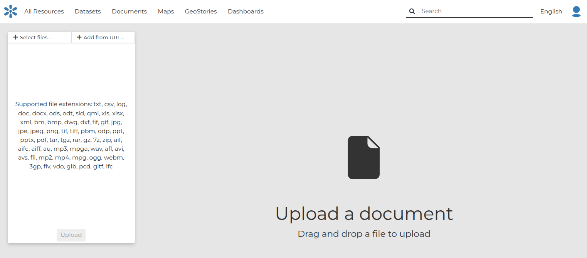

## Upload a document { #uploading-documents }

GeoNode allows you to share reports, conceptual notes, posters, spreadsheets, and so on. A wide range of document files can be hosted on the platform, including text files (`.doc`, `.docx`, `.txt`, `.odt`), spreadsheets (`.xls`, `.xlsx`, `.ods`), presentations (`.ppt`, `.pptx`, `.odp`), images (`.gif`, `.jpg`, `.png`, `.tif`, `.tiff`), PDF, zip files (`.rar`, `.zip`, `.gz`), SLD, XML, QML files or as External URL.

!!! warning
    Only authenticated users can upload data into GeoNode.

It is possible to upload *Documents* in two ways:

- From the `All Resources` page, by clicking *Add Resource* which displays a list including `Upload document`:
- From the `Documents` page, by clicking on the *New* button.

The *Document Upload* page looks like the one shown in the picture below.

{ align=center }
/// caption
*Document Upload page*
///

On GeoNode documents can be:

- Uploaded from the **Local file**
- Created with reference to **External URL**

In order to upload a document from the **Local file**, you need to:

1. Click on `Select files`
2. Select a file from your disk
3. Click the `Upload` button

## Add a document { #adding-documents }

A document may refer to a remote document, without making a local copy of the remote resource.

To add a document that references an **External URL** you need to:

1. Click on `Add URL`
2. Select a URL
3. Select an extension from the drop-down menu
4. Click the `Upload` button

At the end of the uploading process, by clicking on the View button, you will be driven to the document page with the Info panel open. Here it is possible to view more info, edit metadata, share, download, and delete the document. See the next section to know more about metadata.

!!! note
    If you get the following error message:

    `Total upload size exceeds 100.0 MB. Please try again with smaller files.`

    This means that there is an upload size limit of 100 MB. A user with administrative access can change the upload limits in the admin panel.
