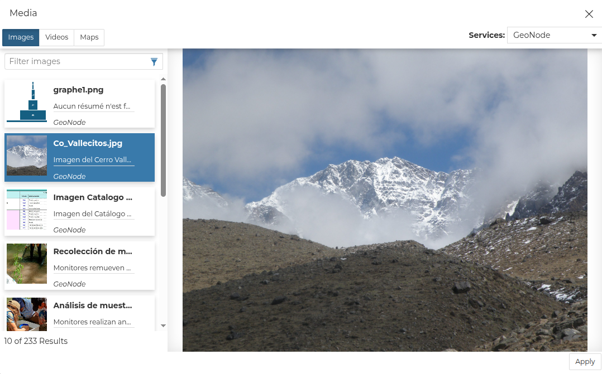

## GeoStory { #geostory }

GeoStory is a MapStore tool integrated in GeoNode that provides the user with a way to create inspiring and immersive stories by combining text, interactive maps, and other multimedia content like images and video or other third party contents.

Through this tool you can simply tell your stories on the web and then publish and share them with different groups of GeoNode users or make them public to everyone around the world.

To build a new GeoStory go to `Add Resource` on the *All Resources* page and choose *Create geostory*, or select `New` on the *Geostories* page.

Now you have landed on the GeoStory editing page, which is composed of the following sections:

{ align=center }
/// caption
*New GeoStory Apps option*
///

The GeoStory content is organized in Sections, that can be added with the { width="30px" height="30px" } button in the *Container* area. In particular, the user can add the following kinds of sections to the story:

{ align=center }
/// caption
*GeoStory Sections Types*
///

For more information on these specific sections please follow the official MapStore documentation:

- [Title Section](https://mapstore.readthedocs.io/en/latest/user-guide/title-section/)
- [Banner Section](https://mapstore.readthedocs.io/en/latest/user-guide/banner-section/)
- [Paragraph Section](https://mapstore.readthedocs.io/en/latest/user-guide/paragraph-section/)
- [Immersive Section](https://mapstore.readthedocs.io/en/latest/user-guide/immersive-section/)
- [Media Section](https://mapstore.readthedocs.io/en/latest/user-guide/media-section/)
- [Web Page Section](https://mapstore.readthedocs.io/en/latest/user-guide/web-section/)

### Add GeoNode content to GeoStory

With GeoNode you can add content to your GeoStory using internal GeoNode documents and maps as well as external sources.
This ability to add internal GeoNode content makes GeoStory creation a very useful feature.

To add GeoNode content to your GeoStory use the { width="30px" height="30px" } button on top of your GeoStory section.

From there you can add `Images`, `Videos` and `Maps`.
To enable the GeoNode internal catalog, on the `Services` dropdown choose `GeoNode` as shown in the picture below.
On the left you get a list of media documents available, with a complementary text filter feature on top.

{ align=center }
/// caption
*Add Media to GeoStory*
///

To save your GeoStory, choose `Save` and then `Save as...` from the top of your GeoStory content.

Now your GeoStory can be shared with everyone.

### Further Reading

Follow the link below to get more detailed information about the usage of GeoStory.

[GeoStory Documentation](https://mapstore.readthedocs.io/en/latest/user-guide/exploring-stories)
