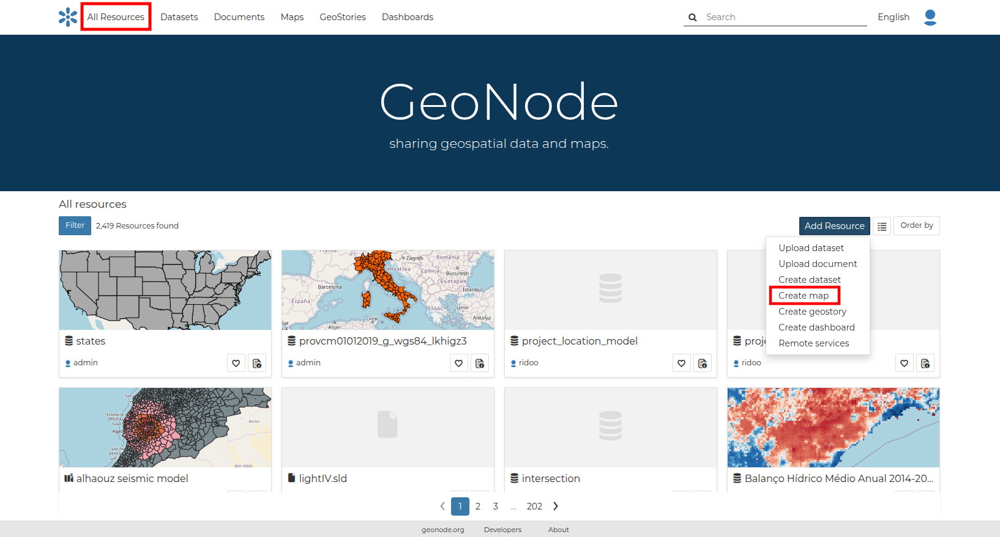
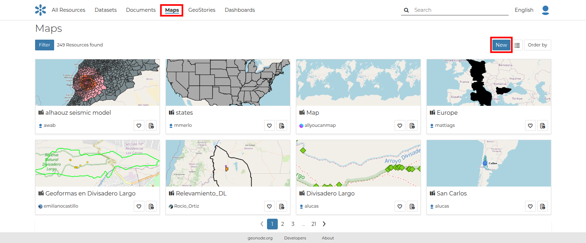
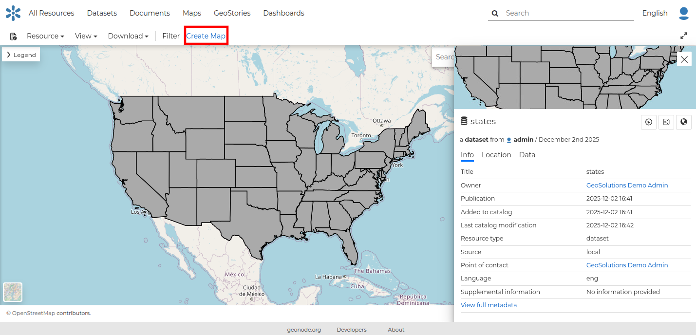
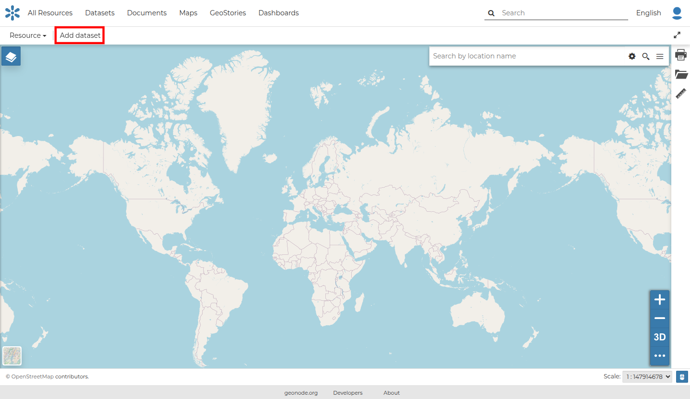

## Creating Maps { #creating-map }

In this section, we will create a *Map* using some uploaded datasets, combine them with some other datasets from remote web services, and then share the resulting map for public viewing.

In order to create new maps you can use:

- The `Create map` listed after clicking the `Add Resource` button on the *All Resources* list page.

  { align=center }
  /// caption
  *The Create Map from All Resources page*
  ///

- The `New` button after clicking the `Maps` button on the menu bar.

  { align=center }
  /// caption
  *The Create Map from Maps page*
  ///

- The `Create map` link in the *Dataset Page*. It creates a map using a specific dataset.

  { align=center }
  /// caption
  *The Create map from dataset*
  ///

The new *Map* will open in a *Map Viewer* like the one in the picture below.

{ align=center }
/// caption
*The Map Viewer*
///

Using the `Add dataset` link, you can add a layer by clicking on one of the layers listed in the catalog.
In the upper left corner the *TOC button* { width="30px" height="30px" } opens the [table of contents](maps_configuration/toc.md#toc) of the *Map*. It allows you to manage all the datasets associated with the map and to add new ones from `Add dataset`.

The *TOC* component makes it possible to manage dataset overlap on the map by shifting their relative positions in the list. Drag and drop them up or down in the list.

It also allows you to hide or show datasets { width="30px" height="30px" } and { width="30px" height="30px" }, to zoom to dataset extents { width="30px" height="30px" } and to manage their properties { width="30px" height="30px" }.

Once the map datasets have been settled it is possible to save the *Map* by clicking `Save as` under the `Resources` link in the map toolbar.

If you followed the steps above, you have just created your first *Map*.
Now you should see it in the *Explore Maps* page.

We will take a closer look at the *Map Viewer* tools in the [maps exploration section](maps_configuration/maps_conf_overview.md#map-tools-and-configuration).
