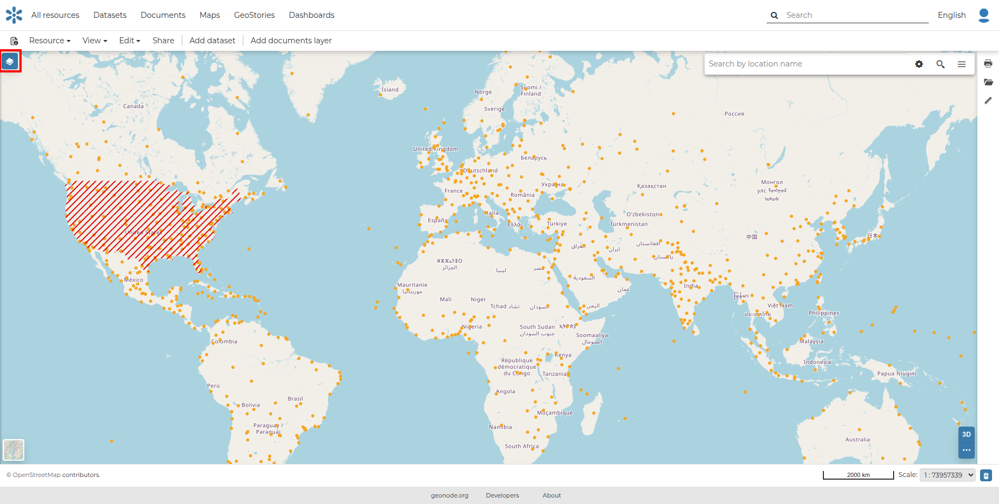
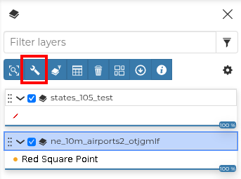
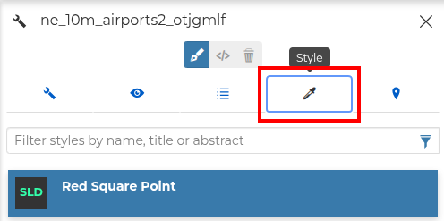

# Map Styling

In GeoNode, users can also edit or create a style for a map by modifying the style of one of the datasets included in that map.

To access the styling panel, open a `map` from the maps `catalog` and then select the `layers` button on the right side of the map.

{ align=center }

After that, in the panel that opens, choose the `layer` for which you want to modify or create a style and then select the `Selected layer settings` button, as shown in the image below.

{ align=center }

Finally, select the `Style` button and the styling panel will be presented.

{ align=center }

For more information about editing the style, please take a look at [Dataset and Map Styling](../resource_styling.md).
