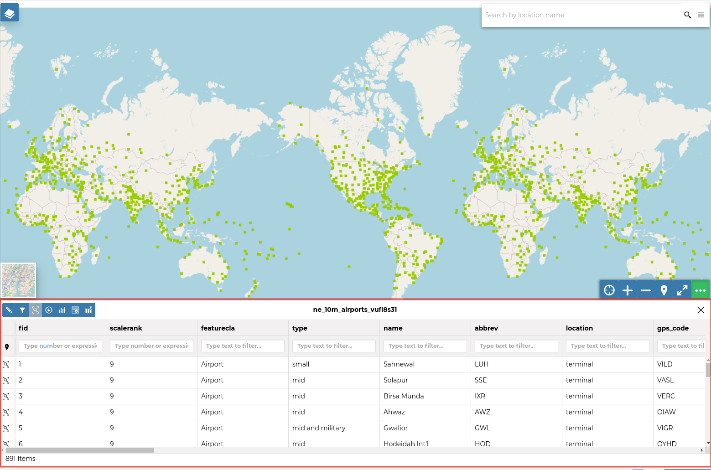
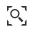
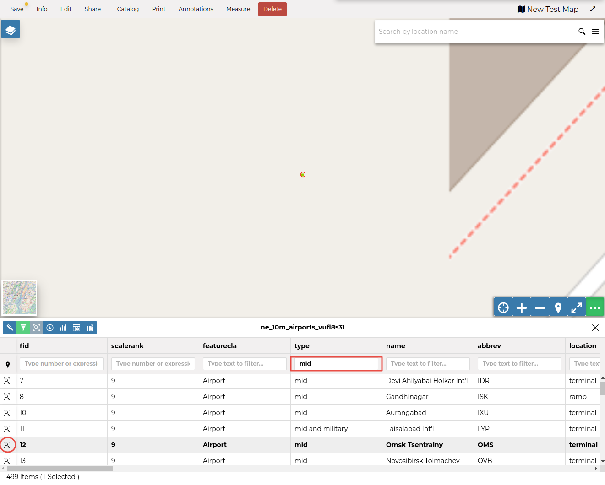
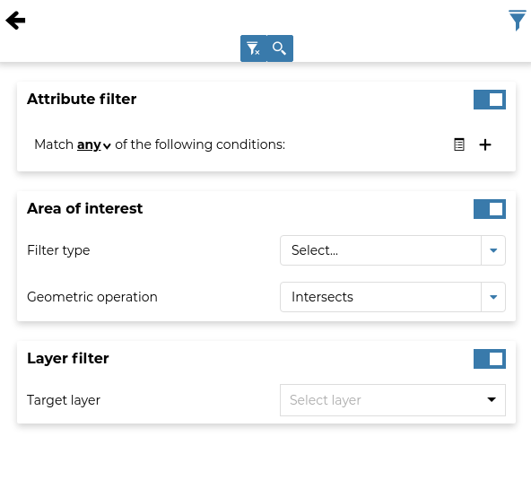
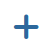
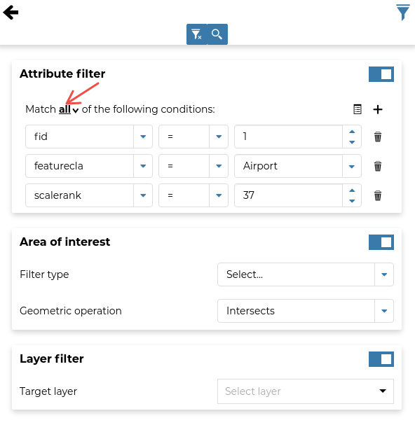
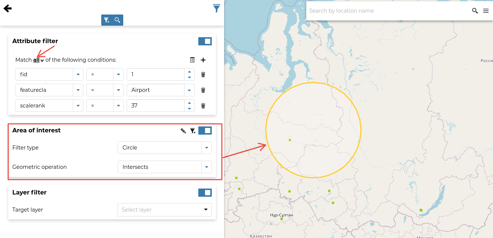
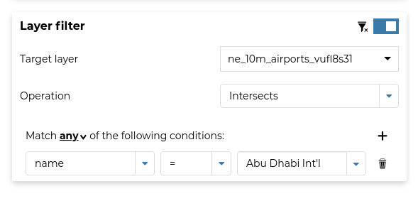

## Attributes Table { #attributes-table }

When clicking { width="30px" height="30px" } from the [TOC](toc.md#toc), the *Attributes Table* panel opens at the bottom of the *Map* page.

{ align=center }
/// caption
*The Attributes Table Panel*
///

In that panel you can navigate through the features of the dataset, zoom to their geometries by clicking { width="30px" height="30px" } and explore their attributes.

The *Attributes Table* has one row for each feature belonging to the dataset and one column for each attribute that describes the feature.
Each column has a *Filter* input field through which you can filter the features based on a value or expression, depending on the data type of the field.

{ align=center }
/// caption
*Filtering Features by Attribute*
///

The *Attributes Table* panel contains a *Toolbar* which makes available some useful functionalities.

{ align=center }
/// caption
*The Attributes Table Toolbar*
///

Those functionalities are:

- *Edit Mode*
  By clicking { width="30px" height="30px" } you can start an editing session. It permits you to add new features, delete or modify the existing ones, and edit geometries. See [Edit a dataset](../../datasets/dataset_editing.md#dataset-data-editing) for further information.

- *Advanced Search*
  Click { width="30px" height="30px" }, and a new panel opens. That panel allows you to filter features in many different ways. This functionality is explained below.

- *Zoom to page extent*
  Click { width="30px" height="30px" } to zoom to the page extent.

- *Export Data*
  Click { width="30px" height="30px" } to open the export or download data form.

- *Hide/show columns*
  When clicking { width="30px" height="30px" } another panel opens inside the *Attributes Table*. Through that panel you can choose which columns you want to see.

- *Create a chart*
  Through { width="30px" height="30px" } you can open the chart widgets panel where many functionalities to describe and visualize the dataset data are available.

- *Sync map with filter*
  Click { width="30px" height="30px" } to synchronize the map with the filter.

### Advanced Search { #advanced-search }

As mentioned before, GeoNode allows both attribute-based and spatial filtering.
When clicking { width="30px" height="30px" } from the dataset *Attributes Table*, the *Advanced Search* panel opens and shows three different filtering functionalities:

{ align=center }
/// caption
*Advanced Search*
///

- In the **Attribute Filter** section you can compose a series of conditions about the attributes of the dataset.
  Click { width="30px" height="30px" } to insert a new empty condition.
  Select the attribute you are interested in, select an operator and type a comparison value.
  You can group conditions through { width="30px" height="30px" }.
  Click { width="30px" height="30px" } to perform the search.

  { align=center }
  /// caption
  *Filtering by Attributes*
  ///

  You can also decide if *All* the conditions have to be met, if only *Any* or *None* of them.

- The **Area of interest** filtering allows you to filter features that have some relationship with a spatial region that you draw on the map.
  Select the *Filter Type* (Circle, Viewport, Polygon or Rectangle), draw the spatial region of interest on the map, select a *Geometric Operation* (Intersects, Bounding Box, Contains or Is contained) and then click { width="30px" height="30px" }.

  { align=center }
  /// caption
  *Filtering by Area Of Interest*
  ///

- Through the **Dataset Filter** you can select only those features which comply with some conditions on other datasets of the map. You can also add conditions on attributes for those datasets.

  { align=center }
  /// caption
  *Dataset Filtering*
  ///

You can read more about the *Attributes Table* and the *Advanced Search* in the [MapStore Documentation](https://docs.mapstore.geosolutionsgroup.com/en/latest/user-guide/filtering-layers/#query-panel).
