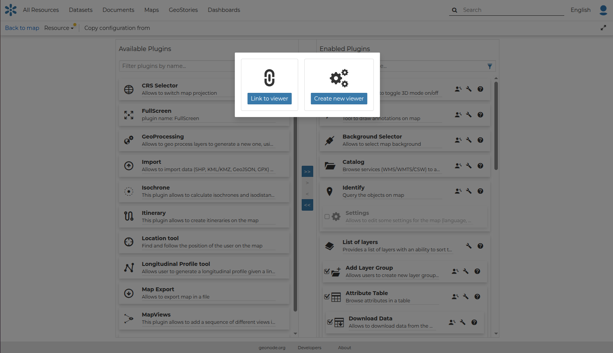
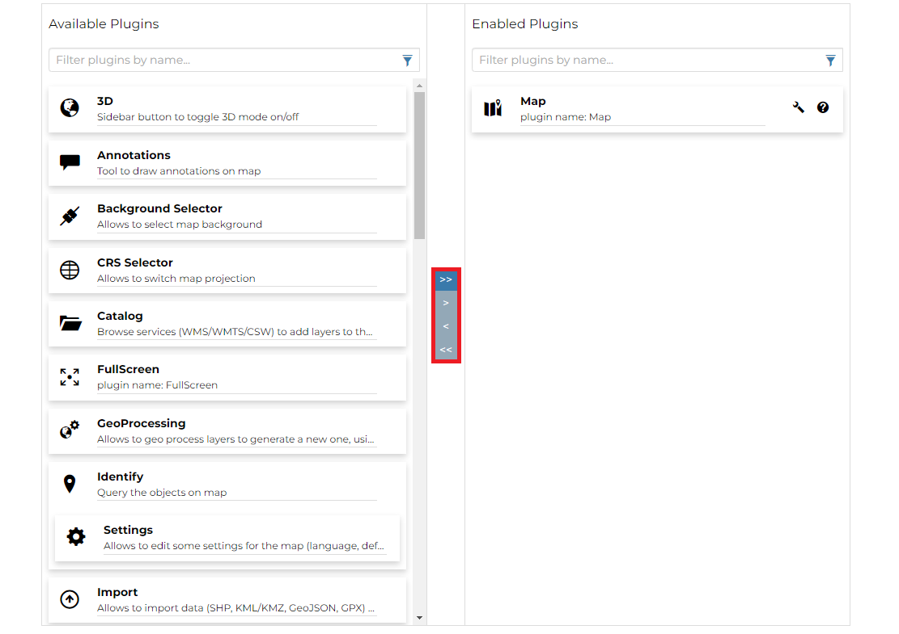

## Map Viewer { #map-viewers }

GeoNode allows the administrator of the map to configure a custom viewer by choosing the set of plugins available for the viewer.

From the `Add viewer` option under the `Edit` options of the *Menu*, a page opens and the user can:

- select an existing viewer from the list of viewers by clicking `Link to viewer`
- create a new viewer by clicking `Create new viewer`

{ align=center }
/// caption
*Add viewer option*
///

Once `Create new viewer` is selected, an *Edit Plugins* page opens and, through the central vertical bar, the user can select the plugins to include in the context viewer by moving them from the **Available Plugins** list to the **Enabled Plugins** list.

{ align=center }
/// caption
*Enable plugins for the viewer*
///

To save and enable the map viewer, the user can click `Save as` under the `Resource` options of the *Menu*.

The *Map Viewer* will be visible to all users who have permission to view the map and can be reused or modified by the user who has edit permissions on it.
It will be available in the list of resources on the *Home Page*.

See the [MapStore Documentation](https://docs.mapstore.geosolutionsgroup.com/en/latest/user-guide/application-context/#configure-plugins) for more information.
