## Map tools and configuration { #map-tools-and-configuration }

In this section, we are going to explore all tools provided on the Map View page. From the list of available maps, you can select the map you are interested in and click *View map*. The map will look like this.

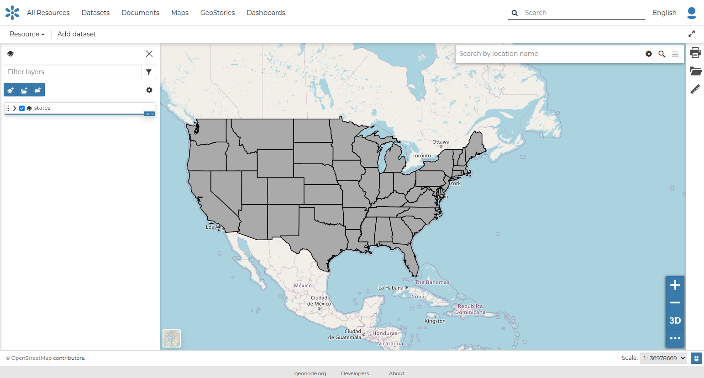{ align=center }
/// caption
*The Map View*
///

The Map View, based on [MapStore](https://docs.mapstore.geosolutionsgroup.com/en/latest/), provides the following tools:

- the [Table of Contents (TOC)](toc.md#table-of-contents-toc) to manage the map contents
- the *Basemap Switcher* to change the basemap
- the *Search Bar* to search by location, name and coordinates
- the [Other Menu Tools](options_menu.md#other-menu-tools) which include the link to the datasets *Catalog*
- the *Sidebar* which contains, by default, the link to the *Print* tool and to the *Measure* tool
- the *Navigation Bar* and its tools such as the *Zoom* tools, the *3D Navigation* tool and the *Get Features Info* tool
- the *Footer Tools* to manage the scale of the map, to track the mouse coordinates and change the CRS (Coordinates Reference System)

A map can be configured to use a custom [Map Viewer](map_viewers.md#map-viewer), with which the list of tools available in the map can be customized.

### Search Bar

The *Search Bar* of the map viewer allows you to find points of interest, streets or locations by name.
Let us type the keyword `airport`, since one of the added layers is related to airports, and select one of the records.

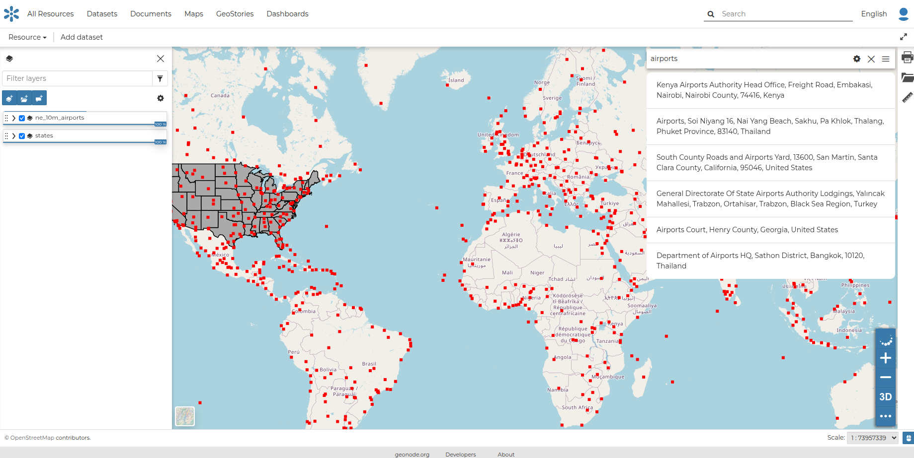{ align=center }
/// caption
*The Search Bar*
///

The map will automatically recenter on that area, delimiting it by a polygon in the case of an area, by a line in the case of a linear shape such as streets or streams, and by a marker in the case of a point.

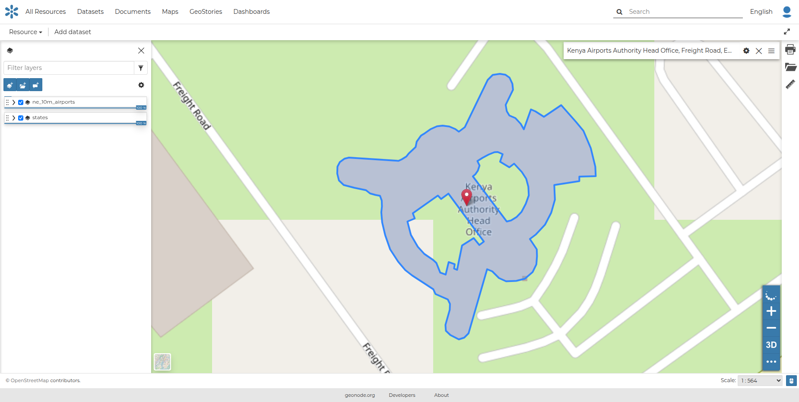{ align=center }
/// caption
*Result of a Search*
///

### Navigation bar

The *Map Viewer* also makes available the *Navigation bar*.
It is a navigation panel containing various tools that help you to explore the map, such as tools for zooming, changing the extent and querying objects on the map.

By default, the *Navigation bar* shows the zooming buttons { width="30px" height="30px" } { width="30px" height="30px" } and 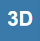{ width="30px" height="30px" }. Other options can be explored by clicking { width="30px" height="30px" }, which expands or collapses the toolbar.

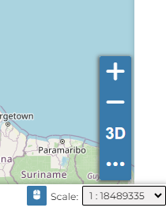{ align=center width="300px" }
/// caption
*The Default Navigation bar*
///

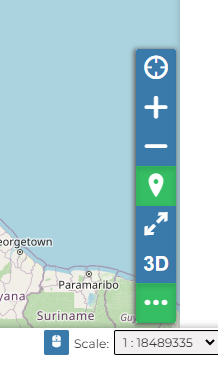{ align=center width="300px" }
/// caption
*The Expanded Navigation bar*
///

The *Navigation bar* contains the following tools:

- The *Query Objects on map* tool allows you to get feature information through 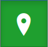{ width="30px" height="30px" }.
  It allows you to retrieve information about the features of some datasets by clicking them directly on the map.

  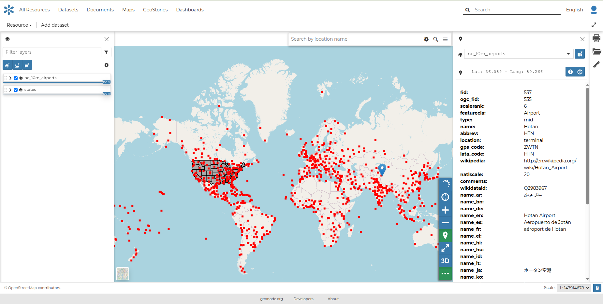{ align=center }
  /// caption
  *Querying Objects on map*
  ///

  When clicking on the map, a new panel opens. That panel shows all the information about the clicked features for each active loaded dataset.

- You can *Zoom To Max Extent* by clicking { width="30px" height="30px" }.

### Basemap Switcher

By default, GeoNode allows you to enrich maps with many world backgrounds. You can open available backgrounds by clicking on the map tile below:

- *OpenStreetMap*
- *OpenTopoMap*
- *Sentinel-2-cloudless*

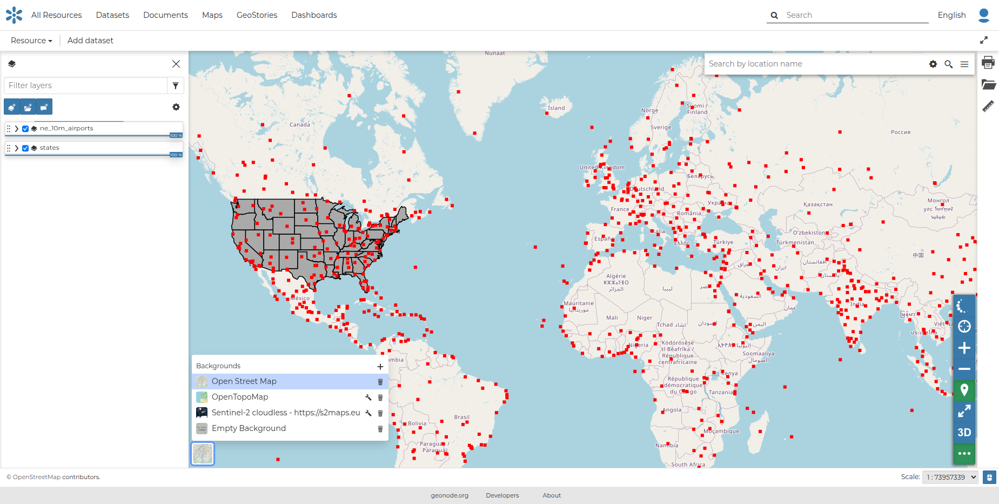{ align=center height="400px" }
/// caption
*The Basemap Switcher Tool*
///

You can also decide to have an *Empty Background*.

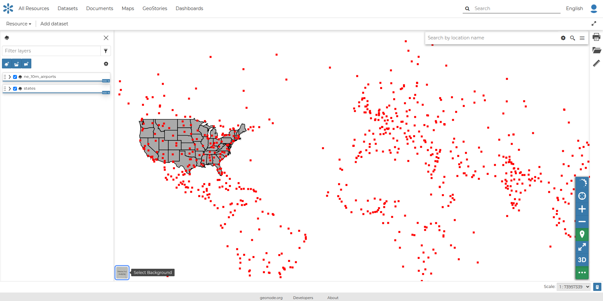{ align=center height="400px" }
/// caption
*Switching the Basemap*
///

### Footer Tools

At the bottom of the map, the *Footer* shows you the *Scale* of the map and allows you to change it.

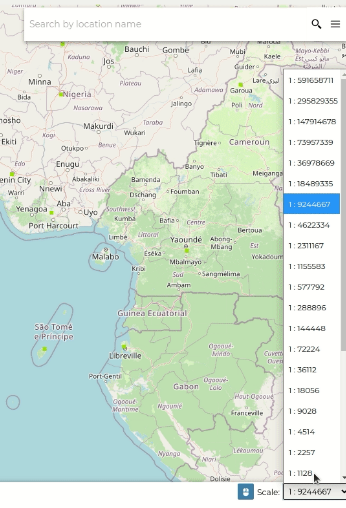{ align=center height="600px" }
/// caption
*The Map Scale*
///

The { width="30px" height="30px" } button allows you to see the pointer *Coordinates* and to change the Coordinates Reference System (CRS), `WGS 84` by default.

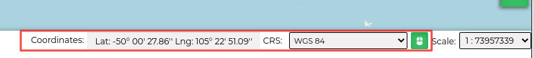{ align=center }
/// caption
*The Pointer Coordinates and the CRS*
///
