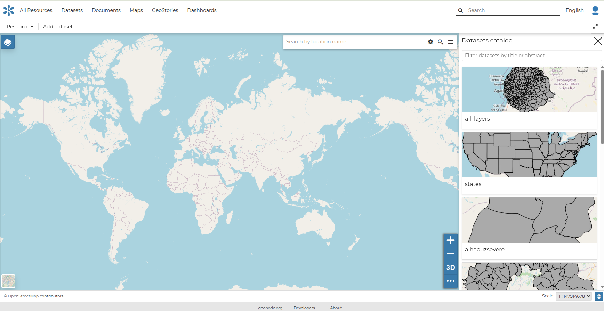
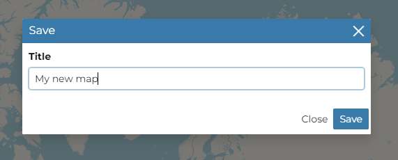
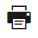
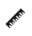
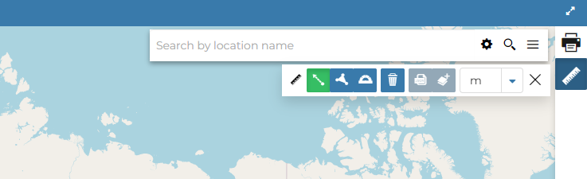
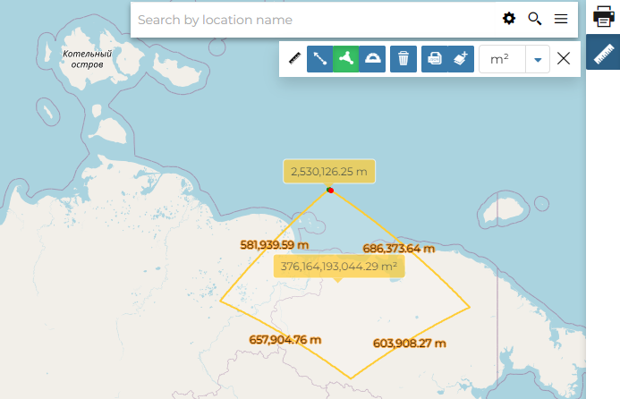

## Other Menu Tools { #options-menu-tools }

At the top of the *Map* and on the *Sidebar* of the map there are more menu items which are explained in this section.

### Add dataset

All the datasets available in GeoNode, both uploaded and remote, can be loaded on the map through the *Catalog*.
Click on the `Add dataset` option of the *Menu* to take a look at the catalog panel.

{ align=center }
/// caption
*The Datasets Catalog*
///

You can navigate through datasets and look at their *Thumbnail* images, *Title*, *Description* and *Abstract*.
Click on a dataset to load it into the map. It will also be visible in the [TOC](toc.md#toc).

### Saving a map

Once all the customizations have been carried out, you can *Save* your map by clicking `Save` under the `Resources` options of the *Menu*.

You can create a new map from the existing view by clicking `Save As...`.
A new popup window will open.

{ align=center }
/// caption
*Saving as Map option*
///

The current map title is filled by default. You can change it to the preferred name and then click `Save`.
The page will reload and your map should be visible in the data discovery pages.

### Printing a map

The [MapStore](https://docs.mapstore.geosolutionsgroup.com/en/latest/) based map viewer of GeoNode allows you to print the current view with a customizable layout.

Click { width="30px" height="30px" } from the *Sidebar*. The **Printing Window** will open.

{ align=center }
/// caption
*The Printing Window*
///

From this window you can:

- enter *Title* and *Description*
- choose the *Resolution* in dpi
- select the format
- select the coordinate
- add the scale
- add a grid with label
- customize the *Layout*
- the *Sheet size* (A3, A4)
- whether to include the legend or not
- whether to put the legend on a separate page
- the page *Orientation* (Landscape or Portrait)
- customize the *Legend*
- the *Label Font*
- the *Font Size*
- the *Font Emphasis* (bold, italic)
- whether to *Force Labels*
- whether to use *Anti Aliasing Font*
- the *Icon Size*
- the *Legend Resolution* in dpi

To print the view click `Print`.

### Performing Measurements

Click { width="30px" height="30px" } from the *Sidebar* to perform a measurement.
As you can see in the picture below, this tool allows you to measure *Distances*, *Areas* and the *Bearing* of lines.

{ align=center }
/// caption
*The Measure Tool*
///

To perform a measure, draw on the map the geometry you are interested in. The result will be displayed on the left of the unit-of-measure selector. This tool also allows you to change the unit of measure.

{ align=center }
/// caption
*Measuring Areas*
///
