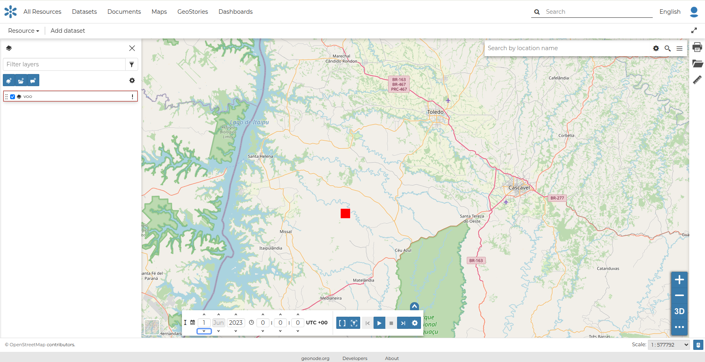
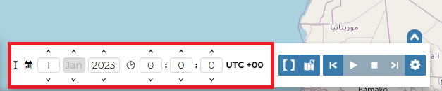
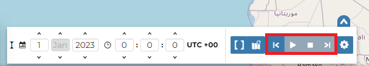
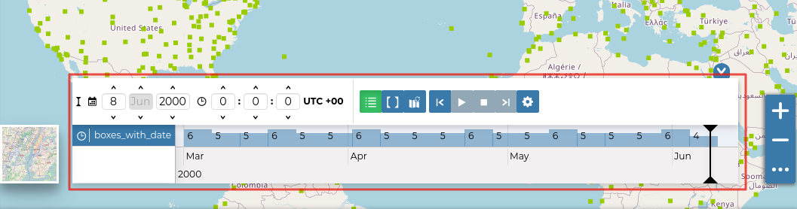
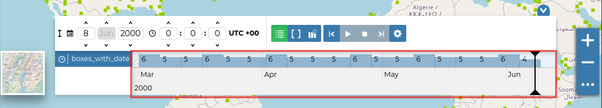
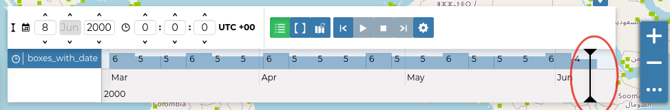
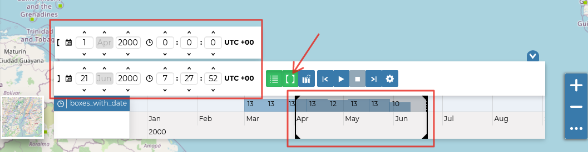
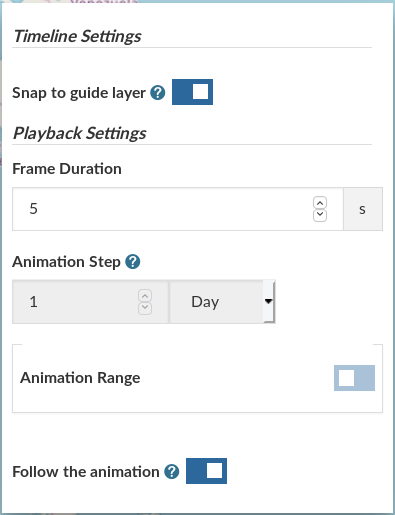
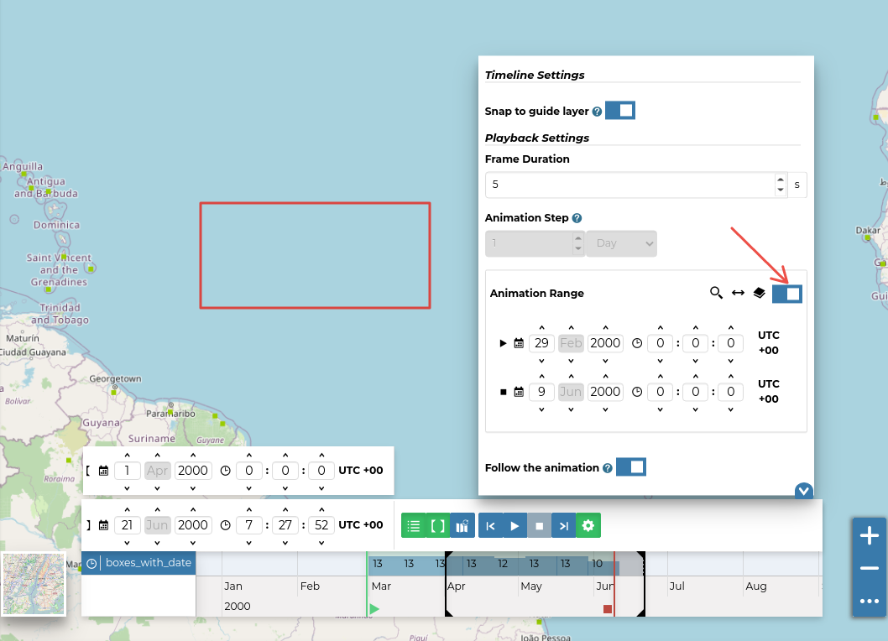

## Timeline { #timeline }

GeoNode can manage datasets with a *time dimension*. Those vector datasets may vary their data through time so it is useful to represent that variation on the map.

The [MapStore](https://docs.mapstore.geosolutionsgroup.com/en/latest/) based map viewer used in GeoNode makes available the **Timeline** tool which allows you to observe the datasets evolution over time, inspect the dataset configuration at a specific time instant and view different dataset configurations dynamically through animations.

!!! warning
    Timeline actually works only with the `WMTS-Multidim` extension. WMS time in capabilities is not fully supported.

When loading a temporal dataset into the map, the *Timeline* opens automatically.

{ align=center }
/// caption
*The Timeline*
///

On the left side of the *Timeline* panel you can set the time value in which you want to observe the data. You can type it directly in the corresponding input fields or use the up and down arrows.

{ align=center }
/// caption
*The Time Control Buttons*
///

On the other side there are the buttons responsible for managing the animations.
In particular you can *Play* the animation by clicking { width="30px" height="30px" }, go back to the previous time instant through { width="30px" height="30px" }, go forward to the next time step using { width="30px" height="30px" } and stop the animation by clicking { width="30px" height="30px" }.

{ align=center }
/// caption
*The Animation Control Buttons*
///

The *Timeline* panel can be expanded through { width="30px" height="30px" }.

{ align=center }
/// caption
*The Expanded Timeline*
///

The expanded section of the *Timeline* panel contains the *Time Datasets List* and a *Histogram* which shows:

- the distribution of the data over time

  { align=center }
  /// caption
  *The Timeline Histogram*
  ///

- the *Time Cursor*

  { align=center }
  /// caption
  *The Time Cursor*
  ///

You can show or hide the datasets list by clicking { width="30px" height="30px" }.

Through the *Time Range* function you can observe the data in a finite temporal interval.
Click { width="30px" height="30px" } and set the initial and the final times to use it.

{ align=center }
/// caption
*The Time Range Settings*
///

### Animations

The *Timeline* allows you to see the data configurations, one for each time in which the data are defined, through ordered sequences of steps.
As said before, you can play the resulting *Animation* by clicking { width="30px" height="30px" }.
The dataset data displayed on the map will change according to the time reached by the cursor on the *Histogram*.

By clicking { width="30px" height="30px" } you can manage some *Animation Settings*.

{ align=center height="400px" }
/// caption
*The Timeline Settings*
///

You can activate *Snap to guide dataset* so that the time cursor snaps to the selected dataset data. You can also set the *Frame Duration*, which is 5 seconds by default.
If *Snap to guide dataset* is disabled, you can force the animation step to be a fixed value.

The *Animation Range* option lets you define a temporal range within which the time cursor can move.

{ align=center }
/// caption
*The Timeline Animation Range*
///

See the [MapStore Documentation](https://docs.mapstore.geosolutionsgroup.com/en/latest/user-guide/timeline/) for more information.
