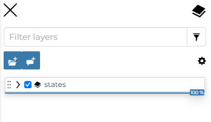
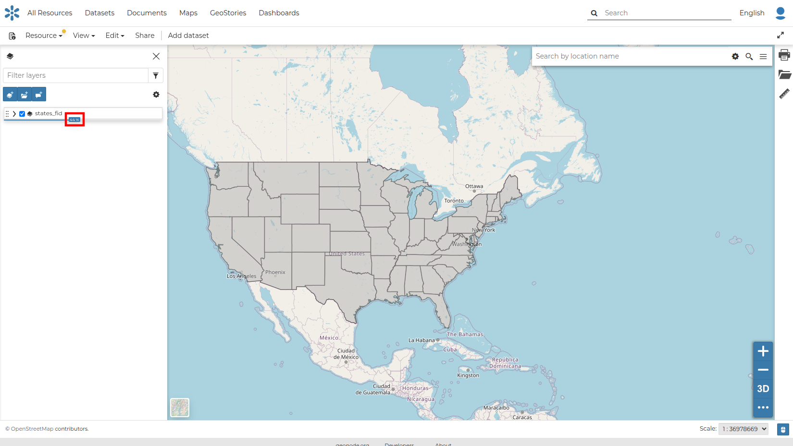
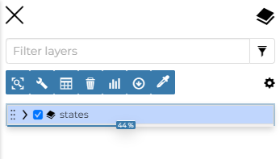
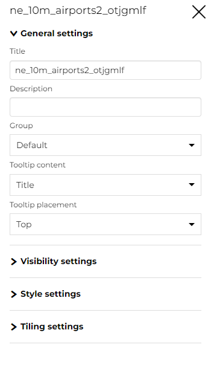
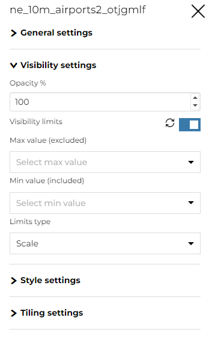
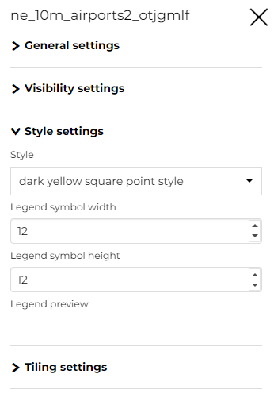
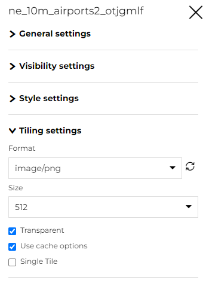
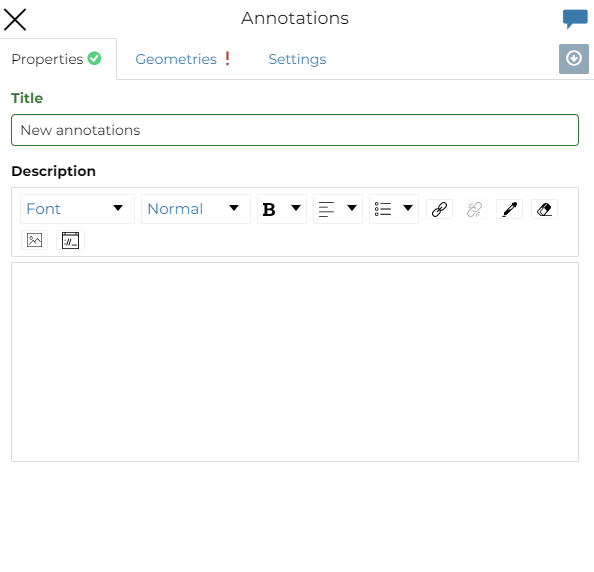
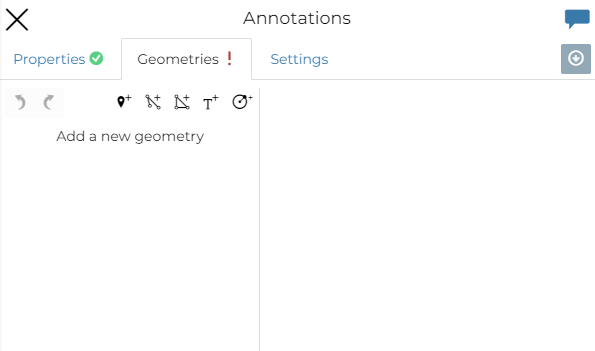

## Table of Contents (TOC) { #toc }

In the upper left corner, click { width="30px" height="30px" } to open the *Table Of Contents*, briefly *TOC*, of the map.
The *TOC* shows all the datasets involved with the *Map* and allows you to manage their properties and representations on the map.

{ align=center height="200px" }
/// caption
*The Table Of Contents (TOC)*
///

From the *TOC* you can:

- manage the *TOC Settings* by clicking { width="30px" height="30px" }
- manage the datasets *Overlap*
- filter the datasets list by typing text in the *Filter Datasets* field
- manage the datasets properties such as *Opacity* and *Visibility* by clicking { width="30px" height="30px" } or { width="30px" height="30px" }
- add and manage *Annotations* by clicking { width="30px" height="30px" }
- manage the *Dataset Settings*

{ align=center height="400px" }
/// caption
*Scrolling the Dataset Opacity*
///

Select a *Dataset* from the list and click on it. The *Dataset Toolbar* should appear in the *TOC*.

{ align=center height="200px" }
/// caption
*The Dataset Toolbar*
///

The *Toolbar* shows many buttons:

- the **Zoom to dataset extent** button allows you to zoom to the dataset extent
- the **Filter layer** button acts directly on a layer with WFS available and filters its content
- the **Attribute Table** button explores the features of the dataset and their attributes. See [Attributes Table](attribute_table.md#attributes-table)
- the **Delete** button deletes datasets
- the **Widgets** button creates widgets
- the **Export data** button exports data
- the **Settings** button opens the dataset settings customization panel
- the **Compare tool** button lets you *Swipe* or *Spy* the selected layer
- the **Edit Style** button edits the style

### Managing Dataset Settings

The *Dataset Settings* panel looks like the one below.

{ align=center height="600px" }
/// caption
*The Dataset Settings Panel*
///

The *Dataset Settings* are divided into four groups:

1. *General* settings
2. *Visibility* settings
3. *Style* settings
4. *Tiling* settings

In the **General** tab of the *Settings Panel* you can customize the dataset *Title*, insert a *Description*, change or add the *Dataset Group* and change the *Tooltip content* and the *Tooltip placement*.

The **Visibility** tab lets you change the *Opacity* of the layer and add *Visibility limits* to display the layer only within certain scale limits.

{ align=center height="400px" }
/// caption
*The Visibility tab on Settings Panel*
///

The **Style** tab allows you to select the style from the available layer styles and change the *Width* and the *Height* of the *Legend*.

{ align=center height="400px" }
/// caption
*The Style tab on Settings Panel*
///

Click the **Tiling** tab to change the output *Format* of the WMS requests, the *Tile Size* and enable or disable *Transparent*, *Use cache options* and *Single Tile*.

{ align=center height="400px" }
/// caption
*The Tiling tab on Settings Panel*
///

### Add an Annotation

Click { width="30px" height="30px" } from the *TOC Toolbar* to enrich the map with special features that expose additional information, mark particular positions on the map and so on.
From there the editor can insert a *Title* and a *Description*.

{ align=center }
/// caption
*Annotations panel*
///

To begin, from the annotation panel, the editor adds a new annotation by selecting the `Geometries` tab.

{ align=center }
/// caption
*Add an Annotations*
///

Here the user can choose between five different types of *Geometries*:

1. *Marker*
2. *Line*
3. *Polygon*
4. *Text*
5. *Circle*

See the [MapStore Documentation](https://docs.mapstore.geosolutionsgroup.com/en/latest/user-guide/annotations/) for more information.
