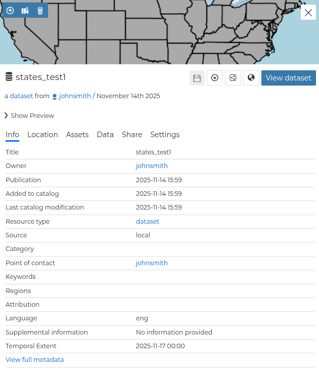
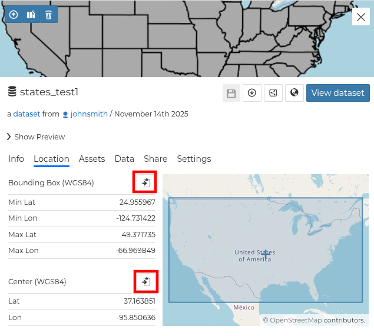
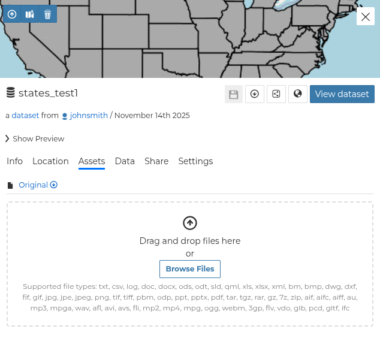
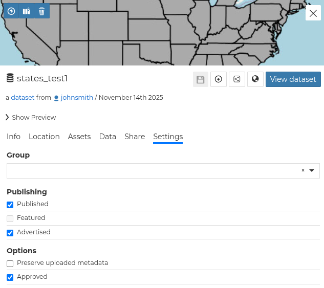
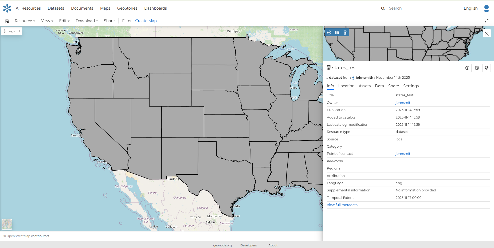
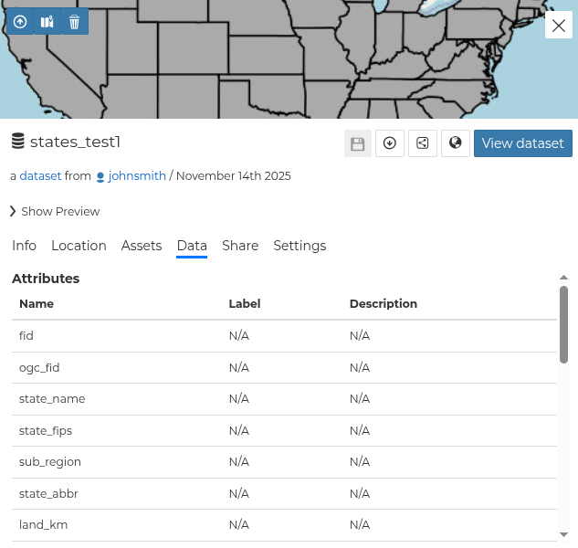
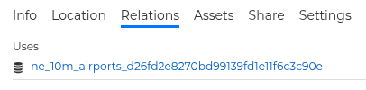

# Resource Information

From the *resources catalog* (e.g. `Datasets`, `Maps`, etc.) you can select the `Open properties` icon for the resource you are interested in to see an overview of it. In the images below, we use a `dataset` as an example, but a similar `properties table` is used for all resources.

{ align=center }

## General `properties table` tabs

This section presents the `properties table` tabs that are available for all resources (e.g. `Documents`, `GeoStories`, etc.).

- The *Info* tab is active by default. This tab section shows resource metadata such as its title, abstract, date of publication, and more. The metadata also indicates the resource owner, the topic categories the resource belongs to, and the affected regions.
  It is worth noting that for all resources, the user can view the full metadata by clicking `View full metadata`, which is presented at the end of the `Info` tab section.

{ align=center }
/// caption
*Resource Info tab*
///

- The *Location* tab shows the spatial extent of the resource.

{ align=center }
/// caption
*Resource Location tab*
///

By clicking the copy icons, you can copy the current *Bounding Box* or the *Center* to the clipboard. Once pasted, it will be a WKT text.

{ align=center }
/// caption
*Bounding Box and Center*
///

- The *Assets* tab presents the current resource download link. Moreover, the user can add additional assets related to this resource.

{ align=center }
/// caption
*Resource Assets tab*
///

- The *Share* tab allows the owner of the resource to edit its permissions.

{ align=center }
/// caption
*Resource Share tab*
///

For detailed information about the `Share` options, please take a look at [Share options](sharing.md).

- The *Settings* tab allows the owner of the resource to define a group, the publishing status, and more options (e.g. Approved).

{ align=center }
/// caption
*Resource Settings tab*
///

From the upper left toolbar on the thumbnail part of the properties panel, it is possible to:

{ align=center }
/// caption
*Resource Info toolbar*
///

- Upload a new thumbnail for the resource
- Set a thumbnail by using the full extent of the resource (in the case of a `Dataset` or a `Map`)
- Remove the thumbnail

From the lower right toolbar on the thumbnail part of the properties panel, it is possible to:

- Save the current changes of the resource (this is not included for `Maps`)
- Download the resource (this is not included for `Maps`)
- Copy the resource URL
- Copy the OGC resource web services URL (in the case of a `Dataset`)

You can access the resource details page by clicking the button on the right (`View dataset` in the case of a `dataset`) in the overview panel.
That page looks like the one shown in the picture below.

{ align=center }
/// caption
*Resource page*
///

## Specific `properties table` tabs

Beyond the general tabs, there are a few tabs for specific resources:

### Dataset resource

- The *Data* tab shows the data structure behind the dataset. All attributes are listed and, for each of them, some statistics (e.g. the range of values) are estimated when possible.

{ align=center }
/// caption
*Dataset Attributes tab*
///

### Map resource

- The *Relations* tab shows resources linked to the map, such as *Documents*, *Datasets*, *GeoStories*, and *Dashboards*.

{ align=center }
/// caption
*Map Relations tab*
///
