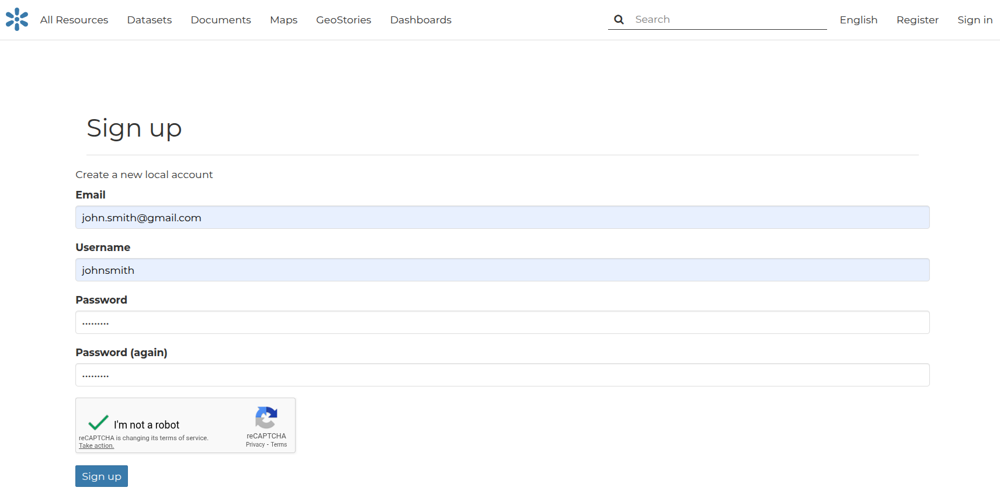

# User account

## Accounts and User Profile

In GeoNode many contents are public so unregistered users have read-only access to public maps, datasets,documents, geostory and dashboard. In order to create maps, dashboard or geostory and add datasets or documents, edit the data and share these resources with other users, you need to sign in.

GeoNode is primarily a social platform, thus a primary component of any GeoNode instance is the user account.

This section will guide you through account registration, updating your account information and preferences, connections with social networks and email addresses.

## Creating a New Account
To take full advantage of all the GeoNode features you need a user account. Follow these step to create a new one.

From any page in the web interface, you will see a **Register** link at the top right. Click that link, and the register form will appear

!!! note
    The registrations in GeoNode must be open, in case you don’t see the register link then it’s not possible to register unless the administrator of the site does that for you.

On the next page, fill out the form. Enter a username and password in the fields. Also, enter your email address for verification.

Registering for a new account

You will be automatically logged in and redirected to the Profile page. An email will be sent confirming that you have signed up. If no errors occur during the registration, the following alerts will appear on the screen:

## Login in GeoNode
Once the account has been created you can login usign the **Sign In** link at the top right.
Enter your credentials to activate the GeoNode session. Now you are able to:

 - Upload resorces
 - Navigate content that has been enabled only for registered users
 - Navigate content that has been shared with you or any of your user groups

## Update your Profile information

Once having an account you can enrich your profile with useful information, you can also edit or delete the existing ones. You can connect the account with your social network, associate many e-mail addresses to it and manage many options such as preferences about notifications.

You can update these information anytime from your Profile page which is accessible from the user menu.

So, click on your profile picture in the top right of the screen. A drop-down list will show. Click on **Profile** to enter the Profile settings page.

Your personal information is shown under the username. At the bottom of the page are listed all the resources associated to your Profile, you can decide to view only datasets, maps ,documents, dashboard or geostory by clicking on the corresponding tab.

On the right side of the page there are many useful links to edit personal information to update your Profile settings and to get in touch with other GeoNode users.

The **My Activities** link allows to see all your recent activities on GeoNode such as datasets uploading and maps creation.

### Associating your Account with an e-mail
Your account is automatically associated with the e-mail that you used to register yourself on the platform.
For activate further functioanlity, you should verify your email if the verification step wasn't

By clicking on **Associated e-mails** of the Profile page, you will have the possibility to fill up a new e-mail address. Type in the e-mail input filed then click on Add E-mail to perform a new association.

You can make it primary if necessary, in order to receive the notification on this address. To do that, select the e-mail that you want, then click on Make Primary.

### Managing the Password
To change your password, click on the **Set/Change password** link of the Profile page. You will be asked to enter your current password and the new one (two times). Click on Change my password to perform the change.

If no errors occur you will see a succesful message.
Next time you signin, you will have to use the new password.

### Setting Notification Preferences
By default GeoNode sends notifications to the users for events that they could be subscribed to such as a new dataset uploaded or a new rate added to a map. You can adjust your notification settings by clicking on the **Notifications** link of the Profile page.

!!! note
    Make sure to have a verified email address to which notices can be sent. If not do it inside the Associated e-mails seciont by clocking **Re-send verification code**

Now you can check/uncheck the notification types you wish to receive or not receive.

