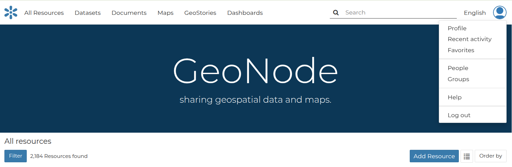
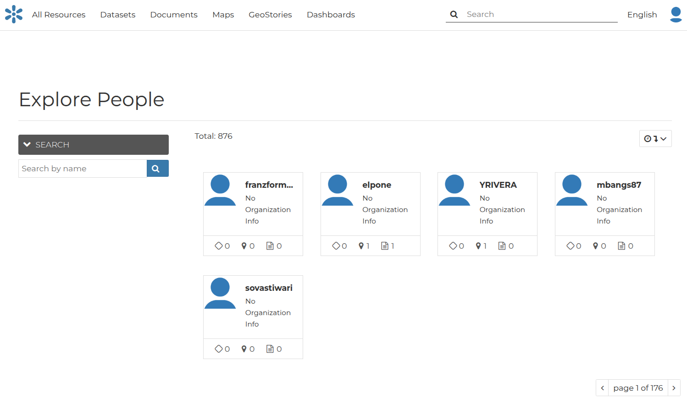
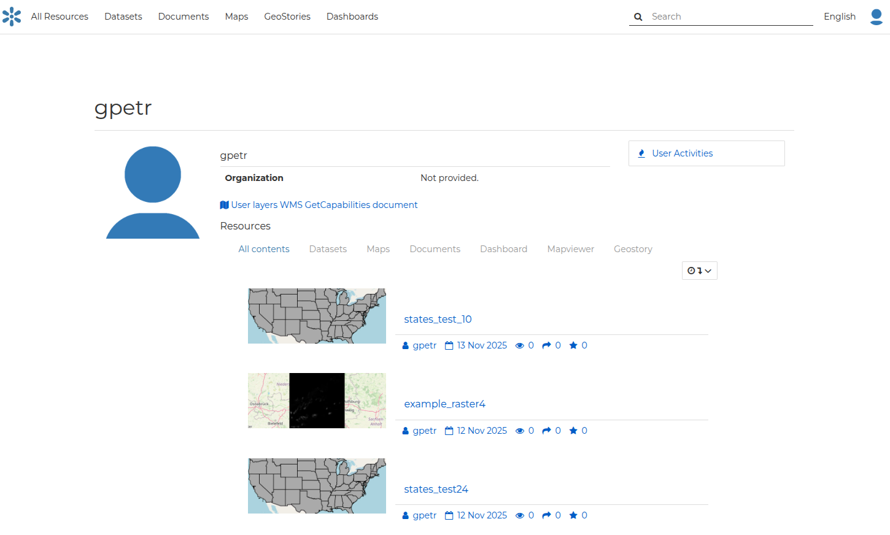
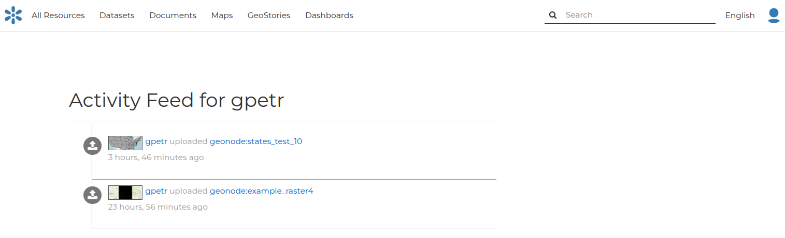
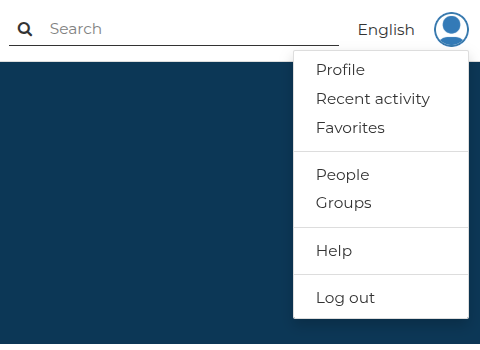
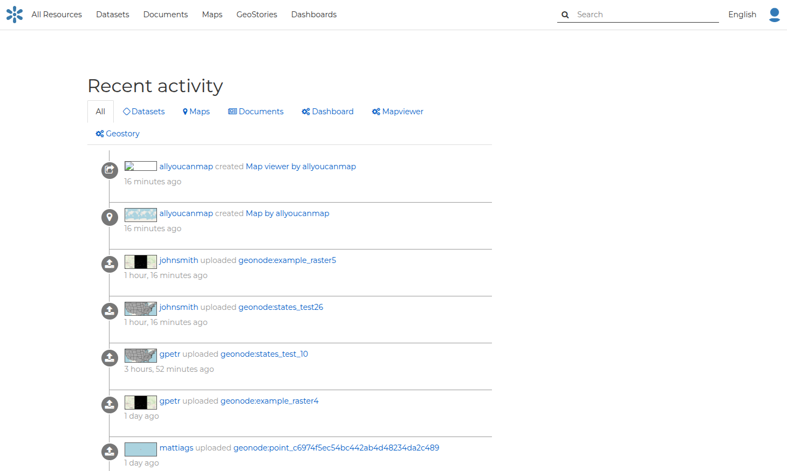
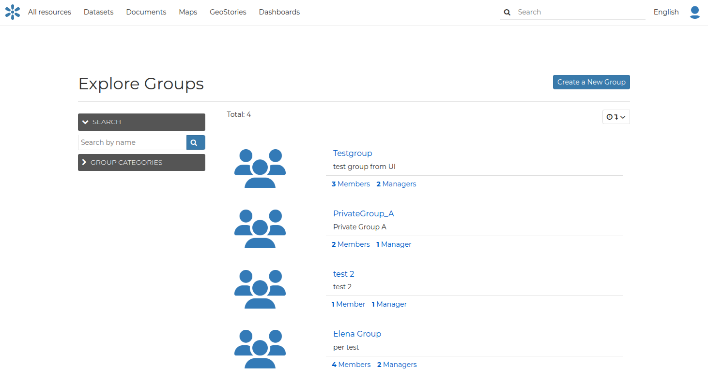
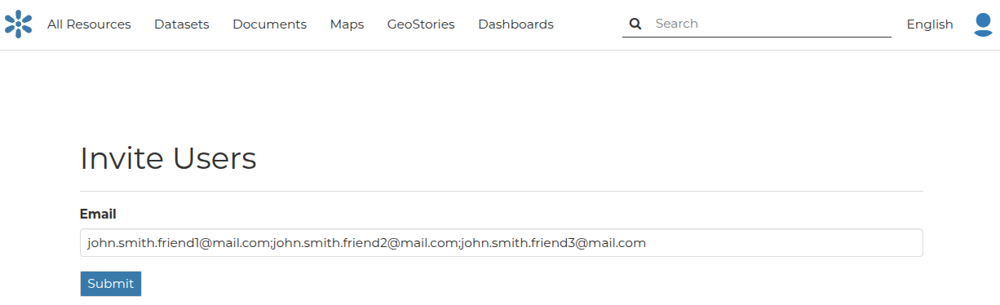
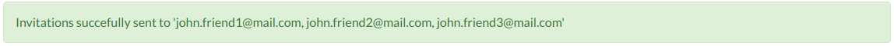

# Users and Groups

## Viewing other users and groups information { #user-group-info }

Once your account is created, you can view other accounts on the system.

To see information about other users on the system, click the `People` link in the `User` menu.

{ align=center }
/// caption
*User menu - People link*
///

You will see a list of users registered on the system.

{ align=center }
/// caption
*List of the registered users*
///

The *Search* tool is very useful in case of many registered users. Type the name of the user you are looking for in the input text field to filter the users list.

Select a user and click on its *username* to access the user details page.

{ align=center }
/// caption
*User details*
///

On this page the main information about the user is shown: personal information, such as organization, and the resources the user owns, such as datasets, maps, documents and other apps.

Through the `User Activities` link, on the right side of the page, it is possible to visualize all the activities the user has performed.

{ align=center }
/// caption
*User activities*
///

In GeoNode, it is also possible to see the recent activities of all users through the `Recent Activity` link in the user menu.

{ align=center }
/// caption
*Recent Activities link*
///

The picture below shows an example.

{ align=center }
/// caption
*Recent Activities*
///

As you can see, you can decide whether to see only the activities related to datasets or those related to maps or comments by switching the tabs.

To see information about other Groups on the system, click the `Groups` link in the `User` menu.

{ align=center }
/// caption
*List of the registered groups*
///

## Interacting with Users and Groups

The GeoNode platform allows you to communicate by message with other GeoNode users and groups of users.

You can also invite external users to join your GeoNode. In order to do that, click on `Invite Users` in the *Profile* page or in the `About` menu on the *Home* page.

You can invite your contacts by typing their email addresses in the input field as shown in the picture below. Click on `Submit` to perform the action.

{ align=center }
/// caption
*Invite users to join GeoNode*
///

A message will confirm that invitations have been correctly sent.

{ align=center }
/// caption
*Invitations confirm message*
///

!!! Note
    You can invite more than one user at the same time by typing the email addresses inline with a semi-colon separator.
