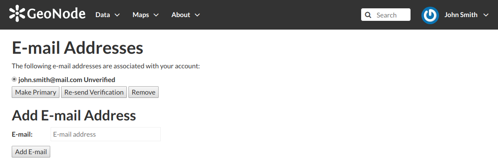
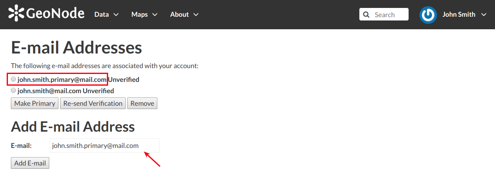
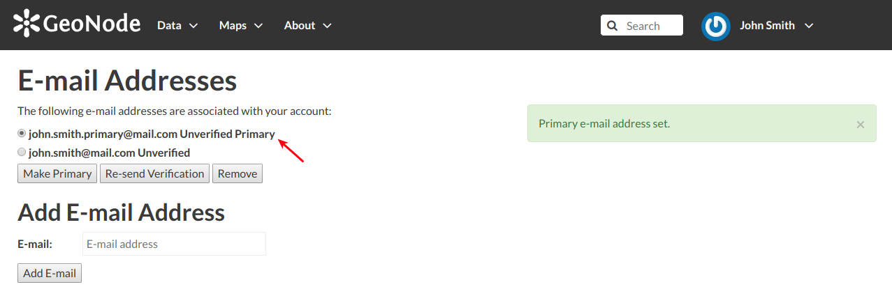

.. _associating_emails:

Associating your Account with an e-mail
=======================================

Your account is automatically associated with the e-mail that you used to register yourself on the platform.

     *Accounts e-mail*

By clicking on :guilabel:`Associated e-mails` of the *Profile* page (see :ref:`editing-profile`), you will have the possibility to fill up a new e-mail address. Type it in the :guilabel:`E-mail` input filed then click on :guilabel:`Add E-mail` to perfrom a new association.

     *New e-mail association*

You can make it primary if necessary, in order to receive the notification on this address. To do that, select the e-mail that you want, then click on :guilabel:`Make Primary`.

     *Primary e-mail address*
