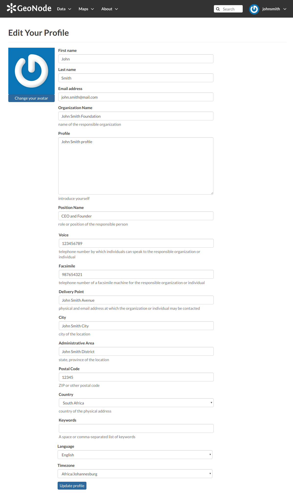
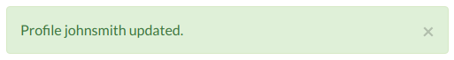

Editing Profile Information
===========================

Your *Profile* contains personal information such as your address, your telephone number, your organization and so on but it is empty by default at the beginning.

Through the :guilabel:`Edit profile` button of the *Profile* page (see :ref:`editing-profile`) you can set your details, including your avatar.

     *Updating Profile information*

| When finished, click :guilabel:`Update profile`. You will be redirected to the *Profile* page.
| A message will confirm the profile has been correctly updated.

     *Updating Profile correctly finalized*
