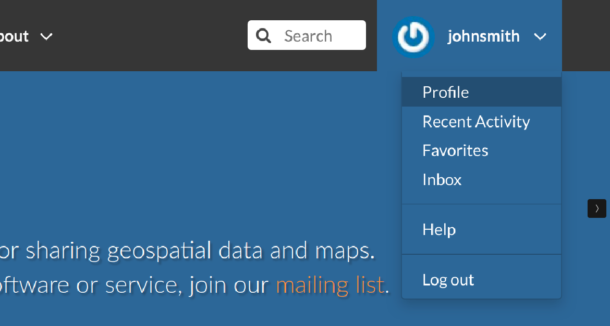
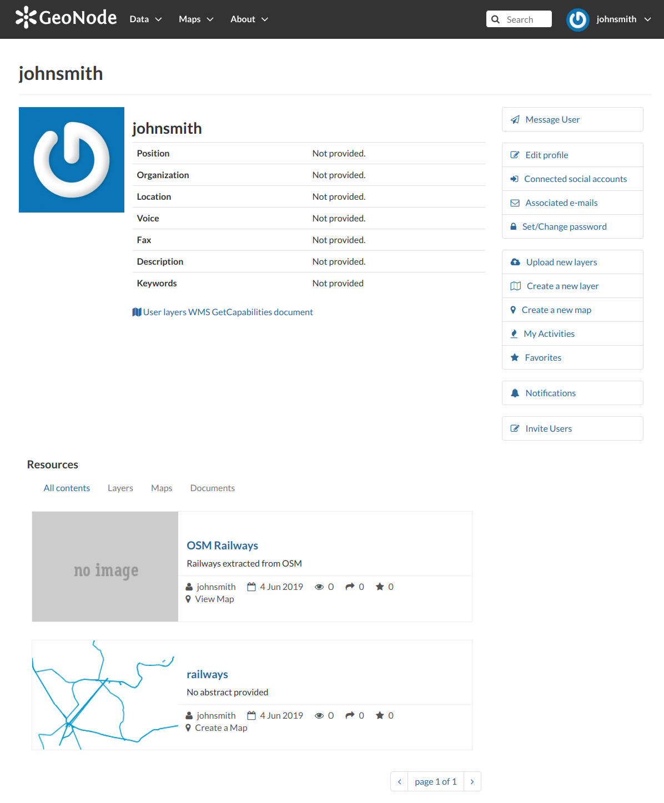
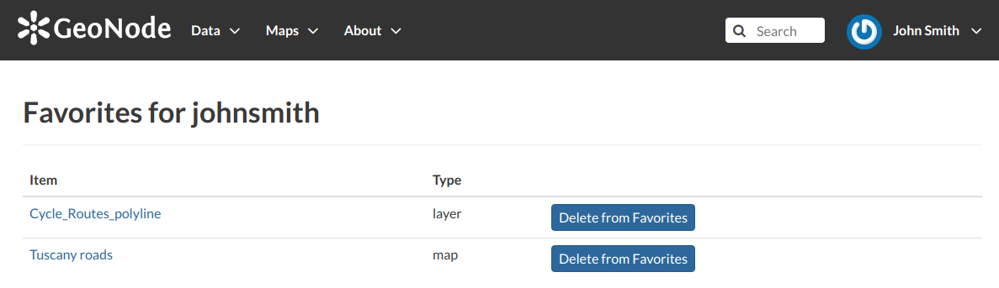
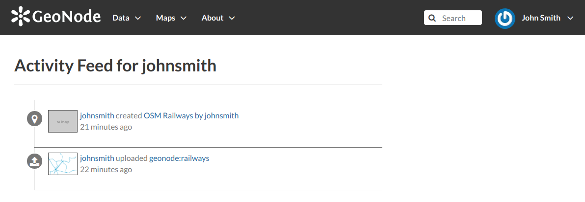

.. _editing-profile:

Updating the Profile
=====================

Once having an account you can enrich your profile with useful information, you can also edit or delete the existing ones.
You can connect the account with your social network, associate many e-mail addresses to it and manage many options such as preferences about notifications.

You can update these information anytime from your *Profile* page, it is accessible from the user menu.

So, click on your user name in the top right of the screen. A drop-down list will show. Click on :guilabel:`Profile` to enter the *Profile* settings page.

     *Link to your profile*

The *Profile* page looks like the one shown in the picture below.

     *User profile page*

Your personal information are shown under the username. At the bottom of the page are listed all the resources associated to your *Profile*, you can decide to view only layers or maps or documents by clicking on the corresponding tab.

Through the link ``User layers WMS GetCapabilities document`` you can retrieve an XML document with the list of the available layers.

On the right side of the page there are many useful links to edit personal information, to upload and create layers or maps, to update your *Profile* settings and to get in touch with other GeoNode users.

The :guilabel:`Favorites` link, also accessible from the user menu, drive you to the list of the resources marked as your favorites.

     *Favorites*

Click the :guilabel:`Delete from Favorites` button to remove the resource from the list.

The :guilabel:`My Activities` link allows to see all your recent activities on GeoNode such as layers uploading and maps creation.

     *Recent activities*

This link is also available in the user menu.

All other links and their functionalities will be described in depth in the following sections.

.. toctree::
    :maxdepth: 1

    editing_profile
    connecting_with_social
    associating_email
    managing_password
    notification_settings
