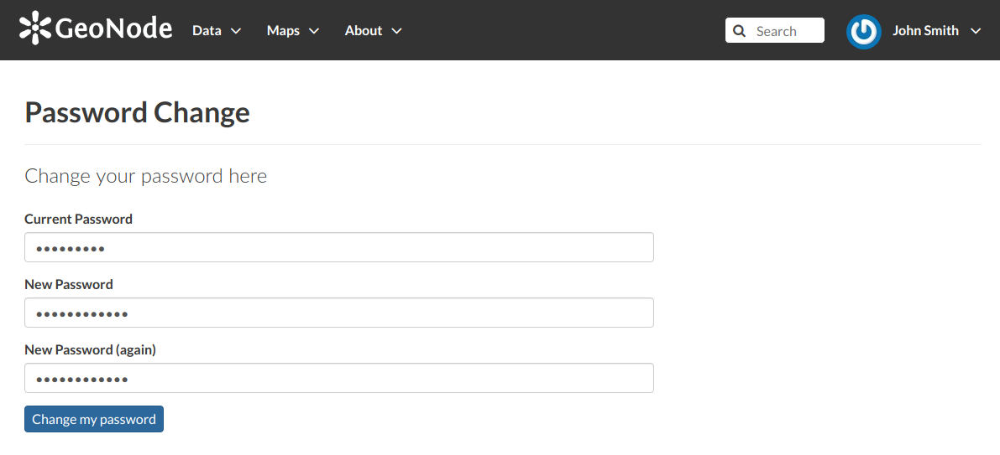

Managing the Password
=====================

To change your password, click on the :guilabel:`Set/Change password` link of the *Profile* page (see :ref:`editing-profile`).
You will be asked to enter your current password and the new one (two times). Click on :guilabel:`Change my password` to perform the change.

     *Change your password*

If no errors occur you will see a confirmation message.

.. figure:: img/change_password_confirm.png
     :align: center

     *Change password confirmation*

Next time you log in you will have to use the new password.
