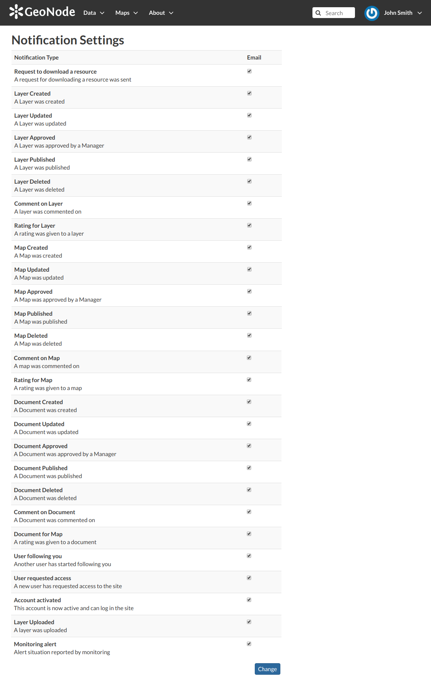

Setting Notification Preferences
================================

By default GeoNode sends notifications to the users for events that the users could be subscribe such as a new layer uploaded or a new rate added to a map.
You can adjust your notification settings by clicking on the :guilabel:`Notifications` link of the *Profile* page (see :ref:`editing-profile`).

.. note:: Make sure to have a verified email address to which notices can be sent. If not see :ref:`associating_emails`.

Now check/uncheck the notification types you wish to receive or not receive. It is possible to be notified for the events shown in the picture below.

     *Notifications settings*
