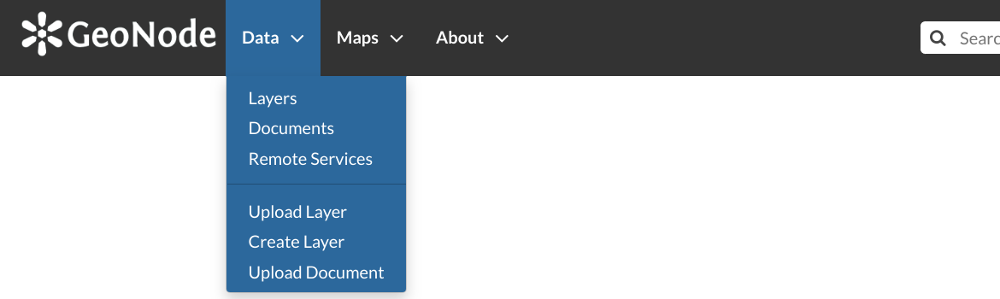
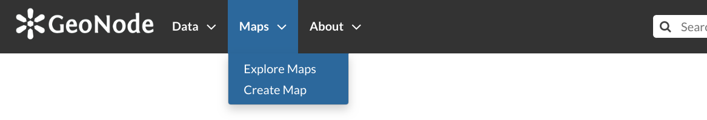

.. _data-types:

Data Types
==========

| GeoNode welcome page shows a variety of information about the current GeoNode instance.
| You can explore the existing data using many search tools and filters (see :ref:`finding-data`) or through the links of the navigation bar at the top of the page.
| There are three main types of resources that GeoNode can manage:

#. Documents
#. Layers
#. Maps

Documents and layers can be accessed from the :guilabel:`Data` menu of the navigation bar.

     *Data menu*

The :guilabel:`Maps` menu let you to manage maps.

    *Maps menu*

.. _document-data-type:

Documents
---------

| GeoNode allows to publish tabular and text data and to manage metadata and associated documents.
| Documents can be uploaded directly from your disk (see :ref:`uploading-documents` for further information).
| The following documents types are allowed: `.doc, .docx, .gif, .jpg, .jpeg, .ods, .odt, .odp, .pdf, .png, .ppt, .pptx, .rar, .sld, .tif, .tiff, .txt, .xls, .xlsx, .xml, .zip, .gz, .qml`.
| Through the document detailed page is possible to view, download and manage a document.

Layers
------

| Layers are a primary component of GeoNode.
| Layers are publishable resources representing a raster or vector spatial data source. Layers also can be associated with metadata, ratings, and comments.

| By clicking the Layers link you will get a list of all published layers. If logged in as an administrator, you will also see the unpublished layers in the same list.
| GeoNode allows the user to upload vector and raster data in their original projections using a web form.

Vector data can be uploaded in many different formats (ESRI Shapefile, KML and so on...). Satellite imagery and other kinds of raster data can be uploaded as GeoTIFFs.

Maps
----

| Maps are a primary component of GeoNode.
| Maps are comprised of various layers and their styles. Layers can be both local layers in GeoNode as well as remote layers either served from other WMS servers or by web service layers such as Google or MapQuest.

GeoNode maps also contain other information such as map zoom and extent, layer ordering, and style.

You can create a map based on uploaded layers, combine them with some existing layers and a remote web service layer, share the resulting map for public viewing.
Once the data has been uploaded, GeoNode lets the user search for it geographically or via keywords and create maps.
All the layers are automatically reprojected to web mercator for maps display, making it possible to use popular base maps such as `OpenStreetMap <https://www.openstreetmap.org>`_.
