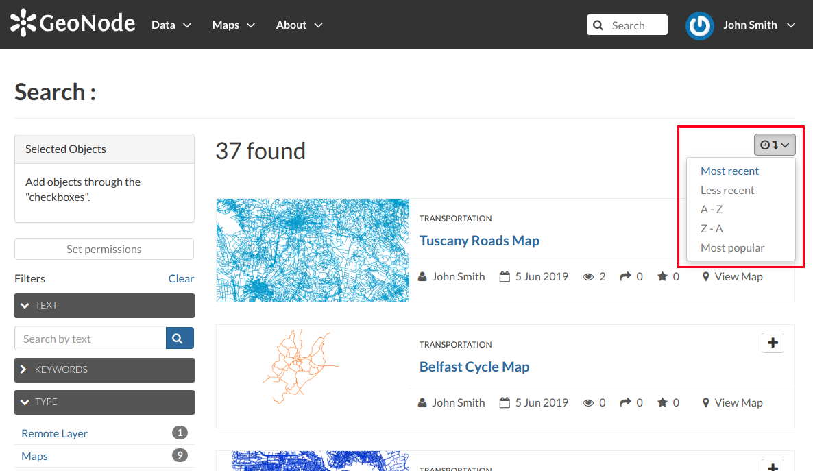

.. _finding-data:

Finding Data
============

| This section will guide you to navigate GeoNode to find layers, maps and documents by using different routes, filters and search functions.
| In *Home* page you can find some quick search tool.

The *Search* box in the navigation bar (see the picture below) let you type a text and find all the data which have to deal with that text.

     *Search tool in GeoNode welcome page*

When you trigger a search you are brought to the *Search* page which shows you the search result through all data types.

     *The Search page*

| This page contains a wealth of options for customizing a search for various information on GeoNode. This search form allows for much more fine-tuned searches than the simple search box is available at the top of every page.
| It is possible to search for data by Text, Categories, Type, Keywords, Owners, Date, Regions or Extent.

Try to set some filter and see how the resulting data list changes accordingly. An interesting type of filter is *EXTENT*: you can apply a spatial filter by moving or zooming a map within a box as shown in the picture below.

.. figure:: img/search_filter_by_extent.png
     :align: center

     *Search filter by EXTENT*

Data can be ordered by date, name and popularity.

     *Ordering Data*

The GeoNode welcome page offers you many other options to find resources.

* The *Search for data* tool allows you to search for data by name.

  .. figure:: img/welcome_search_data.png
      :align: center

      *Searching for data*

  The *Search* page, which you will be redirected to, will have the TEXT filter already set with the name you have typed in the search box (see the picture below).
  If you want to reach the *Search page* directly, without any input text, you can click the :guilabel:`Advanced Search` link.

  .. figure:: img/search_for_data_result.png
     :align: center

     *Results of searching made by name*

* In the *Home* page section shown below are listed all the categories available in the GeoNode instance you are using. You can search for data by category by clicking on it.

  .. figure:: img/search_datasets_by_category.png
     :align: center

     *Searching for datasets by category*

  In the *Search* page, data will be filtered by that category.

  .. figure:: img/search_by_category_result.png
     :align: center

     *Results of searching made by category*

* | The *Featured Datasets* section (see the picture below) shows you aggregate data about *Layers*, *Maps*, *Documents* and *Users*. You can trigger a search on layers by clicking on the *Layers* icon, the same happens for *Maps*, *Documents* and *Users*. The :guilabel:`Explore all datasets` drive you to the *Search* page with no filter on data types.
  | In this section there are also useful quick links to add new resources: the :guilabel:`Add layers` drives you to the layer uploading page, the :guilabel:`Add documents` to the document uploading page and the :guilabel:`Create maps` guide you to the map creation.

  .. figure:: img/featured_datasets.png
    :align: center

    *Featured Datasets*

  For each data type GeoNode makes available an individual *Search* page, the next paragraphs will explain that in depth.
  For *Users* see :ref:`user-info`.

.. _finding-documents:

Documents
---------

When you are searching for *Documents* you can:

* use the *Documents* quick link of the *Featured Datasets* section as described above

* click on the :guilabel:`Documents` link of the :guilabel:`Data` menu in the navigation bar

  .. figure:: img/documents_link.png
     :align: center

     *Link for Documents*

The *Documents* search page looks like the generic one but only *Document* is considered as data type. You can filter documents by CATEGORIES, as in the example below, or by TEXT, KEYWORDS and so on.
You can also use more than one filter at the same time.

   *Documents filtered by categories*

.. _finding-layers:

Layers
------

To find *Layers* you can:

* use the *Layers* quick link of the *Featured Datasets*

* click on the :guilabel:`Layers` link of the :guilabel:`Data` menu in the navigation bar

  .. figure:: img/layers_link.png
     :align: center

     *Link for Layers*

| In the *Layers* search page only *Layer* will be considered as data type. You can set one or more filter to refine the search. In the example below the layers have been filtered by EXTENT and CATEGORIES.

.. figure:: img/filtering_layers.gif
   :align: center

   *Layers filtered by extent*

.. _finding-maps:

Maps
----

If you are searching for *Maps* you can:

* use the *Maps* quick link of the *Featured Datasets* section as described above

* click on the :guilabel:`Explore Maps` link of the :guilabel:`Maps` menu in the navigation bar

  .. figure:: img/maps_link.png
     :align: center

     *Link for Maps*

As seen for the other data types, the *Maps* search page allows you to filter your maps by a combination of criteria. The example below shows maps filtered by REGIONS.

   *Maps filtered by regions*
