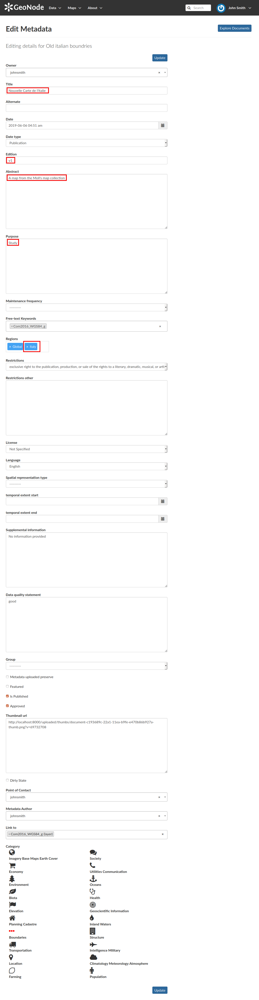

.. _document-editing:

Document Editing
================

The :ref:`document-info` page makes available useful tools for document editing. Click on the :guilabel:`Edit Document` button to see what you can do to make changes. The picture below shows you the *Editing Panel* that will appear on the screen.

.. figure:: img/document_editing_panel.png
    :align: center

    *Document Editing panel*

You can *Replace* the document file with another one by clicking on :guilabel:`Replace`. It will drive you to the *Document Upload* page (see :ref:`uploading-documents`) where you can upload a new file.

The :guilabel:`Remove` button allows you to delete the document. You will have to confirm that choice.

    *Document Removal confirmation*

The *Editing Panel* shows you also some links for editing the metadata and the thumbnail. These actions will be explained more in depth in the next paragraphs.

Setting the Document Thumbnail
------------------------------

From the *Editing Panel*, it is also possible to *Set the Thumbnail* of the document. Click on :guilabel:`Set` to open the *Thumbnail Uploading* page and chose the image that will illustrate your document. You can either drag and drop it in the *Drop files here* box or selecting from your folders by clicking on *Choose Files*. Once this is done, click on the red button :guilabel:`Upload files`. If the thumbnail has been successfully uploaded you can see it by coming back to the document list. Click on the :guilabel:`Explore Documents` button to check that.

.. figure:: img/document_uploading_thumbnail.png
    :align: center

    *Upload Document's Thumbnail*

If no errors occur the following message will be shown.

.. figure:: img/document_uploading_thumbnail_success.png
    :align: center

    *Uploading success*

Editing the Document Metadata
-----------------------------

You can edit the metadata of your document through the buttons shown in the red rectangle in below picture.

.. figure:: img/document_metadata_editing_buttons.png
    :align: center

    *Editing Metadata*

| The :guilabel:`Wizard` button drive you to the wizard described in the :ref:`document-metadata` section. The :guilabel:`Advanced Edit` button takes you to a big form where all the available metadata of the document can be edited.
| Some information are mandatory such as the *Title* or the *Category* the document belongs to, some others are optional.

    *Editing Metadata*

In the example shown in the picture above, the information inside the red rectangles have been changed. To save the changes click on :guilabel:`Update`, you will be redirected to the document page.
