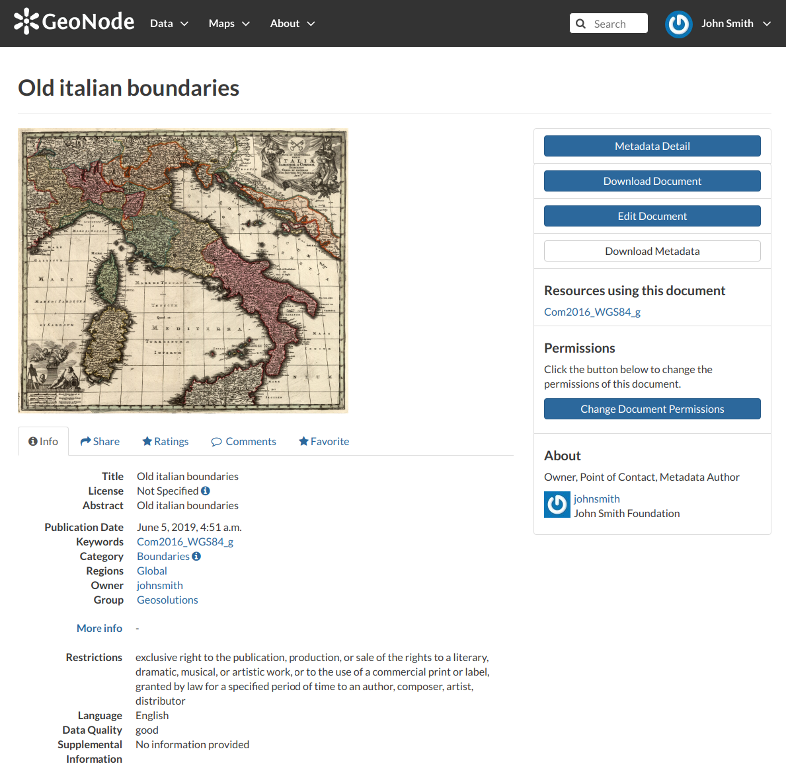
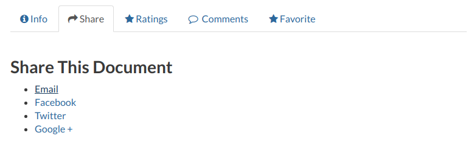
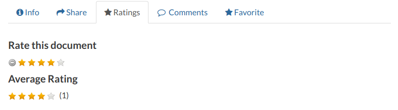
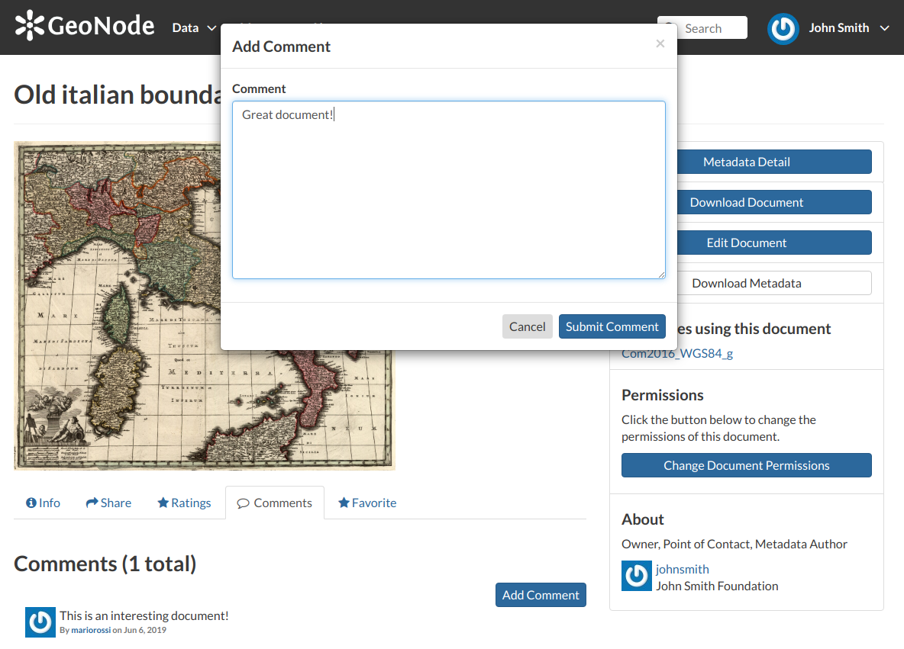
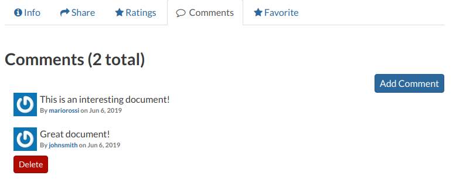
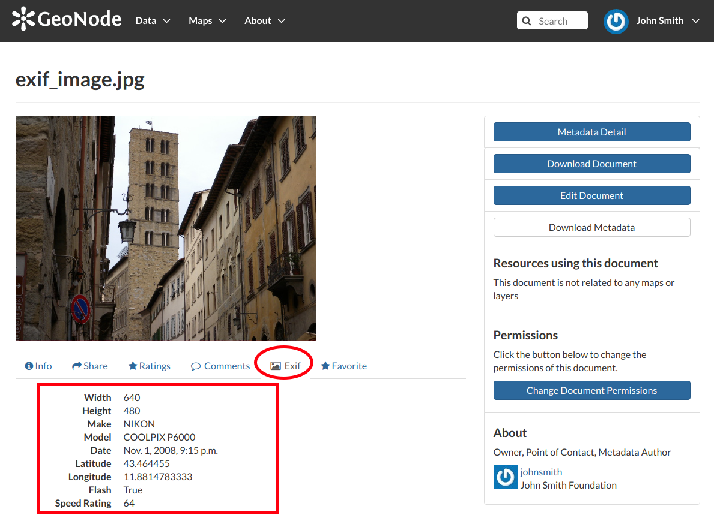
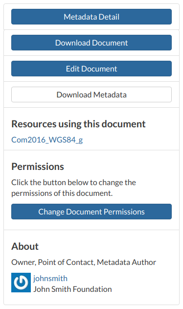
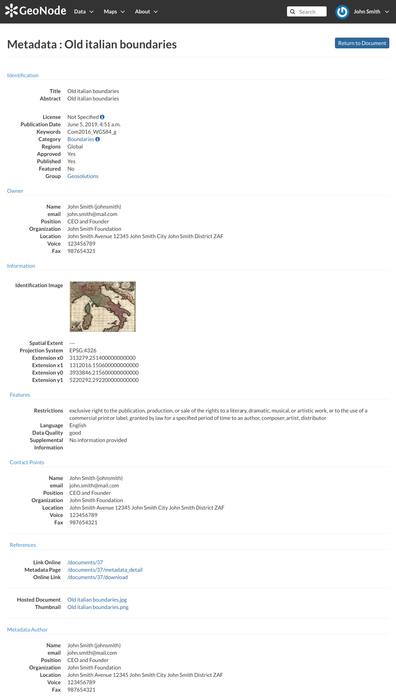

.. _document-info:

Document Information
====================

From the *Documents Search Page* (see :ref:`finding-documents`) you can select the document you are interested in and see some basic information about it. You can access the document details page by clicking on its name.
That page looks like the one shown in the picture below.

    *Document Information page*

On the page of a document, the resource is either directly displayed on the page or accessible by clicking on the link provided under the title.

Exploring the Tabs Sections
---------------------------

There is a *Tab Section* below the document, where you can first view *Info* about the document.

The **Info Tab** section shows the document metadata such as its title, abstract, date of publication etc. The metadata also indicates the user who is responsible for uploading and managing this content, as well as the group to which it is linked.

The **Share Tab** provides the social media links for the document to share. There is also a link to share the document through email.

    *Document Sharing*

You can **Rate** the document through the *Ratings system*.

    *Rate the Document*

In the **Comments Tab** section you can post your comment. Click on :guilabel:`Add Comment`, insert your comment and click :guilabel:`Submit Comment` to post it.

    *Document Comments*

Your comment will be added next to the last already existing comment. If you want to remove it click on the red :guilabel:`Delete` button.

    *Your Comment*

If you want this document in your *Favorites* (see :ref:`editing-profile`), open the **Favorite Tab** and click on :guilabel:`Add to Favorites`.

.. figure:: img/favorite_document.png
    :align: center

    *Your Favorite Comment*

GeoNode also supports the *EXIF (EXchangeable Image Format)* for ``jpeg`` and ``tiff`` image documents.
The *EXIF* means that additional information (metadata) are stored within the image, so GeoNode allows you to see those information in the **Exif Tab**.

    *The EXIF tab*

The Tools Section
-----------------

On the right side of the *Document Page* you can see other useful information such as the links to the resources linked to the document, the document *Owner*, the *Point of Contact* and the *Metadata Author*.

    *Document useful tool*

In the same section of the *Document Page* you can find the following useful tool:

* :guilabel:`Metadata Detail` to explore in detail the document metadata (see the next paragraph)
* :guilabel:`Download Document` to download the document
* :guilabel:`Edit Document` to change the document metadata, replace the file etc (see :ref:`document-editing`)
* :guilabel:`Download Metadata` to download the whole set of metadata in various formats

  .. figure:: img/document_metadata_download.png
      :align: center

      *Document Metadata download*

* :guilabel:`Change Document Permissions` to assign permissions on the document to users and groups (see :ref:`edit-document-permissions`).

Exploring Metadata Details
--------------------------

When clicking on the :guilabel:`Metadata Detail` button the *Metadata Details Page* will open.

    *Document Metadata Details page*

| It displays the whole set of available metadata about the document.
| Metadata are grouped in order to show the following types of information:

* *Identification* to uniquely identify the document
* *Owner*, the user who own the document
* *Information*, the identification image, the Spatial Extent, Projection System and so on
* *Features*, Restrictions, Language and so on
* *Contact Points*, the user available to have a contact
* *References*, various links to the resource information
* *Metadata Author*, the metadata author information
