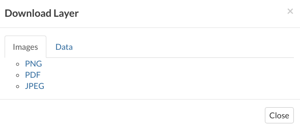
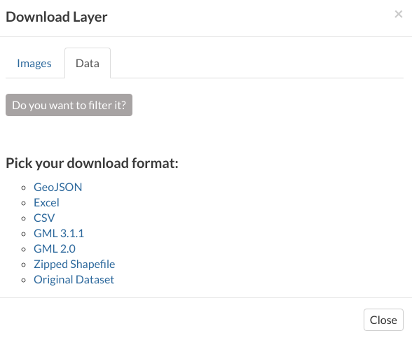
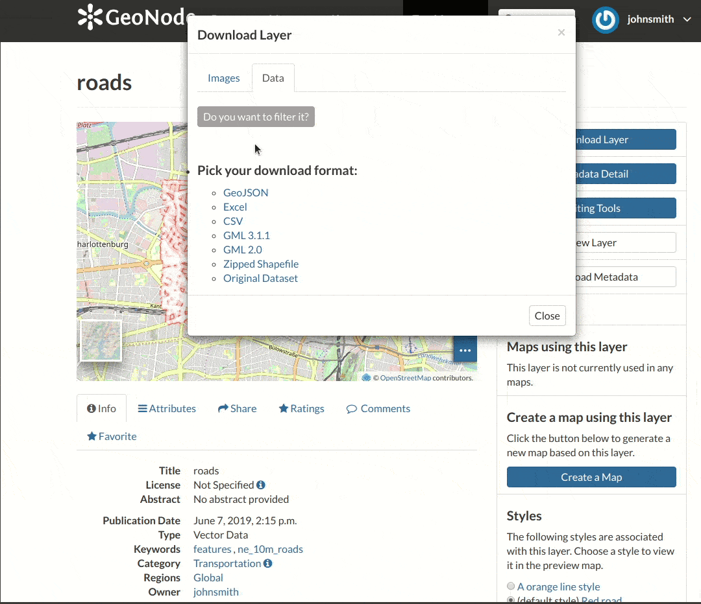

.. _layer-download:

Downloading Layers
==================

| At the top of the *Layer Page* there is the :guilabel:`Download Layer` button (see :ref:`layer-info`). It provides access to the ability to extract geospatial data from within GeoNode.
| You will see a list of options of the supported export formats. You can choose the *Images* formats ``PNG``, ``PDF``, ``JPEG`` if you want to save a "screenshot-like" image of the layer.

     *Downloading Layers as Images*

You can also download the layer data, the supported export formats will be listed in the *Data* tab. Click on your desired format to trigger the download.

     *Downloading the Layer Data*

As shown in the image above, GeoNode allows you to download a subset of data. Click on :guilabel:`Do you want to filter it?` to filter the layer data before the download.

     *Downloading the Layer Data*
