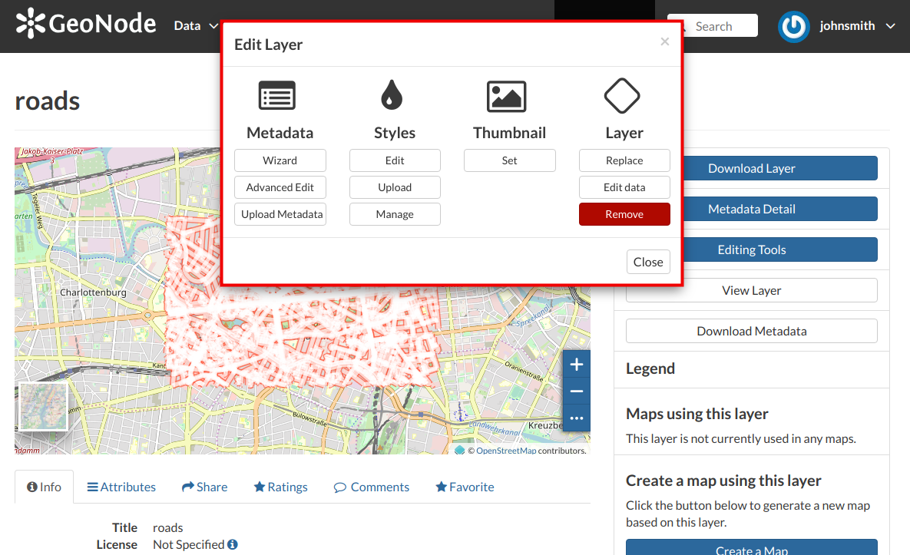
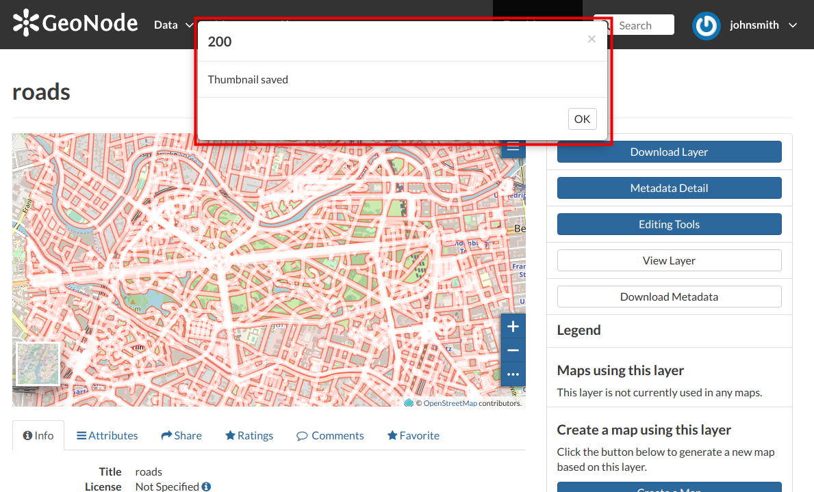
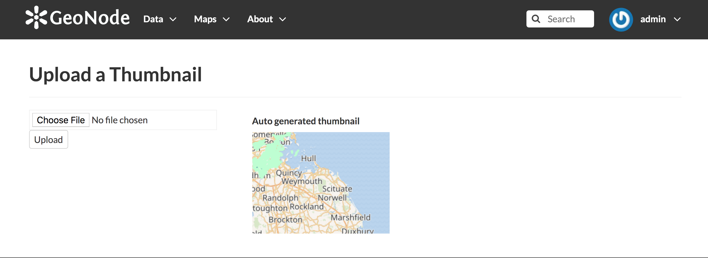
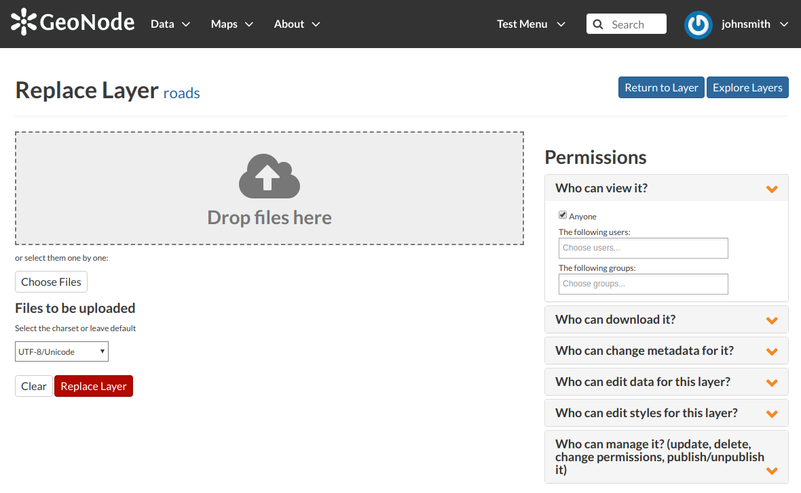
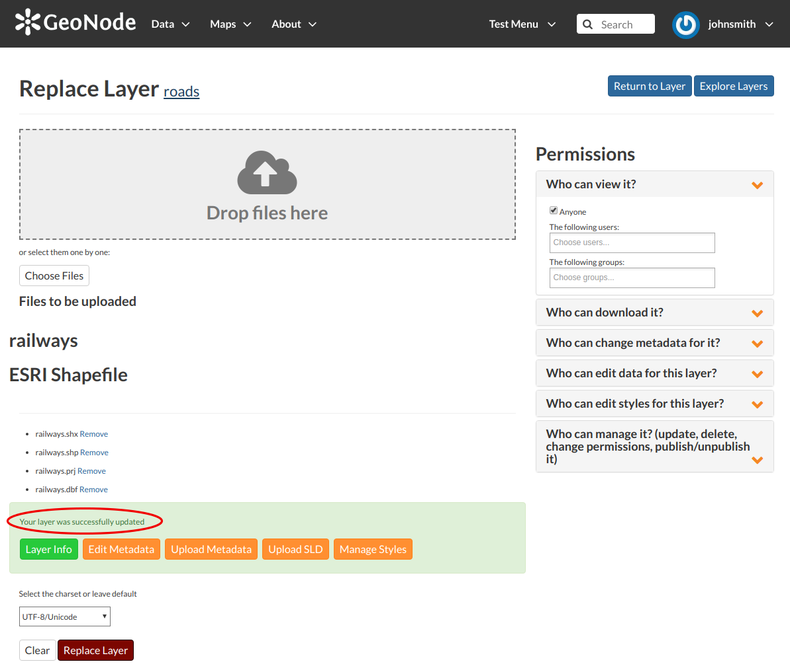
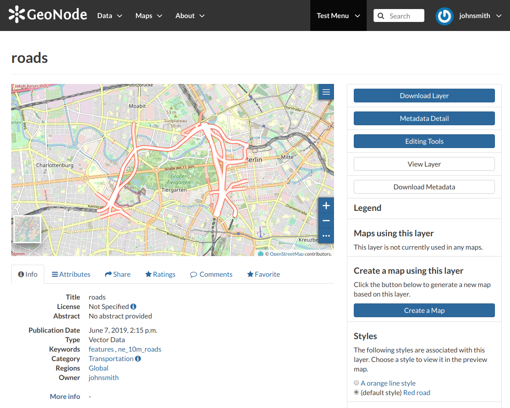
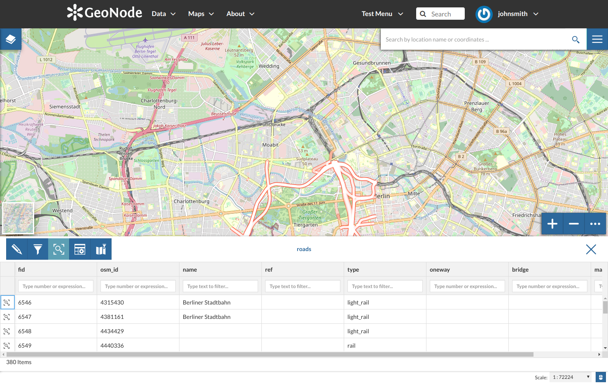
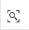

.. _layer-editing:

Layer Editing
=============

The :guilabel:`Editing Tools` button of the *Layer Page* (see :ref:`layer-info`) opens a panel like the one shown in the picture below.

     *The Layer Editing panel*

In that panel you can see many options grouped by four categories:

1. *Metadata*
2. *Styles*
3. *Thumbnail*
4. *Layer*

In this section you will learn how to edit a *Layer*, how to replace and edit its data. See :ref:`layer-metadata` to learn how to explore the layer *Metadata*, how to upload and edit them. The *Styles* will be covered in a dedicated section, see :ref:`layer-style`.

Setting the Layer Thumbnail
---------------------------

| The Thumbnail of the layer that will be displayed on the *Layers* list page can be changed by dragging and zooming on the layer preview to select which portion will be displayed, then by clicking on the :guilabel:`Set` button of the *Layer Editing* panel.
| A message will confirm the thumbnail has been correctly changed.

     *The Layer Editing panel*

It is also possible to manually upload a thumbnail by using the :guilabel:`Upload` button of the *Layer Editing* panel.
Using the "Upload Thumbnail" page it is possible to enable the automatically generated thumbnail or upload an image to be used in place of it.

     *The Upload Thumbnail panel*

Replacing the Layer
-------------------

From the *Layer Editing* panel click on :guilabel:`Replace` to change the layer source dataset. You will be driven to the *Replace Layer* page in which :guilabel:`Choose Files` button allows you to select files from your disk.

     *Replace a Layer*

Once the *Charset* selected the upload process can be triggered by clicking on :guilabel:`Replace Layer`. If no errors occur you will see a message like the one in the picture below.

     *Replace Layer success*

We have replaced the *roads* dataset with the *railways* one. You can see the differences in the *Layer Preview*.

     *Result of the Layer Replacement*

.. _layer-data-editing:

Editing the Layer Data
----------------------

The :guilabel:`Edit data` button of the *Layer Editing* panel opens the *Layer* within a *Map*.

     *Editing the Layer Data*

The *Attribute Table* panel of the *Layer* will automatically appear at the bottom of the *Map*. In that panel all the features are listed. For each feature you can zoom to its extent by clicking on the corresponding *magnifying glass* icon |magnifying_glass_icon| at the beginning of the row, you can also observe which values the feature assumes for each attribute.

Click the *Edit Mode* |edit_mode_button| button to start an editing session.

.. |edit_mode_button| image:: img/edit_mode_button.png
     :width: 30px
     :height: 30px
     :align: middle

Now you can:

* *Add new Features*

  Through the *Add New Feature* button |add_new_feature_button| it is possible to set up a new feature for your layer.
  Fill the attributes fields and click |save_changes_button| to save your change.
  Your new feature doesn't have a shape yet, click on |add_shape_to_geometry_button| to draw its shape directly on the *Map* then click on |save_changes_button| to save it.

  .. |add_new_feature_button| image:: img/add_new_feature_button.png
       :width: 30px
       :height: 30px
       :align: middle

  .. |save_changes_button| image:: img/save_changes_button.png
      :width: 30px
      :height: 30px
      :align: middle

  .. |add_shape_to_geometry_button| image:: img/add_shape_to_geometry_button.png
       :width: 30px
       :height: 30px
       :align: middle

  .. figure:: img/add_new_feature.gif
       :align: center

       *Add a New Feature to the Layer*

  .. note:: When your new feature has a multi-vertex shape you have to double-click the last vertex to finish the drawing.

* *Delete Features*

  If you want to delete a feature you have to select it on the *Attribute Table* and click on |delete_feature_button|.

  .. |delete_feature_button| image:: img/delete_feature_button.png
       :width: 30px
       :height: 30px
       :align: middle

  .. figure:: img/delete_feature.gif
       :align: center

       *Delete a Feature*

* *Change the Feature Shape*

  You can edit the shape of an existing geometry dragging its vertices with the mouse. A blue circle lets you know what vertex you are moving.

  .. figure:: img/edit_feature_shape.gif
       :align: center

       *Feature Shape Editing - Change the existing shape*

  Features can have *multipart shapes*. You can add parts to the shape when editing it.

  .. figure:: img/add_shape_to_existing_geometry.gif
      :align: center

      *Feature Shape Editing -  Add parts to the existing shape*

* *Change the Feature Attributes*

  When you are in *Edit Mode* you can also edit the attributes values changing them directly in the corresponding text fields.

  .. figure:: img/edit_feature_attributes.gif
       :align: center

       *Feature Attributes Editing*

Once you have finished you can end the *Editing Session* by clicking on the |end_editing_session_button| button.

By default the GeoNode map viewer is `MapStore <https://mapstore2.geo-solutions.it/mapstore/#/>`_ based, see the `MapStore Documentation <https://mapstore2.readthedocs.io/en/latest/>`_ for further information.
