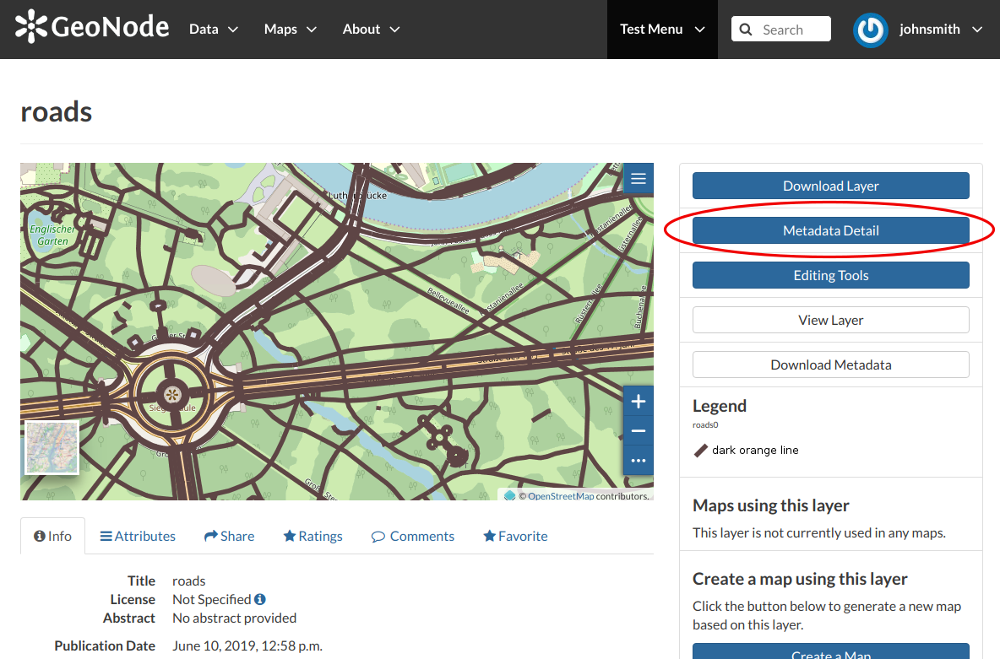
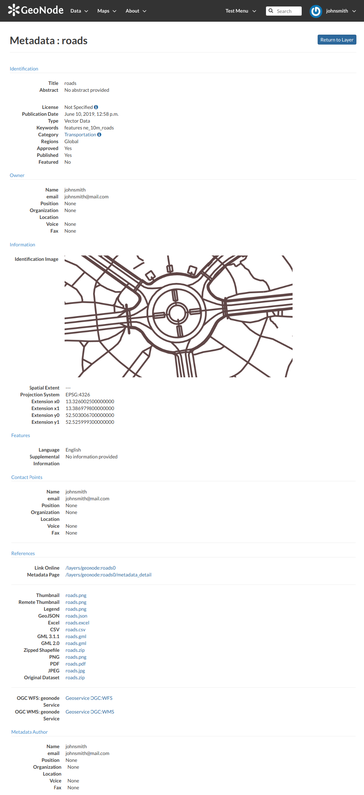
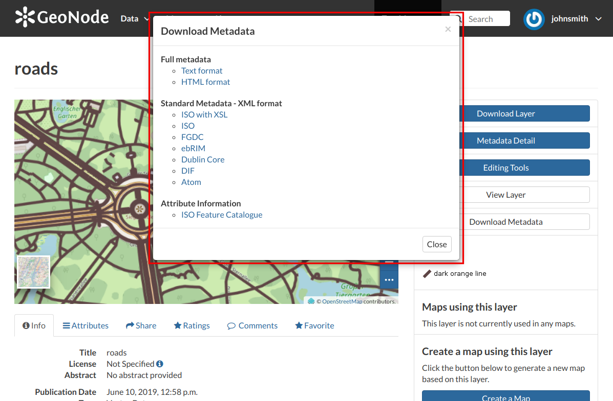
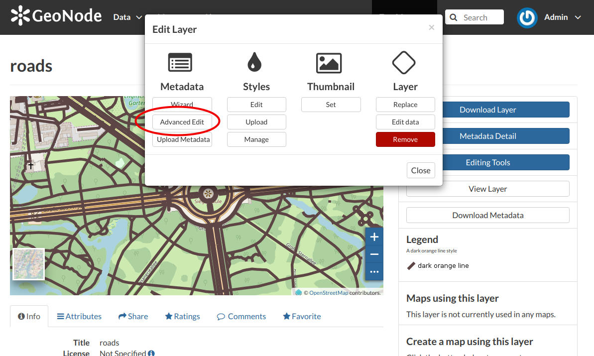
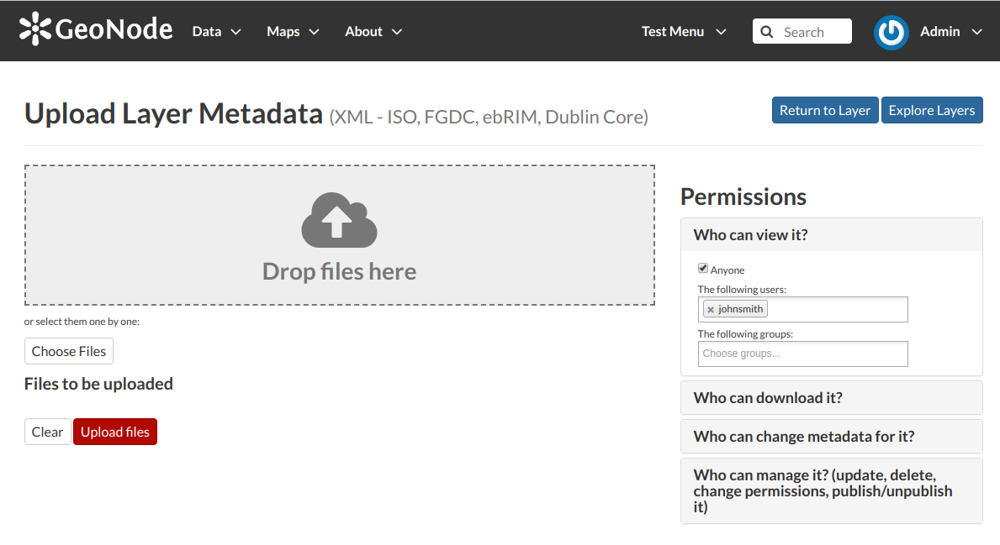

.. _layer-metadata:

Layers Metadata
===============

In GeoNode special importance is given to *Metadata* and their standard formats.
You can explore the *Metadata* of a *Layer* by clicking the :guilabel:`Metadata Detail` button from the *Layer Page*.

    *The Layer Metadata Detail button*

The *Layer Metadata* page will be displayed.

    *The Layer Metadata Details*

In that page you can see the whole set of available metadata about the layer.
Metadata are grouped in order to show the following types of information:

    * *Identification* to uniquely identify the layer (Title, Abstract, Publication Date etc.);
    * *Owner*, the user who owns the layer;
    * *Information*, the Identification Image, the Spatial Extent, Projection System and so on;
    * *Features*, Language, Supplemental and other Information;
    * *Contact Points*, the available user to get in contact;
    * *References*, various links to the resource information and data;
    * *Metadata Author*, information about the author of the metadata.

Downloading Metadata
--------------------

The :guilabel:`Download Metadata` button of the *Layer Page* allows you to download the layer metadata in various formats.

   *How to Download Metadata*

The available download formats are grouped in three categories:

* *Full metadata*
* *Standard Metadata - XML format*
* *Attribute Information*

Click on the format name that you prefer to start the download.

Metadata Wizard
---------------

| Metadata contains all the information related to the layer. They provide essential information for its identification and its comprehension. Metadata also make the layer more easily retrievable through search by other users.
| The *Metadata* of a layer can be changed through a *Wizard* which involves four steps, one for each type of metadata considered:

* *Basic Metadata*

  The first two steps are mandatory (no layers will be published if the required information are not provided) whereas the last two are optional.

  .. figure:: img/basic_layer_metadata.png
      :align: center

      *Basic Layer Metadata*

  In the first step the system asks you to insert the following metadata:

  * The *Thumbnail* of the layer (click :guilabel:`Edit` to change it);
  * The *Title* of the layer, which should be clear and understandable;
  * An *Abstract* on the layer;
  * The *Creation/Publication/Revision Dates*  which define the time period that is covered by the layer;
  * The *Keywords*, which should be chosen within the available list. The contributor search for available keywords by clicking on the searching bar, or on the folder logo representing, or by entering the first letters of the desired word;
  * The *Category* which the layer belongs to;
  * The *Group* which the layer is linked to.

* *Location and Licenses*

  .. figure:: img/location_licenses_layer_metadata.png
      :align: center

      *Location and Licenses Metadata for Layers*

  The following list shows what kinds of metadata you are required to enter (see also the picture below):

  * The *Language* of the layer;
  * The *License* of the dataset;
  * The *Regions*, which informs on the spatial extent covered by the layer. Proposed extents cover the following scales: global, continental, regional, national;
  * The *Data Quality statement* (general explanation of the data producer's knowledge about the lineage of a dataset);
  * Potential *Restrictions* on layer sharing.

* *Optional Metadata*

  .. figure:: img/optional_layer_metadata.png
      :align: center

      *Optional Layer Metadata*

  Complementary information are:

  * The *Edition* to indicate the reference or the source of the layer;
  * The *Purpose* of the layer and its objectives;
  * Any *Supplemental information* that can provide a better understanding of the uploaded layer;
  * The *Maintenance frequency* of the layer;
  * The users who are *Responsible* for the layer, its *Owner*, and the *Author* of its metadata;
  * The *Spatial representation type* used.

* *Dataset Attributes*

  .. figure:: img/dataset_attributes_layer_metadata.png
      :align: center

      *Dataset Attributes Metadata for Layers*

  At this step you can enrich the dataset attributes with useful information like the following:

  * The *Label* displayed
  * A detailed *Description*
  * The *Display Order*

Use :guilabel:`next >>` or :guilabel:`<< back` to navigate through those steps. Once you have finished click on :guilabel:`Update`.

Some metadata are mandatory, if you miss any of that metadata the *Completeness* bar shows you a red message like the one in the picture below.

.. figure:: img/completeness_progress_bar.png
    :align: center
    :width: 200px

    *Completeness Progress Bar*

Metadata Advanced Editing
-------------------------

In the *Layer Editing* panel the :guilabel:`Advanced Edit` is also available.

    *The Advanced Edit button*

Click on it to display the *Metadata Advanced Editing Page*. That page allows you to edit all the layer metadata described in the previous paragraph. Once you have finished to edit them click on :guilabel:`Update` to save your changes.

Uploading Metadata
------------------

Users may also upload a metadata XML document (in ISO, FGDC, or Dublin Core format) to fill in key GeoNode metadata elements automatically.
The picture below shows you how the page looks like.

    *The Metadata Advanced Editing page*

Click on :guilabel:`Choose Files` to select the document from your disk, then click on :guilabel:`Upload files` to trigger the uploading process.
