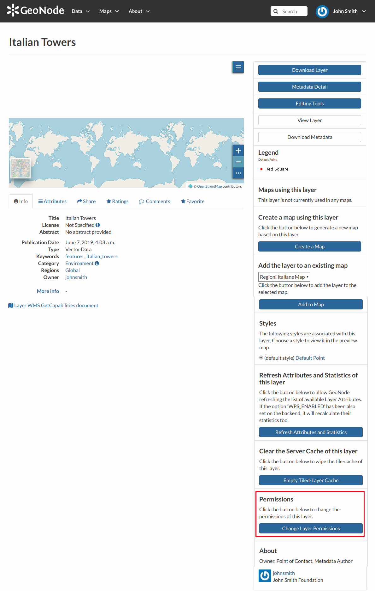
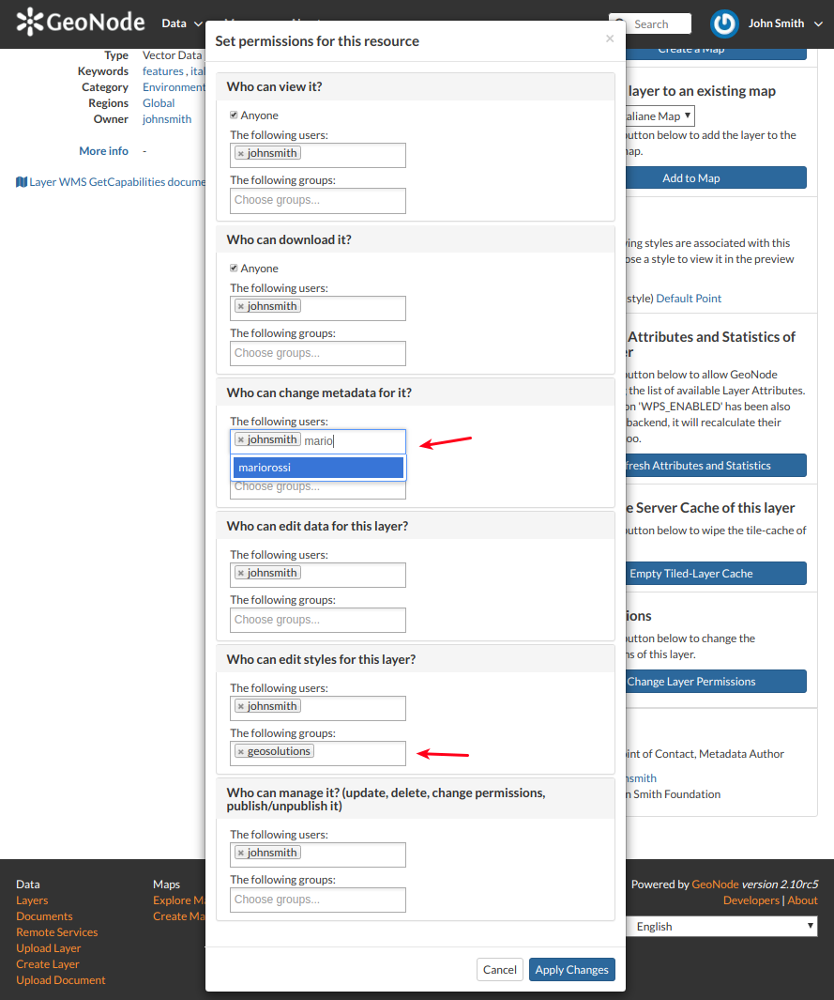

.. _layer-permissions:

Changing the Layer Permissions
==============================

When creating or uploading a new Layer you have to set who can view, download, edit and manage that Layer. By default only owners can edit and manage layers, anyone can view and download them.

In order to modify the Layer *Permissions* settings you have to click the :guilabel:`Change the Layer Permissions` button in the Layer page.

    *Change Layer Permissions*

Through the *Permissions Settings Panel* you can add or remove permissions for users and groups. The picture below shows an example.

    *Layer Permissions settings for users and groups*

You can set the following types of permissions:

* *View* allows to view the layer;
* *Download* allows to download the layer;
* *Change Metadata* allows to change the layer metadata;
* *Edit Data* allows to change attributes and properties of the layers features;
* *Edit Style* allows to change the layer style;
* *Manage* allows to update, delete, change permissions, publish and unpublish the layer.

.. warning:: When assigning permissions to a group, all the group members will have those permissions. Be careful in case of editing permissions.

Click on :guilabel:`Apply Changes` to save these settings.
