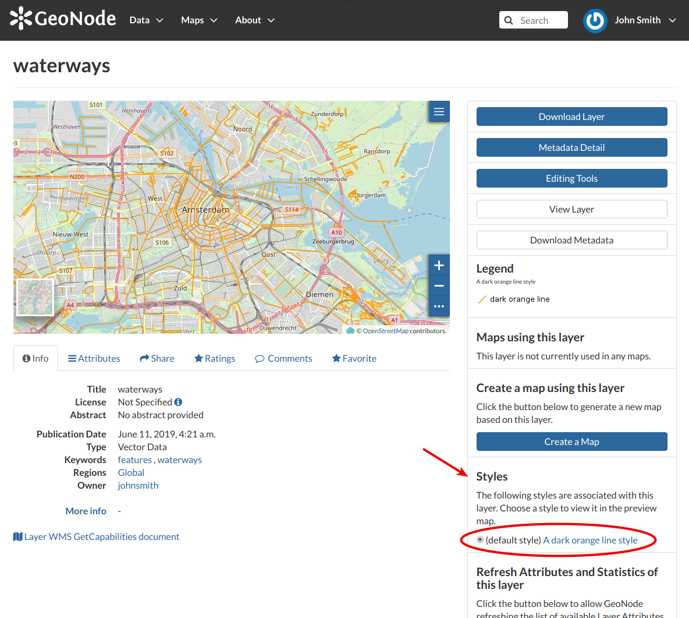
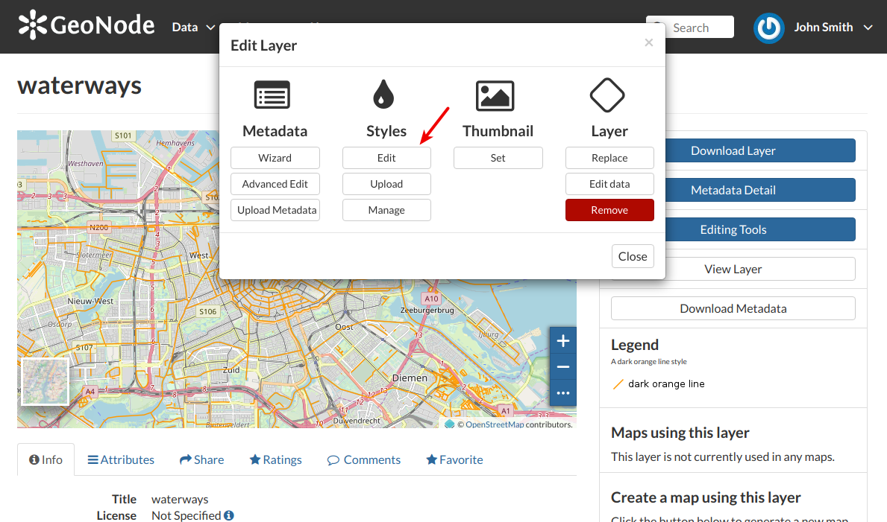
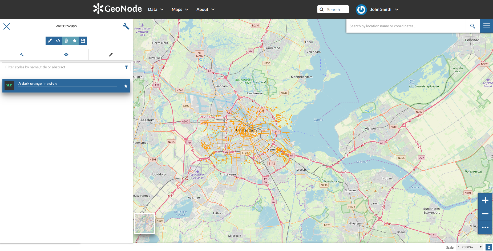
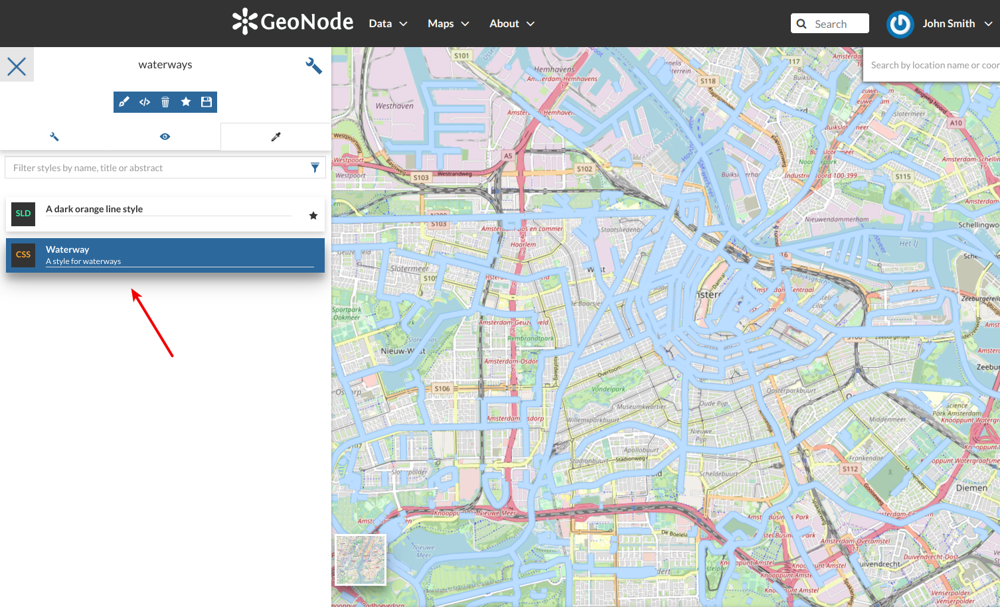
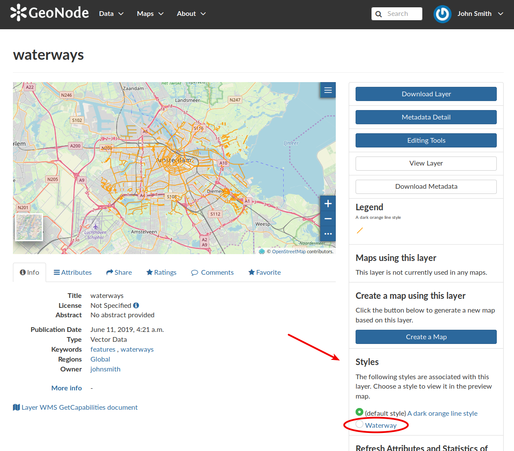
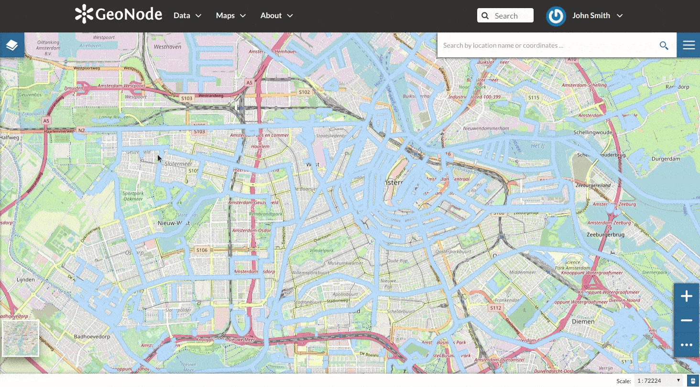
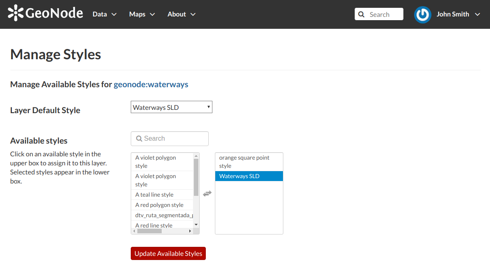

.. _layer-style:

Layer Styling
=============

Maps are helpful because they allow you gain a deeper understanding of your data by allowing you to visualize it in many different ways.
So you can tell different stories depending on how the data is presented.
For any given data or layer, you should explore different styling options and choose the best style for that.

In GeoNode each layer has a *Default Style* which is determined by the nature of the data you're mapping. When uploading a new layer (see :ref:`uploading-layers`) a new default style will be associated to it.

     *Default Style for Layers*

Referring to the example above, dark orange lines are not very good to represent waterways so we would need to change this style. In the following paragraphs you will learn how to create a new style starting from given templates, how to edit a style, how to upload styles from file and how to manage them.

Creating new Styles
-------------------

In order to create a new style, open the *Layer Page* (see :ref:`layer-info`) and click on :guilabel:`Editing Tools`. Then click the :guilabel:`Edit` button in the *Styles* section of the *Layer Editing* panel (see the picture below).

     *Edit Styles button*

The *Layer* will open in a new *Map*. The *Styles Panel* will show you all the available styles for the layer and some useful tools.

     *The Styles Panel in the Map*

Now follow the steps below:

1. Click the |create_new_style_button| button. The *Style Templates Panel* will open.

  .. |create_new_style_button| image:: img/create_new_style_button.png
       :width: 30px
       :height: 30px
       :align: middle

  .. figure:: img/create_new_style_from_templates.png
       :align: center

       *Create new Styles*

2. Choose a *Style Template* from the list (both *CSS* and *SLD* styles are available).

  .. figure:: img/style_templates.png
       :align: center

       *Style Templates*

3. Click the |add_style_button| button to add the *Style Template* to the styles list.

  .. |add_style_button| image:: img/add_style_button.png
       :width: 30px
       :height: 30px
       :align: middle

4. Insert a *Title* and an *Abstract* (optional), then click on :guilabel:`Save`.

  .. figure:: img/new_style_title.png
      :align: center
      :width: 300px

      *Title and Abstract for new Styles*

The style you have created is now added to the *Styles List*.

    *New Styles into the list*

You will also see this new style in the *Layer Page*.

    *The Layer Page with the new Style*

Now you can switch the style by clicking on the corresponding checkbox.

It would be nice to change the style in order to decrease the opacity of the filling color as well as to reduce the lines width.
The embedded `MapStore <https://mapstore2.geo-solutions.it/mapstore/#/>`_ makes available a powerful *Style Editor* to accomplish that tasks. In the next paragraph we will explain how.

Editing the Layer Style
-----------------------

The following steps show you how to edit styles:

.. |layer_settings_button| image:: img/layer_settings_button.png
    :width: 30px
    :height: 30px
    :align: middle

.. |set_style_as_default_button| image:: img/set_style_as_default_button.png
    :width: 30px
    :height: 30px
    :align: middle

1. From inside the map open the *TOC (Table Of Content)* by clicking the |toc_button| button
2. Click on |layer_settings_button|
3. Open the *Style* tab |style_tab|

  .. warning:: Styles editing is allowed only to those users who have the needed permission. See :ref:`layer-permissions` to read more)

4. Select the *Style* and click on |style_editor_button|
5. Edit the style. The *Style Editor* helps you to write valid styles through the *Syntax Validator* which shows you a popup in case of errors (see the picture below).

  .. figure:: img/style_editor_syntax_validator.png
      :align: center

      *The Style Editor Syntax Validation*

6. Click on |save_style_button| to save your changes.

See the following gif to recap the whole process.

    *The Style Editor*

| You can also decide to make your new style the *Default Style* of that layer. Click on |set_style_as_default_button| to do that.
| Click on |delete_style_button| to delete the style.

Uploading Styles
----------------

In GeoNode it is also possible to upload an existing style from file.

.. warning:: Currently only styles in **SLD (Style Layer Descriptor 1.0, 1.1)** format can be uploaded in GeoNode.

From the *Layer Page* click on *Editing Tools* to open the *Editing Tools* panel and follow the steps below:

1. Click the :guilabel:`Upload` button of the *Styles* section

  .. figure:: img/upload_style_button.png
      :align: center
      :width: 400px

      *Upload Styles button*

2. Click on :guilabel:`Choose Files` and select your style from your disk

  .. figure:: img/upload_styles.png
      :align: center

      *Upload Styles*

3. Click on :guilabel:`Upload files`

Once the process has been finished the new *Style* will be visible in the *Layer Page*.

Managing Styles
---------------

Given a layer, you can manage all its styles in tha *Styles Management Page* accessible from the :guilabel:`Manage` button of the *Layer Editing* panel.

    *Managing Styles*

In that page you can:

* See the *Layer Name*
* Add/remove styles to/from the *Available styles* list
* Choose the *Layer Default Style* from the *Available styles* list

Click on :guilabel:`Update Available Styles` to save your changes.
