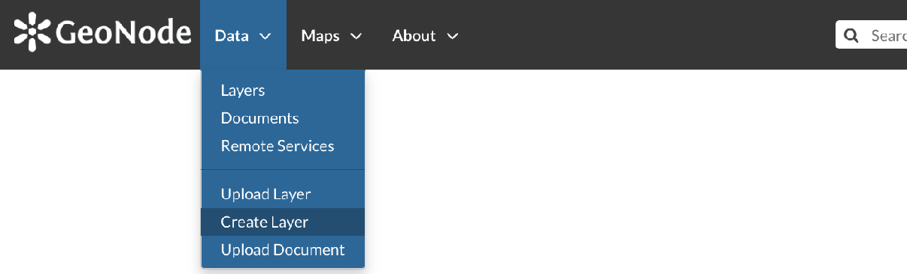
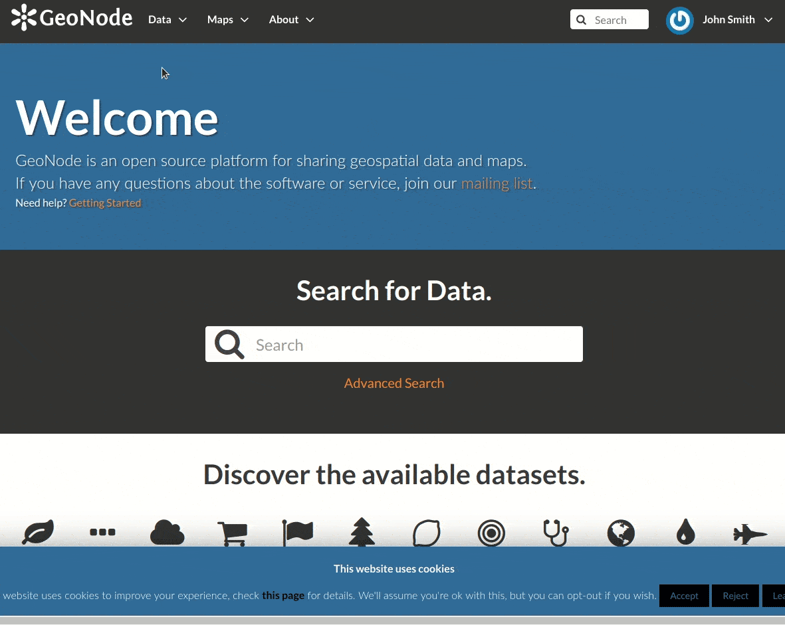

Creating a Layer from scratch
=============================

An interesting tool that GeoNode makes available to you is the *Create Layer*. It allows you to create a new vector layer from scratch. The *Layer Creation Form* is reachable through the :guilabel:`Create Layer` link shown in the picture below.

     *Create layer link*

In order to create the new Layer you have to fill out the required fields:

* *Name*
* *Title*
* *Geometry type*

  .. figure:: img/geometry_types.png
      :align: center

      *Geometry types*

Usually the layers features should have some *Attributes* that enrich the amount of information associated with each of them. Through the :guilabel:`Add Attribute` button you can add new attributes.

    *New Layer creation from scratch*

At this time you can also change the default *Permissions* settings, see :ref:`layer-permissions` to learn how.

Once the form has been filled out, click on :guilabel:`Create`. You will be redirected to the *Layer Page* (see :ref:`layer-info`). Now your Layer is created but is still empty, no features have been added yet. See the :ref:`layer-editing` section to learn how to add new features.
