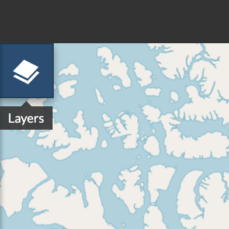
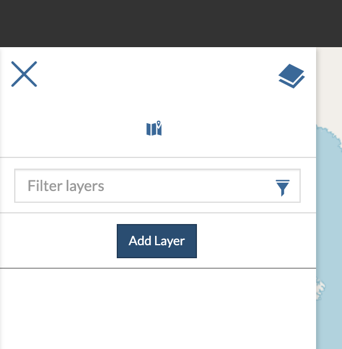
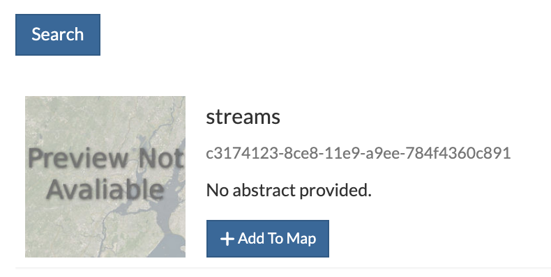
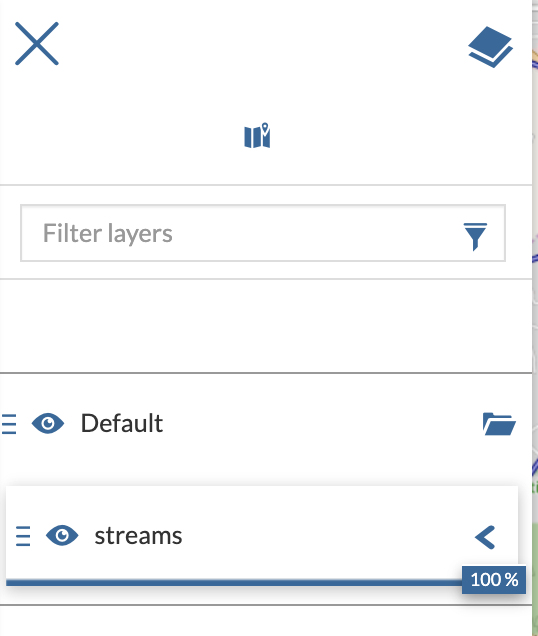

.. _create-maps:

Create Maps
================

| The map creation is done through the map composer (by default powered by MapStore 2), a shortcut is available in the main GeoNode menu as shown in figure

    *The Create Map Menu*

| To add layers to the map click on the *layers* icon on the left and the *Add layer*

    *The Map Layers Button*

    *The Add Layer Menu*

| This will open the catalog pane on the right with the available layers previously loaded on GeoNode. Layers can be filtered by typing a text.
| Each layer provides an *Add to map* button. Once added it will appear on the map and on the left pane *layer switcher*

    *The Add To Map Buttons*

    *The Layers Switcher Pane*
