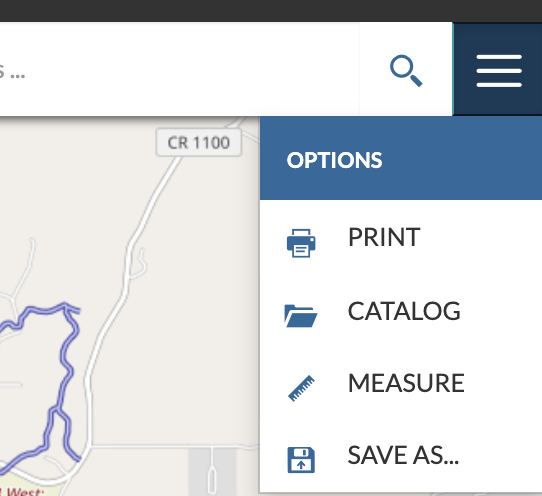
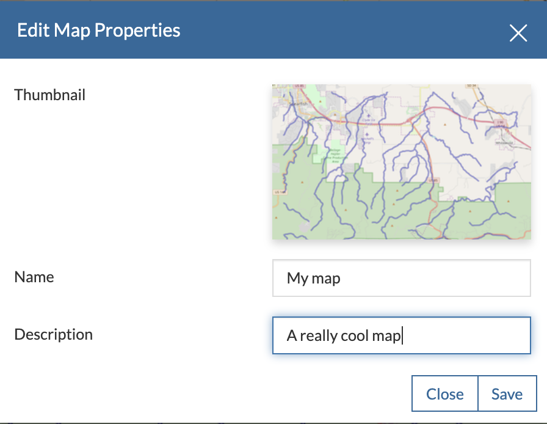
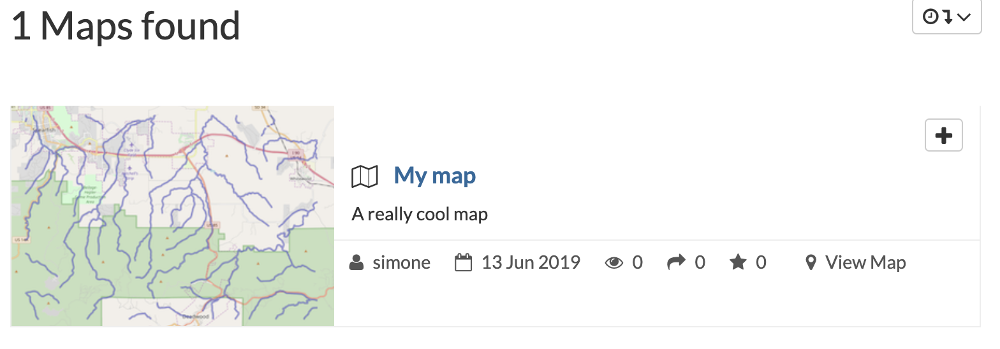

.. _create-maps:

Create Maps
================

| The map creation is done through the map composer (by default powered by MapStore 2), a shortcut is available in the main GeoNode menu as shown in figure

    *The Create Map Menu*

| To add layers to the map click on the *layers* icon on the left and the :guilabel:`Add layer` button

    *The Map Layers Button*

    *The Add Layer Menu*

| This will open the catalog pane on the right with the available layers previously loaded on GeoNode. Layers can be filtered by typing a text.
| Each layer provides an :guilabel:`Add to map` button. Once added it will appear on the map and on the left pane *layer switcher*

    *The Add To Map Buttons*

    *The Layers Switcher Pane*

| You can add as many layers as you want, use the left panel to adjust their order on the map (by dragging and dropping them up or down in the list) and opacity.
| The map can be then saved by closing the right catalog pane and clicking on the :guilabel:`options` button, then chose :guilabel:`save as`.

    *The Save Map Button*

| This will open a dialog where you can add a title, a description and a thumbnail.

    *The Save Dialog*

| The map will be now listed in the GeoNode search engine and, as for any other GeoNode resource, you'll be able to set permissions to it.

    *The maps list*
