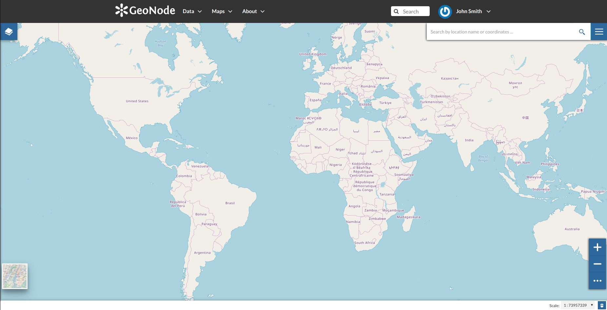
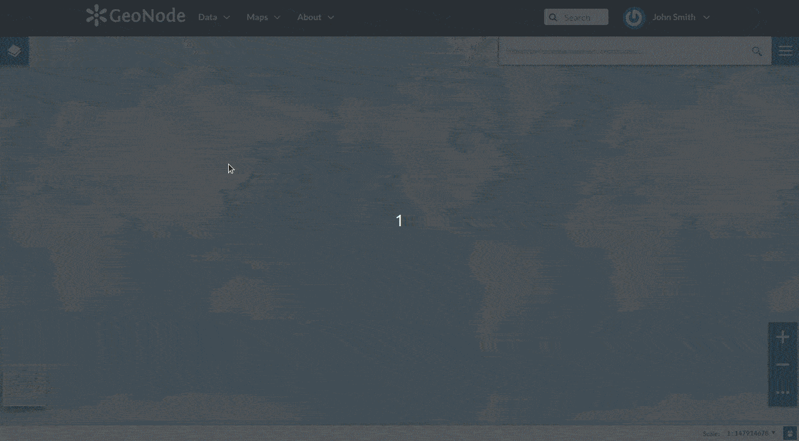

.. _creating-map:

Creating Maps
=============

In this section, we’ll create a *Map* using some uploaded layers, combine them with some other layers from remote web services, and then share the resulting map for public viewing.

In order to create new maps you can use:

* the :guilabel:`Create Map` link of the *Maps* menu in the navigation bar

  .. figure:: img/create_map_link.png
       :align: center

       *The Create Map link*

* the :guilabel:`Create Map` button in the *Layer Page* (it creates a map using a specific layer)

  .. figure:: img/create_map_button.png
       :align: center

       *The Create Map button*

* the :guilabel:`Create New Map` button in the *Explore Maps* page

  .. figure:: img/create_new_map_button.png
      :align: center

      *The Create New Map button*

The new *Map* will open in a *Map Viewer* like the one in the picture below.

     *The Map Viewer*

.. |toc_button| image:: img/toc_button.png
    :width: 30px
    :height: 30px
    :align: middle

.. |burger_menu_button| image:: img/burger_menu_button.png
    :width: 30px
    :height: 30px
    :align: middle

.. |hide_button| image:: img/hide_button.png
    :width: 30px
    :height: 30px
    :align: middle

| In the upper left corner the |toc_button| button opens the :ref:`toc` of the *Map*. It allows to manage all the layers associated with the map and to add new ones from the *Catalog*.
| The *TOC* component makes possible to manage layers overlap on the map by shifting their relative positions in the list (drag and drop them up or down in the list).
| It also allows to hide/show layers ( |show_button| and |hide_button| ), to zoom to layers extents ( |zoom_to_layer_extent_button| ) and to manage their properties ( |layer_settings_button| ).
| Once the map layers have been settled it is possible to save the *Map* by clicking on |burger_menu_button| and choosing :guilabel:`Save as`.

     *Creating new Maps*

If you followed the steps above, you have just created your first *Map*.
Now you should see it in the *Explore Maps* page, see :ref:`map-info` for further details.

We will take a closer look at the *Map Viewer* tools in the :ref:`exploring-maps` section.
