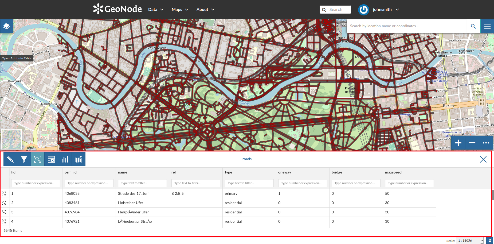
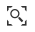
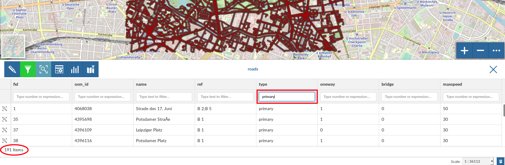
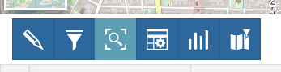
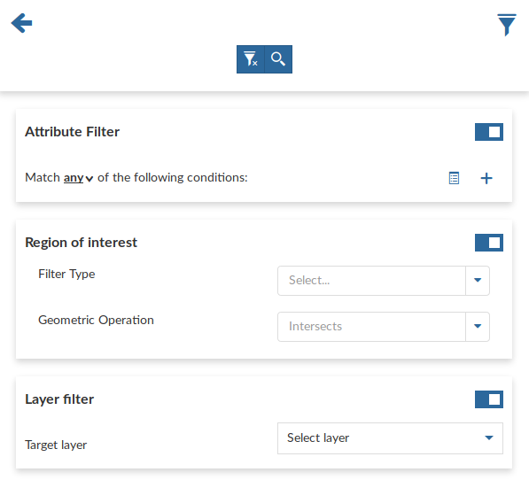

.. _attributes-table:

Attributes Table
================

When clicking on the |attribute_table_button| button of the :ref:`toc`, the *Attributes Table* panel opens at the bottom of the *Map* page.

     *The Attributes Table Panel*

In that panel you can navigate through the features of the layer, zoom to their geometries by clicking on the |zoom_to_feature_icon| icon and explore their attributes.

| The *Attribute Tables* has a row for each feature belonging to the layer and a column for each attribute that describes the feature.
| Each column has a *Filter* input field through which you can filter the features basing on some value or expression (depending on the data type of the field).

    *Filtering Features by Attribute*

The *Attributes Table* panel contains a *Toolbar* which makes you available some useful functionalities.

    *The Attributes Table Toolbar*

Those functionalities are:

* | *Edit Mode*
  | By clicking on |edit_mode_button| you can start an editing session. It permits you to add new features, to delete or modify the existing ones, to edit geometries. See the :ref:`layer-data-editing` section for further information.

  .. |edit_mode_button| image:: img/edit_mode_button.png
     :width: 30px
     :height: 30px
     :align: middle

* | *Advanced Search*
  | Click on |advanced_search_button|, a new panel opens. That panel allows you to filter features in many different ways. This functionality will be explained in depth in the :ref:`advanced-search` section.

  .. |advanced_search_button| image:: img/advanced_search_button.png
     :width: 30px
     :height: 30px
     :align: middle

* | *Zoom to page extent*
  | Click on |zoom_to_page_extent_button| to zoom to the page extent.

  .. |zoom_to_page_extent_button| image:: img/zoom_to_page_extent_button.png
     :width: 30px
     :height: 30px
     :align: middle

* | *Hide/show columns*
  | When clicking on |hide_show_columns_button| another panel opens inside the *Attributes Table*. Through that panel you can choose what columns you want to see, see the picture below.

  .. figure:: img/hide_show_columns.gif
      :align: center

      *Hide/Show Columns of the Attributes Table*

  .. |hide_show_columns_button| image:: img/hide_show_columns_button.png
     :width: 30px
     :height: 30px
     :align: middle

* | *Create a chart*
  | Through the |create_charts_button| button you can open the *Chart Widgets* panel where many functionalities to describe and visualize the layer data are available (see :ref:`creating-widgets`).

  .. |create_charts_button| image:: img/create_charts_button.png
     :width: 30px
     :height: 30px
     :align: middle

* | *Sync map with filter*
  | Click on the |sync_map_with_filter_button| icon to synchronize the map with the filter.

  .. |sync_map_with_filter_button| image:: img/sync_map_with_filter_button.png
     :width: 30px
     :height: 30px
     :align: middle

.. _advanced-search:

Advanced Search
---------------

As mentioned before, GeoNode allows both an attribute based and spatial filtering.
When clicking on |advanced_search_button| from the layer *Attributes Table* the *Advanced Search* panel opens and shows you three different filtering functionalities:

    *Advanced Search*

* In the **Attribute Filter** section you can compose a series of conditions about the attributes of the layer.
  Click on |add_condition_button| to insert a new empty condition.
  Select the attribute you are interested in, select an operator and type a comparison value.
  You can group conditions through the *Add Group* |add_group_button| button.
  Click on |start_search_button| to perform the search.

  .. figure:: img/filtering_by_attributes.png
      :align: center

      *Filtering by Attributes*

  .. |add_condition_button| image:: img/add_condition_button.png
     :width: 30px
     :height: 30px
     :align: middle

  .. |add_group_button| image:: img/add_group_button.png
     :width: 30px
     :height: 30px
     :align: middle

  You can also decide if *All* the conditions have to be met, if only *Any* or *None* of them (see the red arrow in the picture above).

* | The **Region of interest** filtering allows you to filter features that have some relationship with a spatial region that you draw on the map.
  | Select the *Filter Type* (Circle, Viewport, Polygon or Rectangle), draw the spatial region of interest on the map, select a *Geometric Operation* (Intersects, Bounding Box, Contains or Is contained) and then click on |start_search_button|.

  .. figure:: img/filtering_region_of_interest.png
      :align: center

      *Filtering by Region Of Interest*

  .. |start_search_button| image:: img/start_search_button.png
     :width: 30px
     :height: 30px
     :align: middle

* Through the **Layer Filter** you can select only those features which comply with some conditions on other layers of the map. You can also add conditions on attributes for those layers.

  .. figure:: img/layer_filtering.png
      :align: center

      *Layer Filtering*

You can read more about the *Attributes Table* and the *Advanced Search* on the `MapStore2 Documentation <https://mapstore2.readthedocs.io/en/latest/user-guide/attributes-table/#advanced-filtering>`_.
