.. _creating-widgets:

Creating Widgets
================

.. |create_widgets_button| image:: img/create_widgets_button.png
    :width: 30px
    :height: 30px
    :align: middle

*Widgets* are graphical elements that describe the layers data. They can be of different types such as *Charts*, *Texts*, *Tables* and *Counters*.
Through the |create_widgets_button| button of the :ref:`toc` you can open the *Widgets* panel.

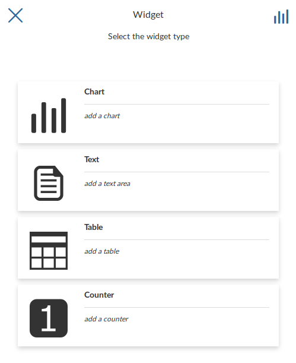

     *Creating Widgets*

Chart Widgets
-------------

*Chart Widgets* are graphical representations of the layer data. They can be *Bar Chart*, *Pie Chart* or *Line Chart* as shown in the picture below.

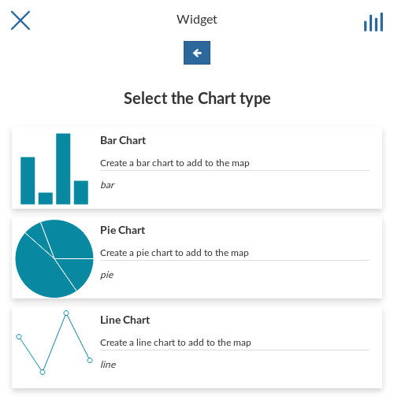

     *Chart Widgets*

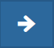

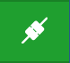

| Let's create a new **Bar Chart**.
| Click on *Bar Chart* then select the *X Attribute*, the *Y Attribute*, the *Operation* and the *Color* do you prefer.
  You can also display the *Legend*, *Hide the Y axis*, *Hide the grid* and decide what *Label* display into the legend.
| Now you can filter the data to be considered for the chart by clicking on |advanced_search_button|. We don't need any filter so click |configure_widgets_options_button| to configure other widget options.
  Insert a *Title* and a *Description* and click on *Save* |save_button|.

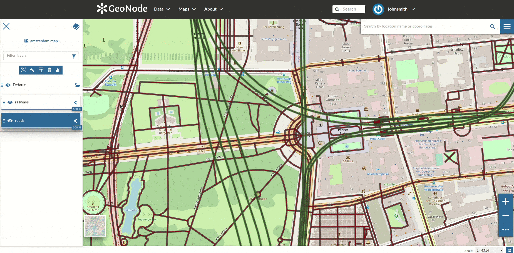

     *Chart Widgets Creation*

The green |connect_to_viewport| icon means that the chart is connected to the viewport.

Expanding the options menu of the widget you can *Show the plotted data*, *Edit* the widget or *Delete* it, *Download* the data as a CSV file or *Export* the image of the graph.

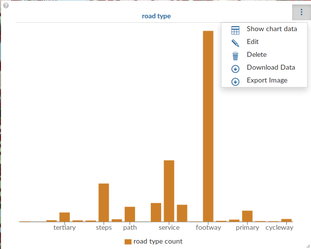

     *Chart Widgets Options*

Text Widgets
------------

If you select *Text* on the *Widgets* panel you can create *Text Widgets*. Add a *Title* and the desired descriptive text, then click on |save_button|.

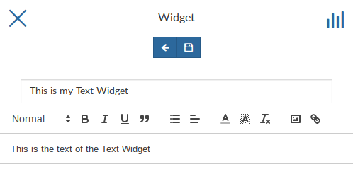

    *Text Widgets Creation*

The resulting widget looks like the following.

.. figure:: img/text_widget.png
    :align: center

    *My Text Widget*

Table Widgets
-------------

| Through the *Table Widgets* you can add the :ref:`attributes-table` of the layer to the map. You can decide to show a subset of the features, through filters, and you can select one or more columns/attributes.
| So, choose what attributes you are interested in and click on |configure_widgets_options_button|.

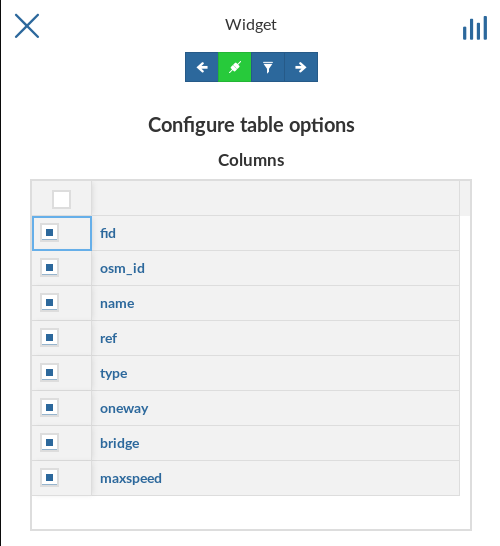

    *Table Widgets Columns*

Insert *Title* and *Description* (optional) and click on |save_button|. The example below shows the *Table Widget* on the map.

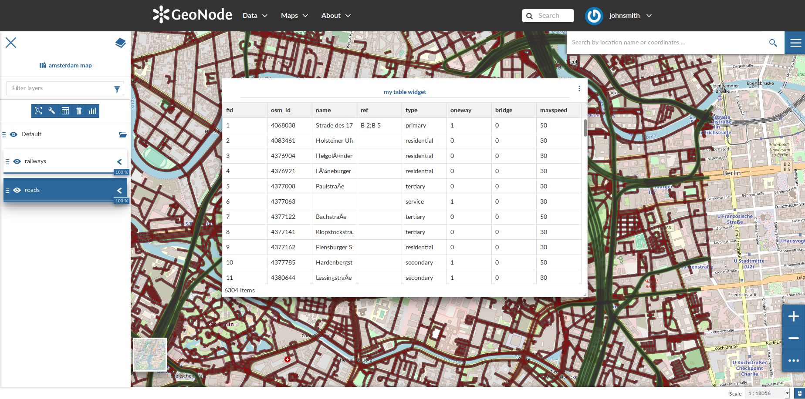

    *Table Widget*

Counter Widgets
---------------

*Counter Widgets* are numeric representations of some attributes. For example you can represent the average speed limit on a road network.

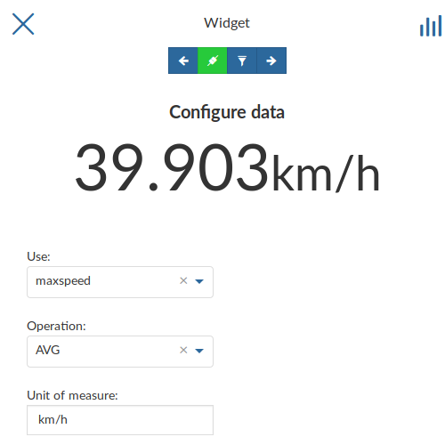

    *Counter Widget Creation*

Click on |configure_widgets_options_button|, insert *Title* and *Description* then click on |save_button|.

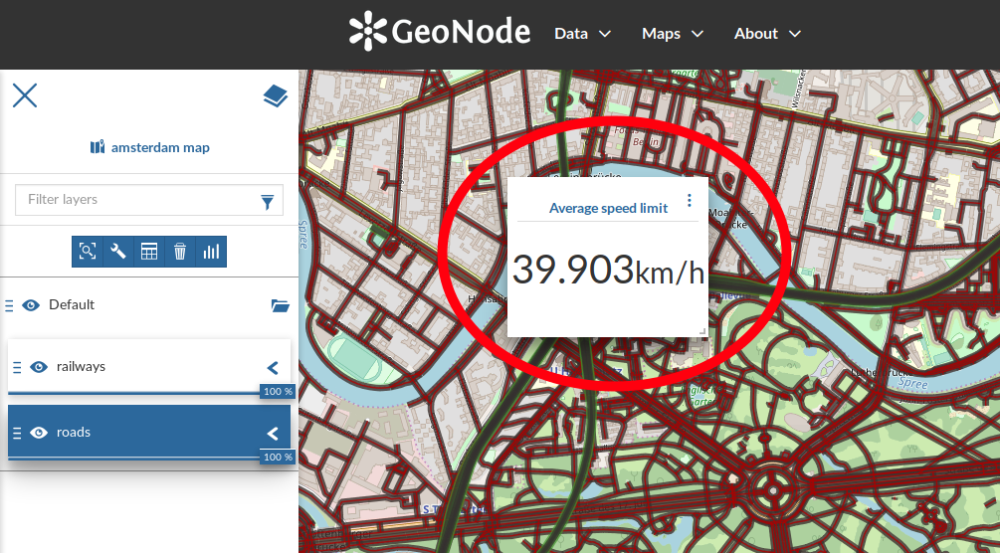

    *Counter Widget*

The GeoNode map viewer is `MapStore <https://mapstore2.geo-solutions.it/mapstore/#/>`_ based, see the `MapStore Documentation <https://mapstore2.readthedocs.io/en/latest/user-guide/widgets/>`_ for further information.
