.. _exploring-maps:

Exploring Maps
==============

From the :guilabel:`Explore Maps` link of the navigation bar you can reach the *Maps List* page (see :ref:`finding-maps`).
Select a map you are interested in and click on it, the *Map Page* will open.

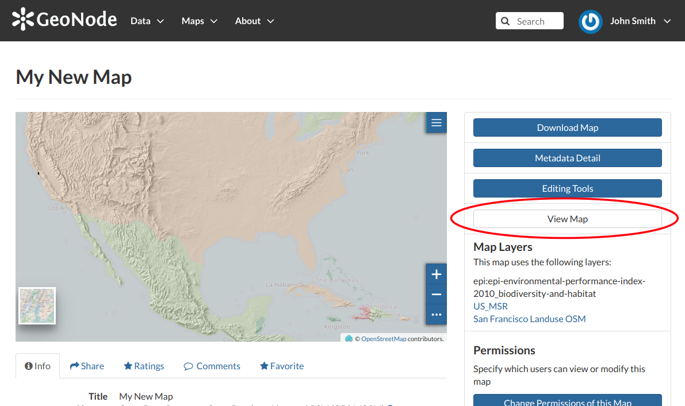

     *The View Map button*

Click on the :guilabel:`View Map` button to open the *Map Viewer*.

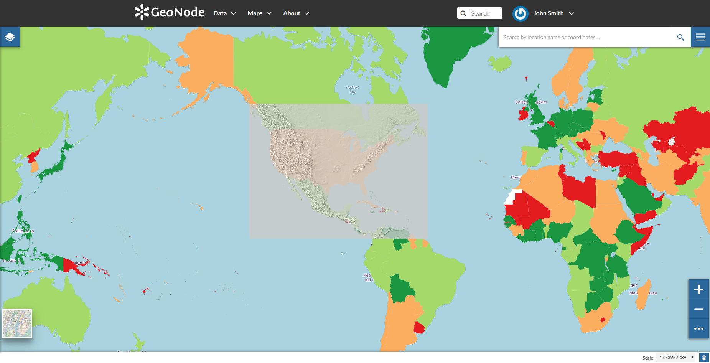

     *The Map View*

The Map Viewer (based on `MapStore <https://mapstore2.geo-solutions.it/mapstore/#/>`_) provides the following tools:

* the :ref:`toc` to manage the map contents;
* the *Basemap Switcher* to change the basemap (see the next paragraphs);
* the *Search Bar* to search by location, name and coordinates (see the paragraph below);
* the :ref:`options-menu-tools` which contains the link to the *Print* tool, to the layers *Catalog* and to the *Measure* tool;
* the *Sidebar* and its tools such as the *Zoom* tools and the *Get Features Info* tool;
* the *Footer Tools* to manage the scale of the map, to track the mouse coordinates and change the CRS (Coordinates Reference System).

.. toctree::
    :hidden:
    :maxdepth: 1

    toc
    attribute_table
    creating_widgets
    timeline
    options_menu

Search Bar
----------

| The *Search Bar* of the map viewer allows you to find point of interests (POIs), streets or locations by name.
| Let's type the name of some place then select the first record.

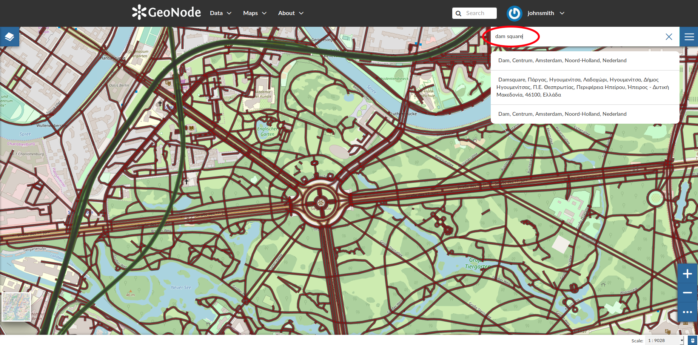

     *The Search Bar*

The map will automatically re-center on that area delimiting it by a polygon in the case of an area, by a line in the case of a linear shape (e.g. streets, streams) and by a marker in the case of a point.

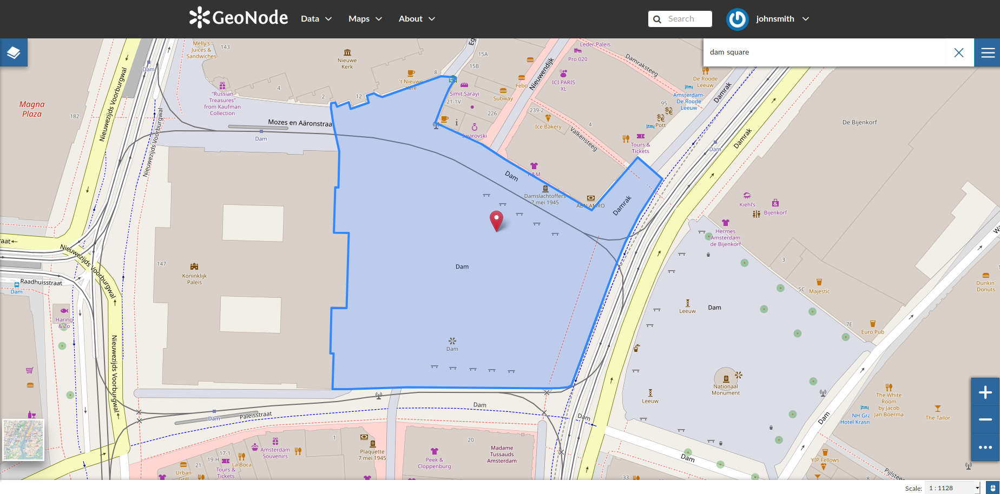

     *Result of a Search*

.. _sidebar:

Sidebar Tools
-------------

.. |zoom_in_button| image:: img/zoom_in_button.png
    :width: 30px
    :height: 30px
    :align: middle

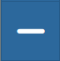

.. |query_objects_on_map_button| image:: img/query_objects_on_map_button.png
    :width: 30px
    :height: 30px
    :align: middle

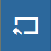

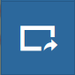

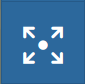

| The *Map Viewer* makes also available the *Sidebar*.
  It is a navigation panel containing various tools that help you to explore the map such as tools for zooming, changing the extent and querying objects on the map.
| By default the *Sidebar* shows you the zooming buttons |zoom_in_button| and |zoom_out_button|, other options can be explored by clicking on |sidebar_expand_button| which expands/collapses the toolbar.

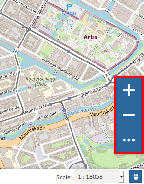

     *The Default Sidebar*

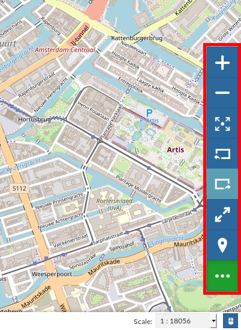

    *The Expanded Sidebar*

The *Sidebar* contains the following tools:

* The *Query Objects on map* allows you to get feature information through the |query_objects_on_map_button| button.
  It allows you to retrieve information about the features of some layers by clicking them directly on the map.

  .. figure:: img/querying_objects_on_map.gif
      :align: center

      *Querying Objects on map*

  When clicking on map a new panel opens. That panel will show you all the information about the clicked features for each active loaded layer.

* You can *Zoom To Max Extent* by clicking |zoom_to_max_extent_button|.

* You can switch between the previous and the next zoom level through the *Go Back* button |go_back_button| and the *Go Forward* one |go_forward_button|.

* The *Switch to Full Screen* |full_screen_button| button allows to have a full screen map.

.. _basemap-switcher:

Basemap Switcher
----------------

By deafault, GeoNode allows to enrich maps with many world backgrounds:

* *OpenStreetMap*
* *OpenTopoMap*
* *Sentinel-2-cloudless*

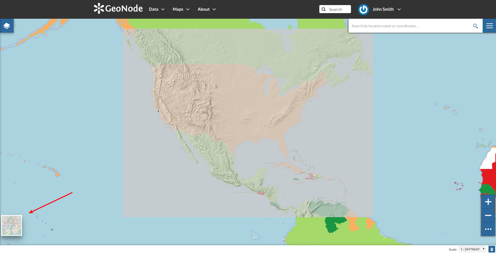

     *The Basemap Switcher Tool*

You can also decide to have an *Empty Background*.

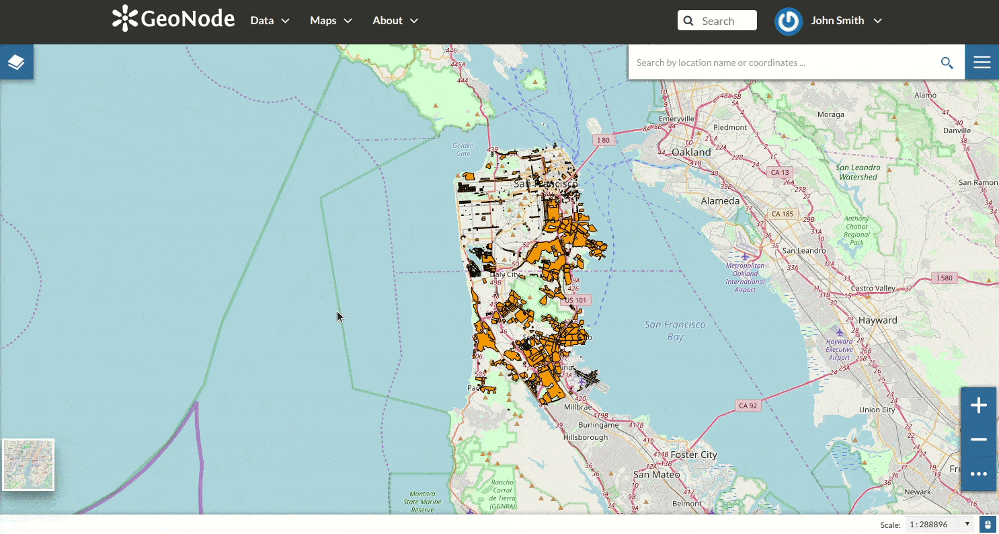

    *Switching the Basemap*

Footer Tools
------------

At the bottom of the map, the *Footer* shows you the *Scale* of the map and allows you to change it.

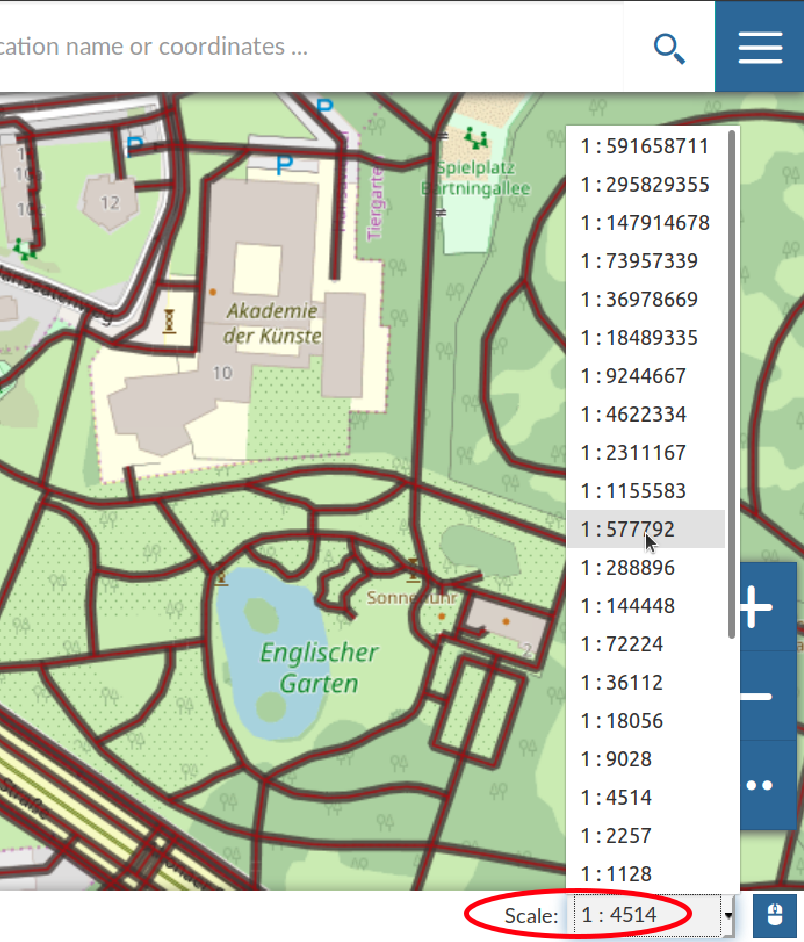

    *The Map Scale*

The |show_hide_coordinates_button| button allows you to see the pointer *Coordinates* and to change the Coordinates Reference System (CRS), WGS 84 by default.

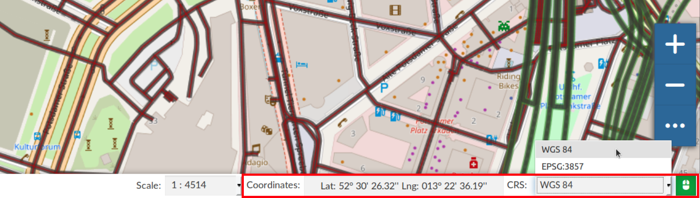

    *The Pointer Coordinates and the CRS*
