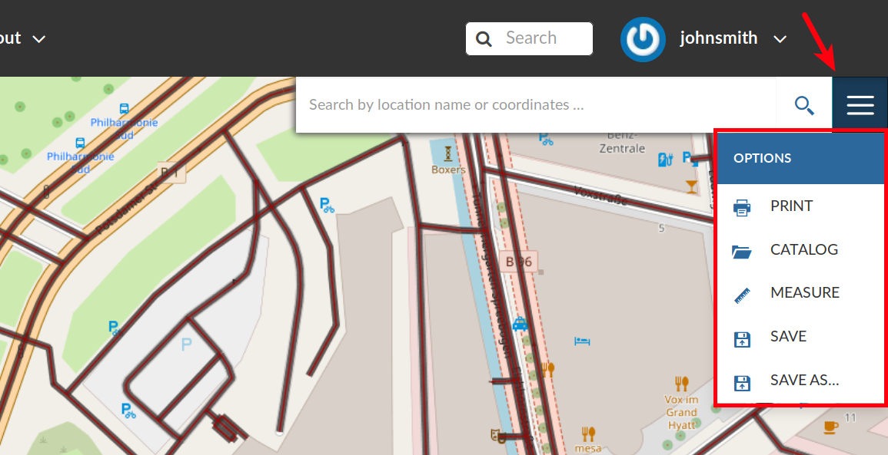
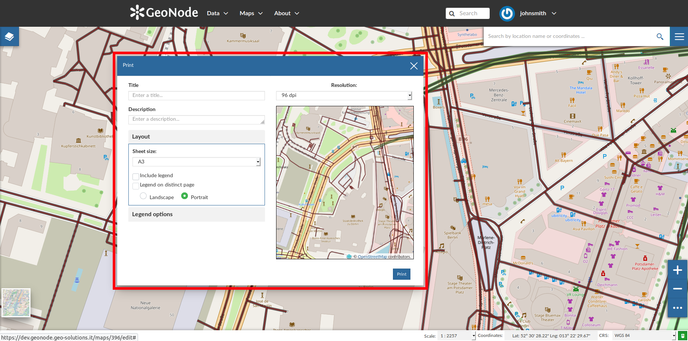
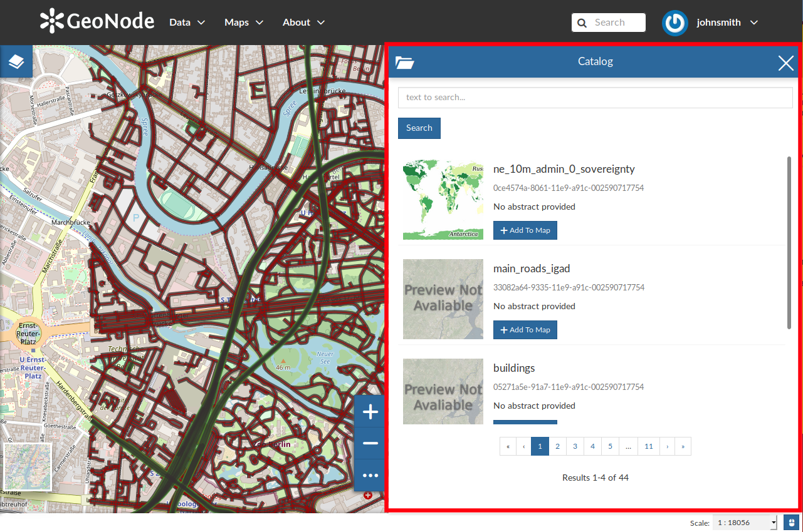
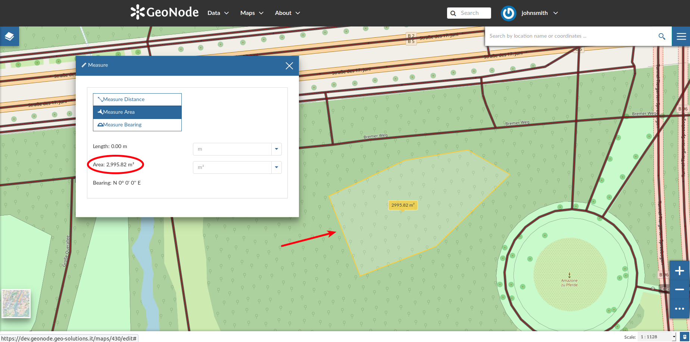
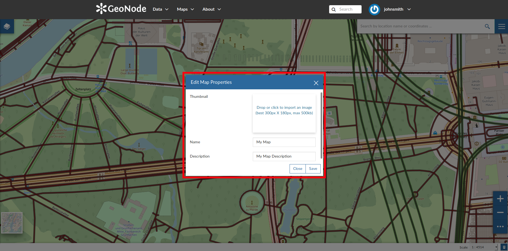
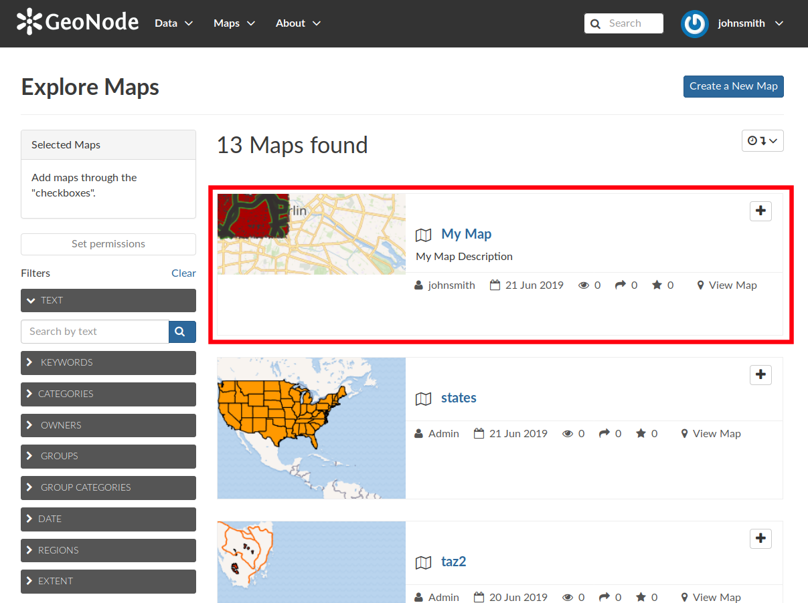

.. _options-menu-tools:

Options Menu Tools
==================

At the top-right corner of the *Map* there is a *Burger Menu* button |burger_menu_button|. Click on it to open the *Map Options* panel.

     *The Map Options Menu*

We will explain those tools more in depth in the next paragraphs.

Printing a Map
--------------

| The `MapStore <https://mapstore2.geo-solutions.it/mapstore/#/>`_ based map viewer of GeoNode allows you to print your map with a customizable layout.
| Click the :guilabel:`PRINT` option from the *Map Options Menu*, the **Printing Window** will open.

     *The Printing Window*

From this window you can:

* enter *Title* and *Description*;
* choose the *Resolution* in dpi;
* customize the *Layout*

  + the *Sheet size* (A3, A4);
  + if include the legend or not;
  + if to put the legend in a separate page;
  + the page *Orientation* (Landscape or Portrait);

* customize the *Legend*

  + the *Label Font*;
  + the *Font Size*;
  + the *Font Emphasis* (bold, italic);
  + if *Force Labels*;
  + if use *Anti Aliasing Font*;
  + the *Icon Size*;
  + the *Legend Resolution* in dpi.

To print the map click on :guilabel:`Print`.

The Layers Catalog
------------------

All the layers available in GeoNode, both uploaded and remote, can be loaded on the map through the *Catalog*.
Click on the :guilabel:`CATALOG` option of the *Map Options Menu* to take a look at the catalog panel.

     *The Layers Catalog*

You can navigate through layers and look at their *Thumbnail* images, *Title*, *Description* and *Abstract*.
Click on :guilabel:`Add To Map` to load a layer into the map, it will be also visible in the :ref:`toc`.

Performing Measurements
-----------------------

Click on the :guilabel:`MEASURE` option of the *Map Options Menu* to perform a measurement.
As you can see in the picture below, this tool allows you to measure *Distances*, *Areas* and the *Bearing* of lines.

.. figure:: img/measure_tool.png
     :align: center

     *The Measure Tool*

| To perform a measure draw on the map the geometry you are interested in, the result will be displayed on the left of the unit of measure select menu (this tool allows you to change the unit of measure also).

     *Measuring Areas*

Saving a map
------------

| Once all the customizations have been carried out, you can *Save* your map by clicking on the :guilabel:`SAVE AS` option of the *Map Options Menu*.
| A new popup window will open.

     *Saving Maps*

You have to fill out a *Title* and an optional *Description*, then click on :guilabel:`Save`. The page will reload and your map should be visible in the :ref:`finding-maps` list.

     *Your Map into the List*
