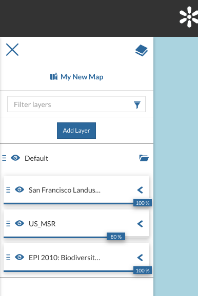
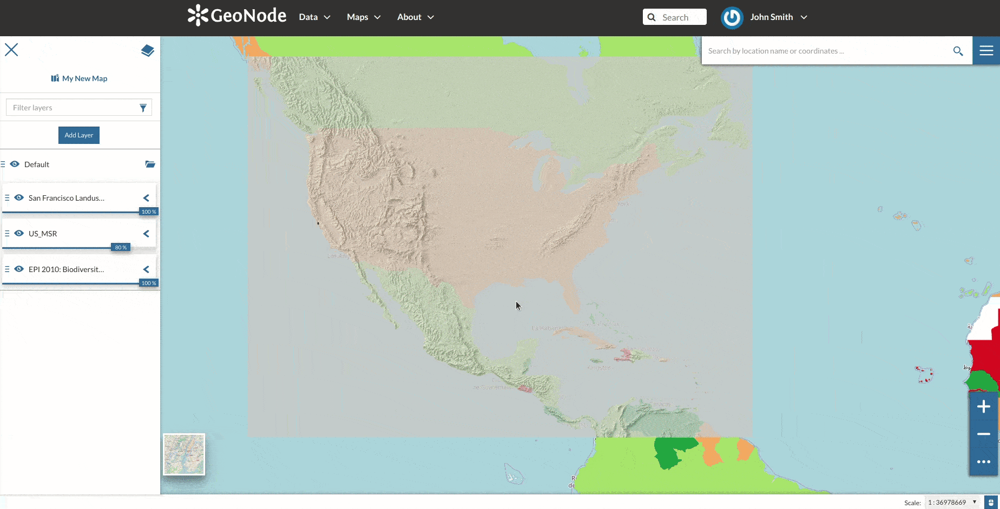
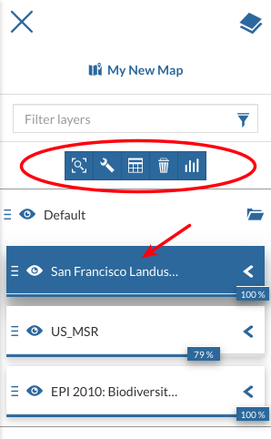
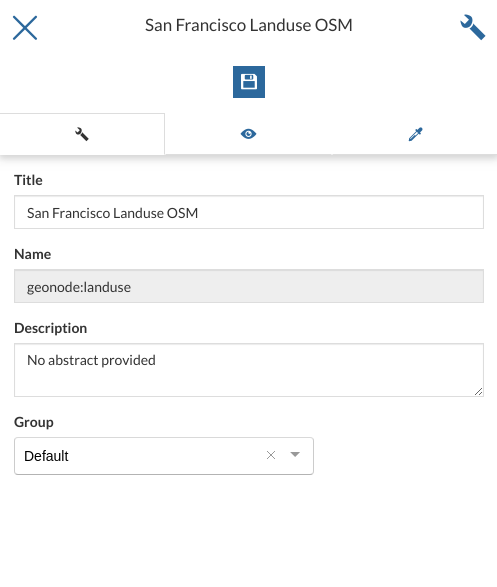
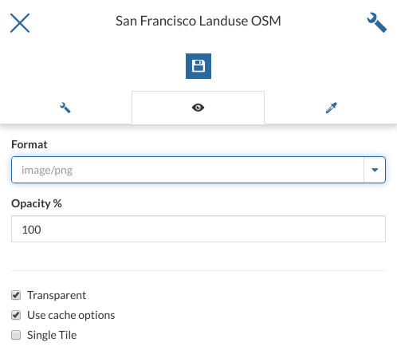

.. _toc:

Table of Contents (TOC)
=======================

In the upper left corner, click on |toc_button| to open the *Table Of Contents*, briefly *TOC* from now on, of the map.
The *TOC* shows all the layers involved with the *Map* and allows to manage their properties and representations on the map.

.. |toc_button| image:: ../img/toc_button.png
    :width: 30px
    :height: 30px
    :align: middle

.. |hide_button| image:: ../img/hide_button.png
    :width: 30px
    :height: 30px
    :align: middle

.. |show_button| image:: ../img/show_button.png
    :width: 30px
    :height: 30px
    :align: middle

     *The Table Of Contents (TOC)*

From the *TOC* you can:

* manage the layers *Overlap*;
* filter the layers list by typing text in the *Filter Layers* field;
* add new layers from the *Catalog* by clicking the :guilabel:`Add Layer` button;
* manage the layers properties such as *Opacity* (scroll the opacity cursor), *Visibility* (click on |hide_button| to make the layer not visible, click on |show_button| to show it on map);
* manage the *Layer Settings*, see the next paragraph.

     *Scrolling the Layer Opacity*

Select a *Layer* from the list and click on it, the *Layer Toolbar* should appear in the *TOC*.

     *The Layer Toolbar*

.. |zoom_to_layer_extent_button| image:: ../img/zoom_to_layer_extent_button.png
    :width: 30px
    :height: 30px
    :align: middle

.. |layer_settings_button| image:: ../img/layer_settings_button.png
    :width: 30px
    :height: 30px
    :align: middle

.. |attribute_table_button| image:: img/attribute_table_button.png
    :width: 30px
    :height: 30px
    :align: middle

.. |delete_layer_button| image:: img/delete_layer_button.png
    :width: 30px
    :height: 30px
    :align: middle

The *Toolbar* shows you many buttons:

* |zoom_to_layer_extent_button| allows you to zoom to the layer extent;
* |layer_settings_button| drives you through the layer settings customization (see the next paragraph);
* |attribute_table_button| to explore the features of the layer and their attributes (more information at :ref:`attributes-table`);
* |delete_layer_button| to delete layers (click on :guilabel:`Delete Layer` to confirm your choice);

  .. figure:: img/delete_layer.png
       :align: center

       *Deleting Layers*

* |create_widgets_button| to create *Widgets* (see :ref:`creating-widgets`).

Managing Layer Settings
-----------------------

The *Layer Settings* panel looks like the one below.

     *The Layer Settings Panel*

The *Layer Settings* are divided in three groups:

1. *General* settings
2. *Display* settings
3. *Style* settings

In the **General** tab of the *Settings Panel* you can customize the layer *Title*, insert a *Description* and change/create the *Layer Group*.

Click on the **Display** tab to see what are the layer appearance properties you can configure.

     *The Layer Display Settings Panel*

| The *Format* field allows you to change the output format of the WMS requests.
| You can set a numeric value of *Opacity* using the corresponding input field.
| You can also set the layer as *Transparent*, decide to *Use cache options* and to use *Single Tile*.

The third tab is the **Style** one. By clicking on it, an advanced *Style Editor* allows you to create new styles and to modify or delete an existing one. See the :ref:`layer-style` section to read more.
