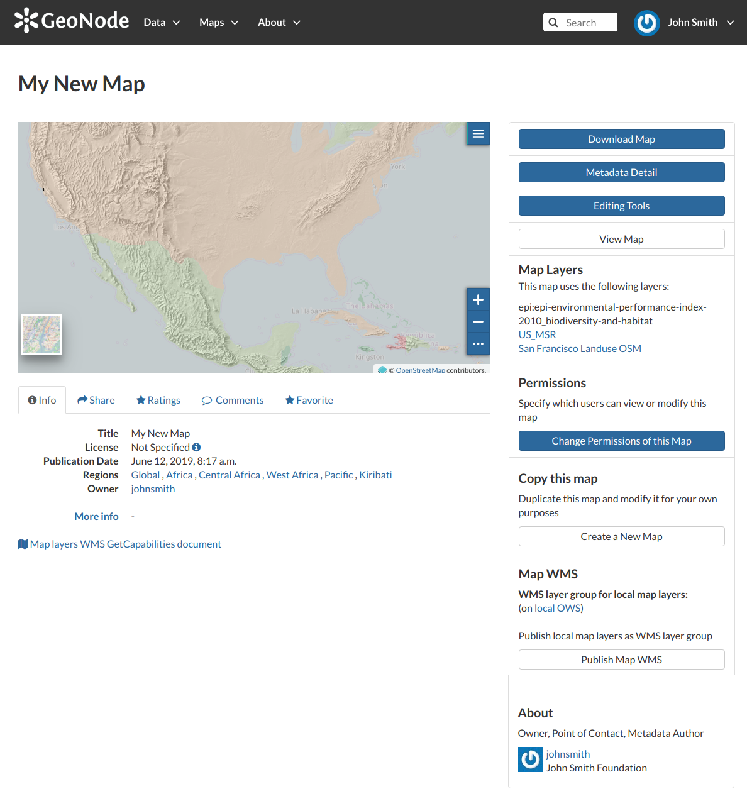
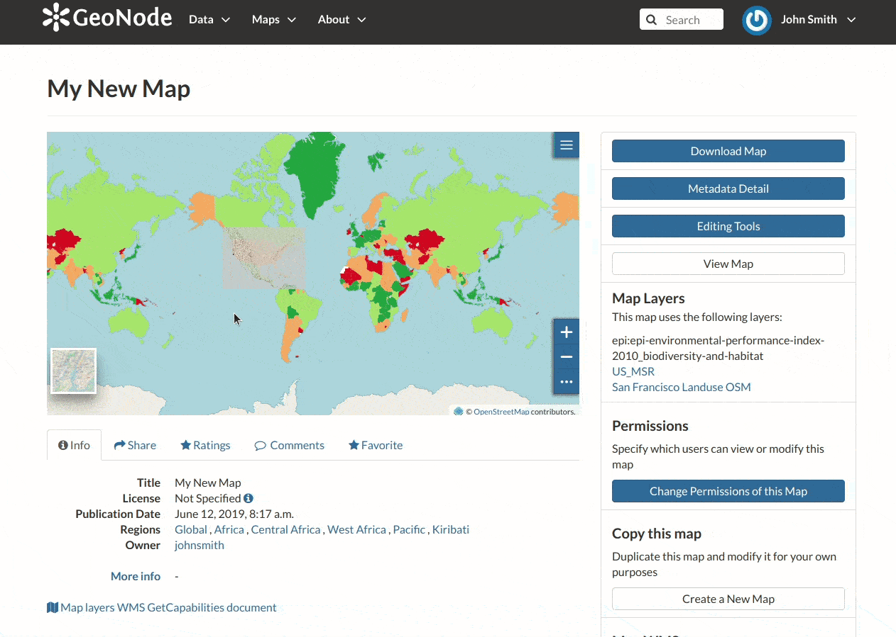

.. _map-info:

Map Information
===============

| As mentioned in the :ref:`finding-maps` section, in GeoNode you can see your maps and all the published maps through the :guilabel:`Explore Maps` link of the navigation bar.
| Click on the title of the *Map* you are interested in to open its *Information* page, it should looks like the following.

     *The Map Information page*

The *Map Page* is divided into three main sections:

1. the *Map Preview* section, under the title
2. the *Tabs* section, under the layer preview
3. the *Tools* section, on the right side of the page

Map Preview
-----------

The *Map Preview* shows the *Map* with very basic functionalities:

* the *Base Map Switcher* that allows you to change the base map;
* the *Zoom in/out* tool to enlarge and decrease the view;
* the *Zoom to max extent* tool for the zoom to fit the layers extents;
* the *Query Objects* tool to retrieve information about the map objects by clicking on the map;
* the *Print* tool to print the preview.

   *Map Preview*

See the `MapStore Documentation <https://mapstore2.readthedocs.io/en/latest/>`_ to learn more.

Tabs Sections
-------------

The *Map Information* page shows you some tabs sections containing different information about the map:

* The tab *Info* is active by default. This tab section shows some metadata such as its Title, the License, the Publication Date etc. The metadata also indicates the map owner and which regions are involved. The ``Map Layers WMS GetCapabilities document`` link is also provided.

  .. figure:: img/map_info_tab.png
      :align: center

      *Maps Info tab*

* The *Share* tab provides the links for the map to share through social media or email.

  .. figure:: img/map_sharing.png
      :align: center

      *Map Sharing*

* You can *Rate* the map through the *Rating system*.

  .. figure:: img/map_rating.png
      :align: center

      *Map Rating*

* In the *Comments* tab section you can post your comment. Click on :guilabel:`Add Comment`, insert your comment and click :guilabel:`Submit Comment` to post it.

   .. figure:: img/map_comments.png
       :align: center

       *Map Comments*

   Your comment will be added next to the last already existing comment. If you want to remove it click on the red :guilabel:`Delete` button.

 * If you want this map in your *Favorites* (see :ref:`editing-profile`), open the *Favorite* tab and click on :guilabel:`Add to Favorites`.

   .. figure:: img/favorite_map.png
       :align: center

       *Your Favorite Maps*

Map Tools
---------

| In the right side of the *Map Information* page there are some tools that can help you to manage your maps.
  In this paragraph you will learn how to discover and retrieve information about maps.
| The following is a list of actions you can take in order to accomplish this task:

* click the :guilabel:`Download Map` button, to download the map as image;
* click the :guilabel:`Metadata Detail` button to see the map metadata, see :ref:`map-metadata`;
* click the :guilabel:`Editing Tools` button to access to many editing tools. Those functionalities will be explained in the :ref:`exploring-maps` section;
* click the :guilabel:`View Map` button to open the map, see the :ref:`exploring-maps` section for more details;
* see the *Map Layers* section to konw which layers are used by the map (you can open the *Layer Page* by clicking on its name, available only for local layers);
* click the :guilabel:`Create a Map` button of the *Copy this map* section to duplicate the map;
* click the :guilabel:`Publish Map WMS` of the *Map WMS* section to publish local map layers as WMS layer group;
* see the *About* section to know the map *Owner*, the *Contact* user and the *Metadata Author*.
