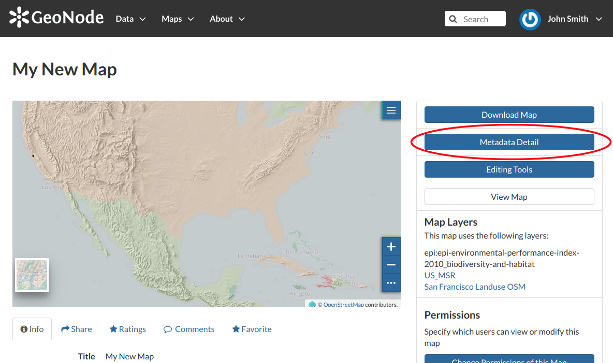
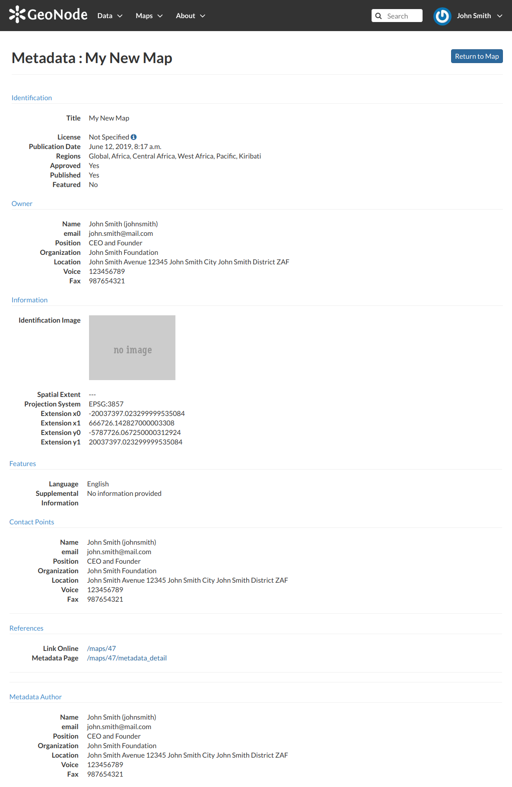
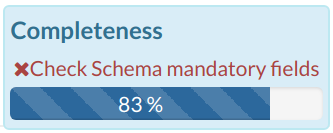
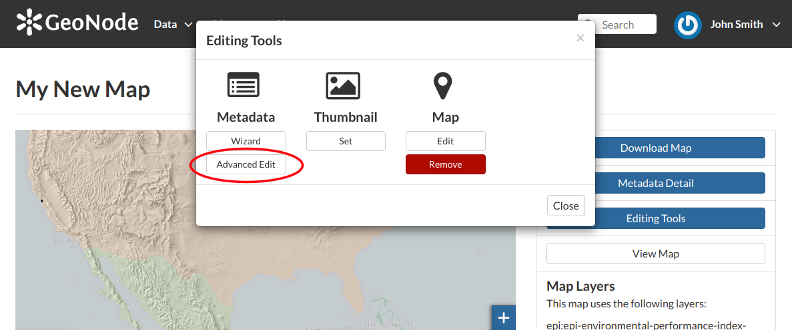

.. _map-metadata:

Maps Metadata
=============

*Maps Metadata* can be explored by clicking the :guilabel:`Metadata Detail` button from the *Map Information* page.

    *The Map Metadata Detail button*

The *Map Metadata* page will open.

    *The Map Metadata Details*

Lots of information are displayed in this page. Those information are grouped as follow:

    * *Identification* to uniquely identify the map (Title, License, Publication Date and Regions. There are also some flags which tell you the state of the map, in particular if it is Approved and/or Published);
    * the map *Owner*;
    * *Information*, the Identification Image, the Spatial Extent, the Projection System and the Extent;
    * *Features*, Language, Supplemental and other Information;
    * *Contact Points*, the available user to get in contact;
    * *References*, links to the map and its metadata;
    * *Metadata Author*, information about the author of the metadata.

Metadata Wizard
---------------

| Metadata provide essential information for the identification and the comprehension of the map. They also make the map more easily retrievable through the search tools.
| Those *Metadata* can be filled out through a three-steps *Wizard* in which you have to provide all mandatory information to complete the process. Those three steps are described below.

* *Basic Metadata*

  .. figure:: img/basic_map_metadata.png
      :align: center

      *Basic Map Metadata*

  In the first step the system asks you to insert the following metadata (required fields are highlighted with red outlines):

  * The *Thumbnail* of the map (click :guilabel:`Edit` to change it);
  * The *Title* of the map, which should be clear and understandable;
  * An *Abstract*;
  * The *Creation/Publication/Revision Dates*  which define the time period that is covered by the map;
  * The *Keywords*, which should be chosen within the available list;
  * The *Category* which the map belongs to;
  * The *Group* which the map is linked to.

  Click :guilabel:`Next >>` to go to the next step.

* *Location and Licenses*

  .. figure:: img/location_licenses_map_metadata.png
      :align: center

      *Location and Licenses Metadata for Maps*

  The following list shows what kinds of metadata you are required to enter (see also the picture below):

  * The *Language* of the layer;
  * The *License* of the dataset;
  * The *Regions* covered by the layers extent. Proposed extents cover the following scales: global, continental, regional, national;
  * The *Data Quality statement* (general explanation of the data producer's knowledge about the lineage of a dataset);
  * Potential *Restrictions* on layer sharing.

  No further mandatory metadata are required in the next step so, once the required fields have been filled out, a green :guilabel:`Done` button will be visible in the screen.
  Click :guilabel:`Next >>` to go to the next step or :guilabel:`<< Back` to go back to the previous step.

* *Optional Metadata*

  .. figure:: img/optional_map_metadata.png
      :align: center

      *Optional Map Metadata*

  Complementary information are:

  * The *Edition* of the map;
  * The *Purpose* of the map and its objectives;
  * Any *Supplemental information* that can provide a better understanding of the map;
  * The *Maintenance frequency* of the map;
  * The *Spatial representation type*, the method used to represent geographic information in the dataset;
  * The users who are *Responsible* for the layer, its *Owner*, and the *Author* of its metadata;

If you miss some mandatory metadata the *Completeness* bar shows you a red message like the one in the picture below.

    *Completeness Progress Bar*

Metadata Advanced Editing
-------------------------

The :guilabel:`Advanced Edit` editing tool allows to change the map metadata. You can find this button into the map *Editing Tools*.

    *The Advanced Edit button*

Click on it to display the *Metadata Advanced Editing Page*. That page allows you to edit all the layer metadata described in the previous paragraph. Once you have finished to edit them click on :guilabel:`Update` to save your changes.
