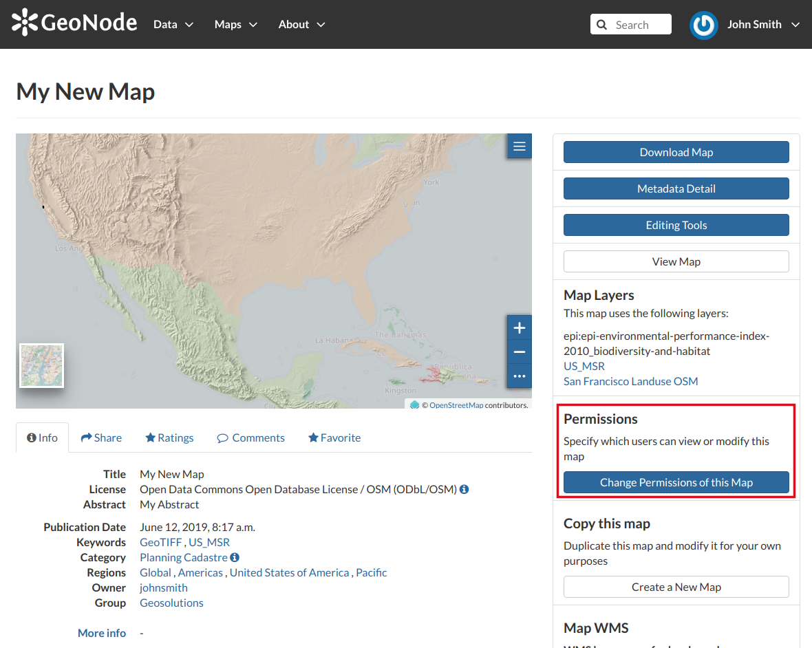
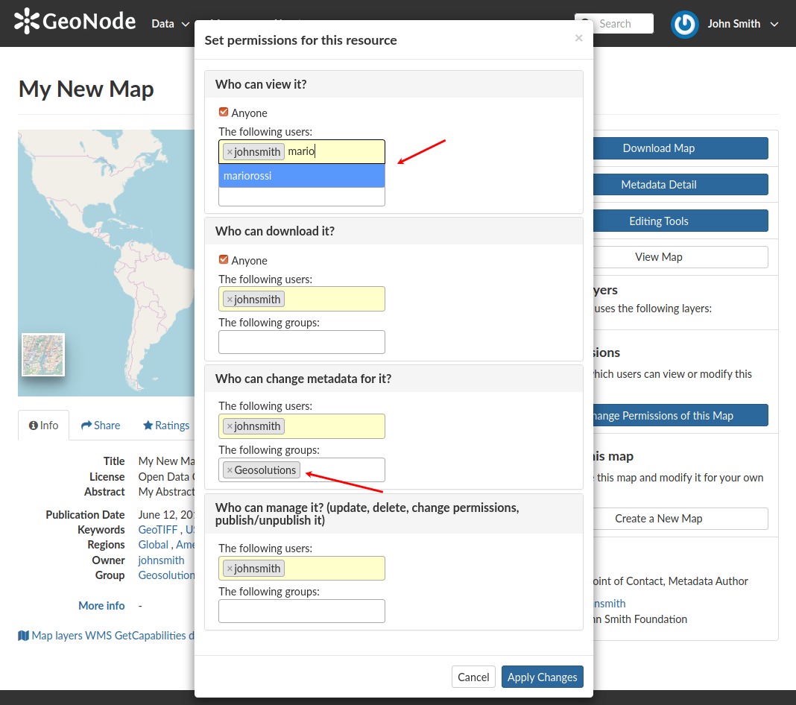

.. _map-permissions:

Changing the Map Permissions
============================

In the :ref:`map-info` section of this guide we said that you can see your maps and all the published maps.
In GeoNode the permissions management system is indeed more complex.
Administrators can choose who can do what for each map.
Users can manage only the maps they own or the maps which they are authorize to manage.

By default only owners can edit and manage maps, anyone can view and download them.

In order to modify the *Map Permissions* settings you have to click the :guilabel:`Change the Layer Permissions` button in the *Map Page*.

    *Change Map Permissions*

Through the *Permissions Settings Panel* you can add or remove permissions for users and groups. The picture below shows an example.

    *Map Permissions settings for users and groups*

You can set the following types of permissions:

* *View* allows to view the map;
* *Download* allows to download the map;
* *Change Metadata* allows to change the map metadata;
* *Manage* allows to update, delete, change permissions, publish and unpublish the map.

.. warning:: When assigning permissions to a group, all the group members will have those permissions. Be careful in case of editing permissions.

Click on :guilabel:`Apply Changes` to save these settings.
