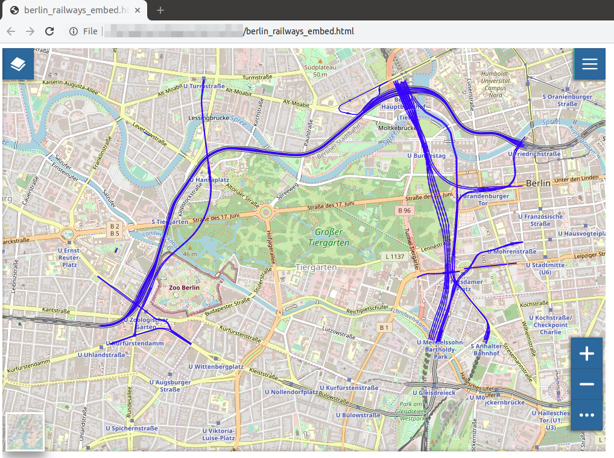

Publishing Data
===============

In GeoNode, each resource can be published in order to share it with other people.
Once a *Map* has been published you can embed it in your web pages, your blog or your web site.

An easy way to accomplish that is to use an ``iframe``. See the following steps:

* Open the :ref:`map-info` page and copy the *URL*

  .. figure:: img/map_url.png
      :align: center

      *The Map Infromation Page URL*

* Add *"/embed"* to the URL so that it will be like this *"http://master.demo.geonode.org/maps/11/embed"*

* Use this URL inside an html ``iframe`` as ``src`` value

  .. code-block:: html

    <iframe
      style="border: none;" height="400" width="600"
      src="http://master.demo.geonode.org/maps/11/embed"
    ></iframe>

* Put this html block of code inside your web pages to display the map.

Saving an html file with this code you can test your map on your pc, look at the following picture.

    *The Embedded Map*

As you can see, some basic functionalities will be available to the user: the :ref:`toc`, the :ref:`basemap-switcher`, the :ref:`sidebar` and the :ref:`options-menu-tools`.
