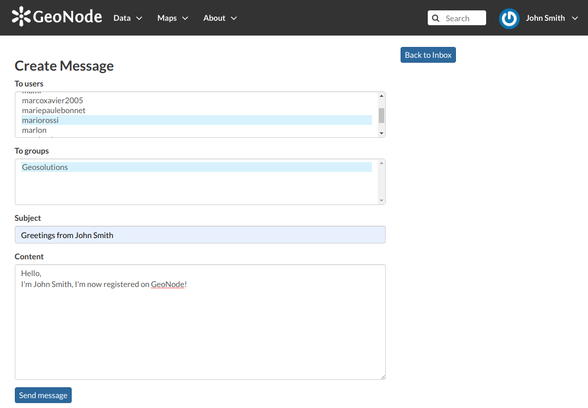
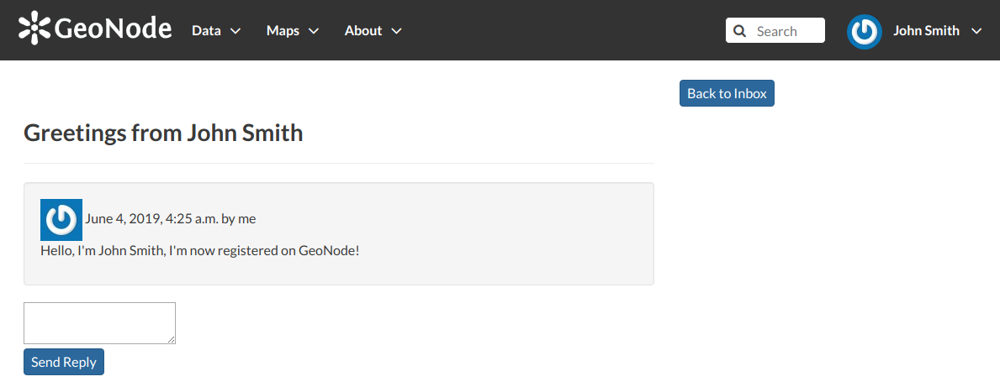
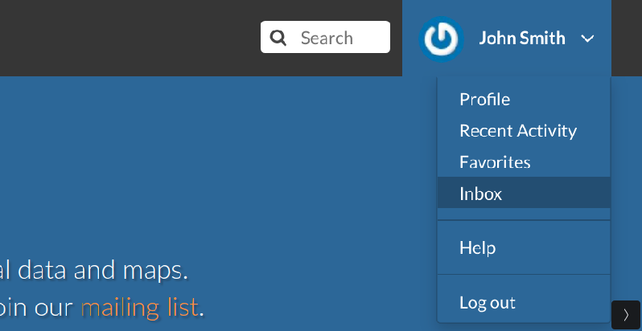
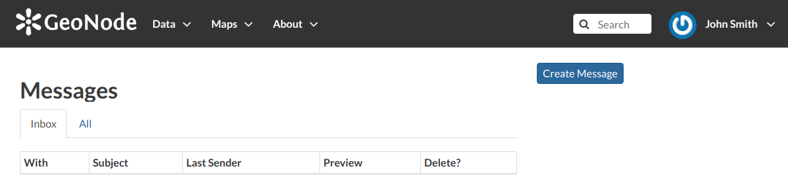
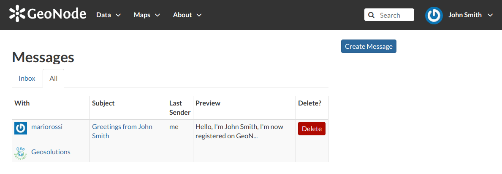
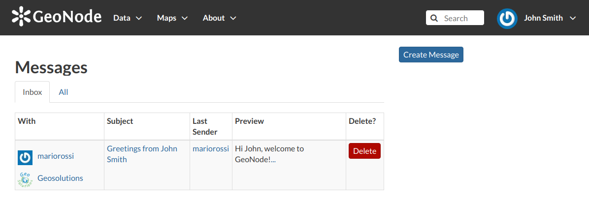
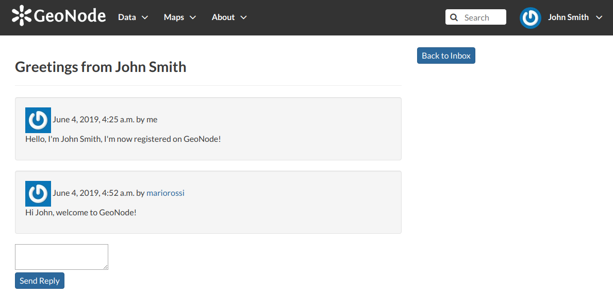

Contacting other users
======================

| GeoNode allows you to communicate by message with other registered users and groups.
| To send a message to some user and/or groups you can follow the link :guilabel:`Message User` from your *Profile* page (see :ref:`editing-profile`) or from the *Profile* details page (see the previous section :ref:`user-info`) of that user.

     *Send message to users and groups*

| Insert your content, type a subject and click on :guilabel:`Send message` to send the message to the users and groups you have selected.
| You will be redirected to the *Conversation* details page related to the subject.

     *Your message*

The Inbox page
--------------

You can view your conversations in your *Inbox* page, reachable through the :guilabel:`Back to inbox` button (see the picture above) or from the :guilabel:`Inbox` link of the user menu.

     *Inbox link*

The picture below shows how your *Inbox* page should look like.

     *Inbox page*

In *Inbox* all the unread messages are listed. You haven't received any message yet so your *Inbox* is empty. If you switch to the *All* tab you can see all the conversations you are involved in.

     *All your conversations*

When some user send a reply to your message your *Inbox* shows it, see the picture below for an example.

     *A reply to your message*

You can open the *Conversation* details by clicking on the *Subject* link.

     *Conversation details*

As you can see in the picture above, in the *Conversation* page you have the ability to write a quick reply. Type your message in the text box and click on :guilabel:`Send Reply` to do that.

In the *Inbox* page there is also the :guilabel:`Create Message` button that provides you a quick link to the message creation form.
