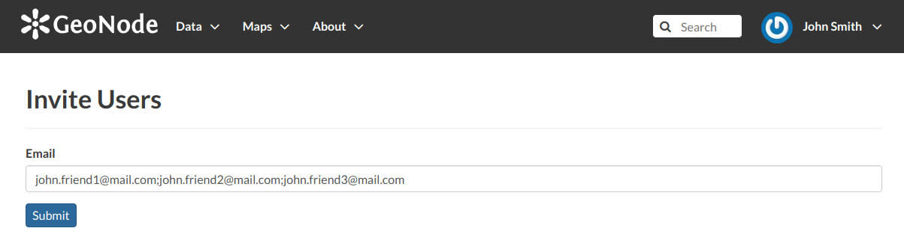

Interacting with Users and Groups
=================================

The GeoNode platform allows you to communicate by message with other GeoNode users and groups of users.

| You can also invite external users to join your GeoNode. In order to do that, click on :guilabel:`Invite Users` in the *Profile* page (see :ref:`editing-profile`) or in the :guilabel:`About` menu in the *Home* page.
| You can invite your contacts typing their email addresses in the input field as shown in the picture below. Click on :guilabel:`Submit` to perform the action.

     *Invite users to join GeoNode*

A message will confirm that invitations have been correctly sent.

     *Invitations confirm message*

.. note:: You can invite more than one user at the same time by typing the email addresses inline with a semi-colon separator.

The next sections will show you how to view information about other users and how to contact them.

.. toctree::
    :maxdepth: 1

    users_info
    contacting_users
