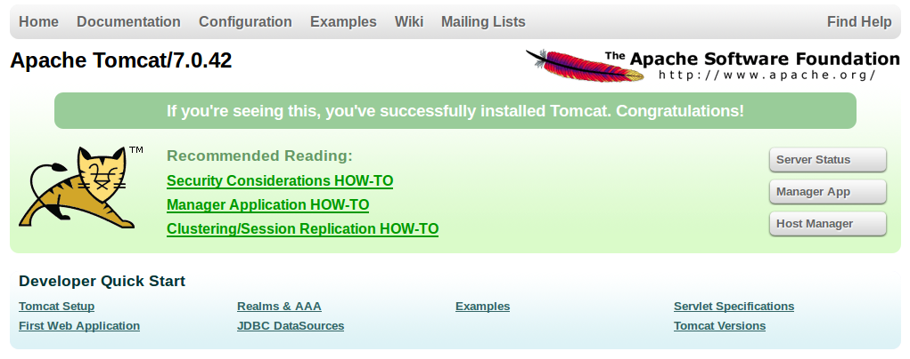

.. config.deploy_install:

Installations
=============

some text here

Install Postgresql
------------------

The Installation of Postgresql-9.2 on Ubuntu 12.04 includes two main steps (Generelly, this installation should work for every version of Postgresql!). 

#. Create an empty file called *pgdg.list* placed in ``/etc/apt/sources.list.d/``, using these commands
   
   .. code-block:: console

   	$ cd /etc/apt/sources.list.d/
   	$ sudo touch pgdg.list

   The following line has to be included into the *pgdg.list* file.

   .. code-block:: console

	   deb http://apt.postgresql.org/pub/repos/apt/ codename-pgdg main
	
   Instead of *codename* write the name of your system. If you do not know this, type

   .. code-block:: console

	   $ lsb_release -c

   This will return you the name of your system.

   .. warning:: Make sure that you have changed *codename* to the name of your system before you copy the link in the next step!

   Thus open the *pgdg.list* file 
 
   .. code-block:: console

	   $ sudo gedit pdgd.list
	
   and include the line from above.

#. The next step is to import the repository key from the postgresql website. Use the following command to do so:

   .. code-block:: console

	   $ wget --quiet -O - http://apt.postgresql.org/pub/repos/apt/ACCC4CF8.asc | sudo apt-key add -

   Afterwards you have to update the package lists using

   .. code-block:: console

	   $ sudo apt-get update
	
   Now you should be able to install postgresql-9.2 and pgadmin3 (if needed)

   .. code-block:: console

	   $ sudo apt-get install postgresql-9.2 pgadmin3

Basic configurations
********************

Before we start configuring postgres to work with geonode, we´ll do two initial configuration steps.

#. **Change superuser password**

   First of all you have to set a new password for the superuser *postgres*. In order to do so, type the following command line into your terminal:

   .. code-block:: console
   
	   $ sudo -u postgres psql postgres
	
   Now you are in *psql*, the command interface for postgresql, and in the database *postgres*. In your terminal it looks like this at the moment::
   
	   postgres=#

   To change your password, type::

	   $ \password postgres
	
   and set your new password when asked for it.
   
#. Create a database (for testing)

   If you want to create a db, posgresql has to know, which user you are. Therefore you have to type `-u username` in front of the command `createdb`. If you type the following, it means that you as the user *postgres* want to create a database wich is called *mydb*.
   
   .. code-block:: console
   
	$ sudo -u postgres createdb mydb

For more informations on the installation and configuration of postgresql visit the `Postgresql Documentation <http://www.postgresql.org/docs/9.1/static/index.html>`_.

Install Postgis
---------------

#. **Install dependencies**
   
   Before you can install PostGis 2.0.3, some dependencies have to be installed first. You can do this by using the Linux command *apt-get*. 

   .. code-block:: console

	$ sudo apt-get install build-essential postgresql-server-dev-9.2 libxml2-dev libproj-dev libjson0-dev xsltproc docbook-xsl docbook-mathml libgdal1-dev

   .. note:: ``libgdal1-dev`` is needed for raster support and is required if you want to build the postgresql extension!

#. **Build Geos 3.3.2 or higher**

   GEOS is used for the topology support and because Postgis 2.0 requires a GEOS version 3.3.2 or higher, you have to build this before you can install postgis itself. (genereally Ubuntu comes with an GEOS version lower than 3.3.2!) Download your favourite version of geos (has to be 3.3.2 or higher!) using the following command line:

   .. code-block:: console
   
       $ wget http://download.osgeo.org/geos/geos-3.3.8.tar.bz2

   Unpack it and go to the unpacked folder:

   .. code-block:: console
   
      $ tar xvfj geos-3.3.8.tar.bz2
      $ cd geos-3.3.8

   Now you can install geos by using the following command lines (this process may take a while)

   .. code-block:: console
   
       $ ./configure
       $ make
       $ sudo make install
       $ cd ..

#. **Install postgis**

   The following steps are almost the same like instructed lllll. Download postgis 2.0.3, unpack it and go to unpacked folder.

   .. code-block:: console
   
	   $ wget http://download.osgeo.org/postgis/source/postgis-2.0.3.tar.gz
           $ tar xfvz postgis-2.0.3.tar.gz
           $ cd postgis-2.0.3

   Now postgis can be installed:

   .. code-block:: console
   
	   $ ./configure
           $ make
           $ sudo make install
           $ sudo ldconfig
           $ sudo make comments-install

   .. note:: PostGIS 2.0.3 can be configured to disable topology or raster components using the configure flags ``--without-raster`` and/or ``--without-topology``. The default is to build both. Note that the raster component is required for the extension installation method for postgresql!

For more information on postgis you may visit the `Postgis Homepage <http://www.postgis.net>`_.

Create the postgis extension for postgresql
-------------------------------------------

Now we´ve installed postgres and postgis we want to create the postgis extension for postgresql. The best way to do so is by using templates. Therefore we will now create a database called **template_postigsxxx** (xxx should be replaced by your version of postgis; in this case postgis 2.0.3 was used).

.. code-block:: console
   
	$ sudo -u postgres createdb template_postgis203

Before installing the extension you have to log in to the database

.. code-block:: console
	
	$ sudo su postgres
   	$ psql template_postgis203

and now you can create the extension

.. code-block:: console

	$ CREATE EXTENSION postigs;

.. note:: Do not forget the semicolon at the end, otherwise this statement will have no effect!

We can now use this template to easily create a new database wich automatically has the postgis extension as well!

Install psycopg2
----------------

If you do not already have it on your machine, it is neccessary to install *psycopg2*, the postgresql adapter for Python programming language. But, be sure that you are working in your virtualenv, otherwise you will create a permission problem!! Thus activate your virtualenv first

.. code-block:: console

	$ source home/user/.venvs/geonode/bin/activate
	$ cd
	$ pip install psycopg2
	
Install Apache2 and mod_wsgi
----------------------------

First of all Apache2 has to be installed. This is very easy using the apt-get command in Ubuntu.

.. code-block:: console

	$ sudo apt-get install apache2
	
Furthermore the Apache module *mod_wsgi* has to be installed. To do so go to http://code.google.com/p/modwsgi/downloads/list and download a source code tar ball.

Next, copy the unpacked file into the directory where you want mod_wsgi to be and unpack it:

.. code-block:: console

	$ sudo cp /Downloads/mod_wsgi-X.Y.tar.gz /home/user/
	$ tar xvfz mod_wsgi-X.Y.tar.gz

(replace X.Y with the actual version number!)

To install the mod_wsgi module you will need a apache2 dev version as well, so if you do not have one, please type

.. code-block:: console

	$ sudo apt-get install apache2-dev

If apache2-dev has successfully be installed you can go further to install mod_wsgi from source:

.. code-block:: console

	$ cd mod_wsgi-X.Y
	$ ./configure
	$ make
	$ sudo make install

Now we have to load this module in apache2. To do so, open the *httpd.conf* file

.. code-block:: console

	$ sudo gedit /etc/apche2/httpd.conf

and add the following line::

	LoadModule wsgi_module /path/to/modules/mod_wsgi.so

.. note:: Be aware where *mod_wsgi.so* is located! It might be /usr/lib/apache2/modules/mod_wsgi.so but could also be somewhere else, depending on your system and version!

After this configuration apache2 has to be reloaded so that the configuration will be considered

.. code-block:: console

	$ sudo service apache2 reload

go back to mod_wsgi folder and run

.. code-block:: console

	$ make clean

To check whether you´ve successfully installed and added mod_wgsi go to ``var/log/apache2`` and open the log file. You should see a line like this::

	mod_wsgi/3.4 Python/2.7.3 configured -- resuming normal operations

More informations on the installation and configuration of apache and mod_wsgi can be found on the `mod_wsgi homepage <http://code.google.com/p/modwsgi/wiki/InstallationInstructions>`_.

Install Tomcat
--------------

#. Download and unpack Tomcat

   Go to http://tomcat.apache.org and get the latest version of tomcat (tar.gz package). To install tomcat go to your folder *Downloads* and unpack the *tar* file.

   .. code-block:: console

	$ cd Downloads
	$ tar xzvf apache-tomcat-7.0.xx.tar.gz

   Copy the unpacked folder to another directory, whereever you want tomcat to be, e.g /myproject/ or /usr/local or even /opt/ (you might have to have root permissions on that)

   .. code-block:: console

	$ sudo cp -r apache-tomcat-7.0.42/ /opt/

#. Setup Environment Variable JAVA_HOME

   In a next step we have to set the environment variable JAVA_HOME, containing the JDK installed directory. To proove whether it is already set, type
   
   .. code-block:: console
   
   	$ echo $JAVA_HOME
   
   If nothing happens, it means that your variable is unset at the moment! Therefore you have to edit the file called *profile.
  
   .. code-block:: console
   
	$ cd /etc
	$ sudo gedit profile
	
   The JAVA_HOME variable is basically the path to your JDK. If your variable is not set, you should now where Java has been installed in your directory and copy the path.
   
   Add the following line to the very end of the file::

	export JAVA_HOME=/path/to/your/JDK
	
	e.g
	
	export JAVA_HOME=/usr/lib/jvm/java-6-openjdk
	
   Now rerun the script and then proove again whether the variable is set or not
   
   .. code-block:: console
   
	$ source /etc/profile
	$ echo $JAVA_HOME
	
#. Configure Tomcat Server

   Tomcat 7 will be running on the port 8080 as default. This can be changed in the server.xml file which can be found in the folder *conf*. Leave the settings as they are at the moment. For more information on the configuration of tomcat visit the `Tomcat Homepage <http://tomcat.apache.org/tomcat-7.0-doc/setup.html>`_.

    .. todo:: Is this really necessary?
          .# edit the "conf\tomcat-user.xmls"
          to enable the tomcat's manager, paste those lines into the file
         <tomcat-users>
           <role rolename="manager-gui"/>
           <user username="manager" password="xxxx" roles="manager-gui"/>
         </tomcat-users>

#. Start Tomcat Server

   The executable programs and scripts are in the 'bin' directory of Tomcat. So go to your bin folder and run the *catalina.sh* script.

   .. code-block:: console

	   $ cd /opt/apache-tomcat-7.0.42/bin
	   $ ./catalina.sh run
	
   If that doesn't work for now, try 

   .. code-block:: console

	   $ sudo chmod uga+x *.sh
	
   at first and then again

   .. code-block:: console

	   $ sudo ./catalina.sh run
   again!

   .. hint:: You might get an error that ``java/bin`` wasn´t found. If that´s the case, please check again your path to the JDK and again change it in the *profile* file. Don´t forget to rerun the script afterwards!

Now type http://localhost:8080 and http://localhost:8080/examples and you should see the starting page of Tomcat.

.. todo:: CREATE THIS IMAGE!

    To shut down tomcat:

    .. code-block:: console

	   $ cd /opt/apache-tomcat-7.0.42/bin
	   $ ./shutdown.sh
	
